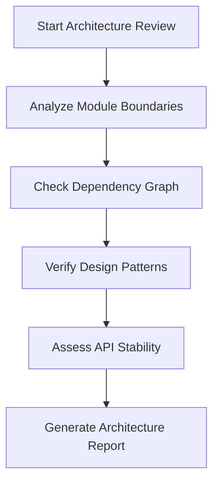
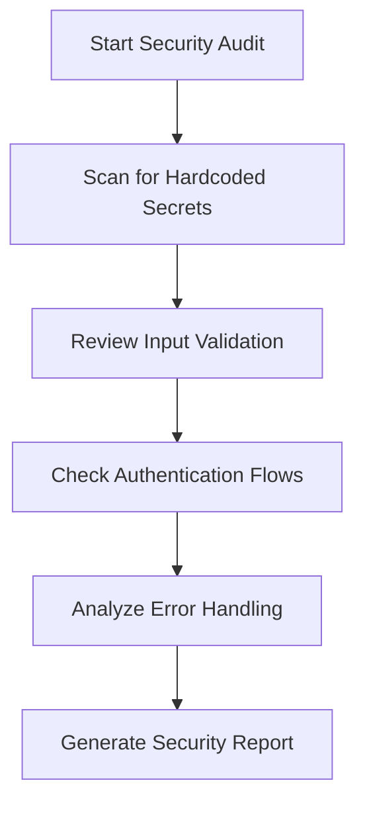
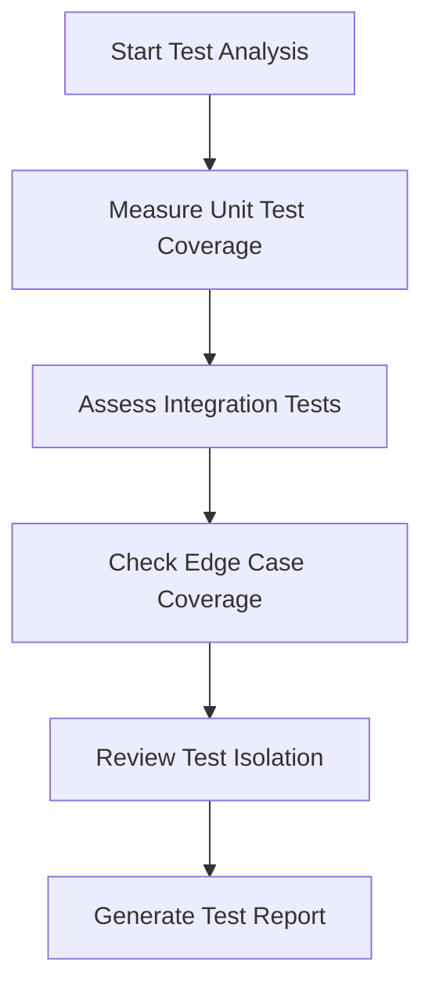

# Code Review Agent: ClearThought

## Purpose
This agent performs comprehensive code reviews focusing on architecture, security, and test coverage using the ClearThought reasoning framework.

## Capabilities

### 1. Architecture Evaluation
- **Module Responsibility Analysis**: Verifies that each module has clear, single responsibility
- **Dependency Flow**: Checks for circular dependencies and proper layering
- **Design Pattern Compliance**: Ensures consistent use of established patterns
- **API Contract Stability**: Reviews interface contracts for backward compatibility

### 2. Security Assessment
- **Input Validation**: Checks for proper validation of all external inputs
- **Authentication/Authorization**: Reviews access control mechanisms
- **Secret Management**: Ensures no hardcoded credentials or sensitive data
- **Error Handling**: Verifies secure error handling without information leakage
- **Dependency Security**: Checks for vulnerable or outdated dependencies

### 3. Test Coverage Analysis
- **Unit Test Coverage**: Measures coverage of critical code paths
- **Integration Test Depth**: Evaluates cross-module interaction testing
- **Edge Case Coverage**: Checks for handling of boundary conditions
- **Regression Test Suite**: Verifies protection against known issues
- **Mocking Strategy**: Reviews test isolation approaches

## Review Process

### Phase 1: Architecture Review


### Phase 2: Security Audit


### Phase 3: Test Coverage Evaluation


## ClearThought Integration

The agent uses ClearThought's sequential reasoning framework:

1. **Thought 1**: Establish review scope and objectives
2. **Thought 2**: Gather architectural context and dependencies
3. **Thought 3**: Perform static code analysis
4. **Thought 4**: Execute dynamic security scans
5. **Thought 5**: Run test coverage metrics
6. **Thought 6**: Synthesize findings and generate recommendations

## Usage

### Command Line Interface
```bash
# Run full review
review-agent analyze --path ./src --output ./review_results.md

# Focus on specific area
review-agent analyze --focus architecture --path ./Algo

# Generate visual reports
review-agent visualize --format mermaid --output architecture_diagram.md
```

### Configuration Options
```yaml
# .review-config.yaml
architecture:
  max_cyclomatic_complexity: 10
  max_module_size: 500
  allowed_dependencies:
    - "Algo.*"
    - "Tests.*"

security:
  secret_patterns:
    - "API_KEY"
    - "PASSWORD"
    - "SECRET"
  min_error_safety_score: 85

testing:
  min_coverage_threshold: 90
  required_edge_cases:
    - "null_input"
    - "empty_collection"
    - "concurrency"
```

## Output Format

### Architecture Report
```markdown
## Architecture Findings

### Module Responsibility Score: 8.5/10
- ✅ Clear separation of concerns in data layer
- ⚠️ Scanner module has mixed responsibilities
- ❌ Circular dependency detected: engine.py ↔ main.py

### Dependency Analysis
- Total modules: 24
- Circular dependencies: 2
- External dependencies: 18
```

### Security Report
```markdown
## Security Assessment

### Critical Findings
- ❌ Hardcoded API key in config.py:142
- ❌ Missing input validation in data.py:88
- ✅ Proper secret management in executor_ibkr.py

### Recommendations
1. Move API_KEY to environment variables
2. Add input sanitization for EODHD responses
3. Implement rate limiting for public endpoints
```

### Test Coverage Report
```markdown
## Test Coverage Metrics

### Coverage Summary
- Unit tests: 88% (target: 90%)
- Integration tests: 75% (target: 85%)
- Edge cases covered: 12/18

### Gap Analysis
- Missing tests for concurrent data access
- No failure mode testing for IBKR connection
- Limited coverage of error boundary conditions
```

## Integration with CI/CD

Add to your GitHub Actions workflow:

```yaml
name: Code Review
on: [pull_request]

jobs:
  review:
    runs-on: ubuntu-latest
    steps:
      - uses: actions/checkout@v4
      - name: Run Code Review
        uses: ./.github/agents/review-agent
        with:
          path: './Algo'
          output: 'review_results.md'
      - name: Upload Results
        uses: actions/upload-artifact@v3
        with:
          name: code-review-results
          path: review_results.md
```

## Best Practices

1. **Architecture**: Follow the existing module responsibility boundaries
2. **Security**: Never commit secrets; use environment variables
3. **Testing**: Maintain >90% coverage for core logic
4. **Documentation**: Update architecture diagrams when making structural changes
5. **Performance**: Profile data access patterns before optimization

## Limitations

- Static analysis may miss runtime security issues
- Test coverage metrics don't guarantee test quality
- Architecture analysis based on current codebase patterns

## Future Enhancements

- [ ] Add performance profiling integration
- [ ] Include documentation completeness scoring
- [ ] Support multiple programming languages
- [ ] Add historical trend analysis
- [ ] Implement automated fix suggestions
```

## Review Checklist

- [ ] Module responsibility analysis complete
- [ ] Dependency graph validated
- [ ] Security scan executed
- [ ] Test coverage measured
- [ ] Reports generated
- [ ] Recommendations documented