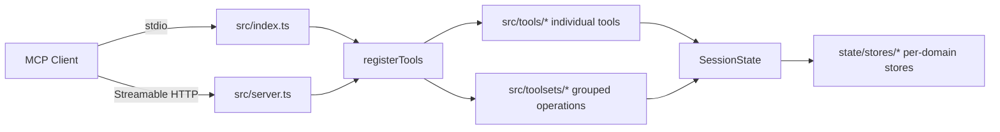

# System Patterns — Thinking-MCP

> Architecture, key technical decisions, usage patterns. Update when new
> architectural decisions are made (see AGENTS.md → Memory Bank Protocol).

## Architecture Overview

## Key Patterns

### 1. Dual registration (individual + toolset)

- Every tool has a module in `src/tools/` exporting a `registerXxx(server, state)`.
- `src/tools/index.ts::registerTools` registers each tool individually and then
  calls the four toolset registrars (`reasoning`, `visualization`, `utility`,
  `session`).
- Toolsets wrap the same handlers behind `{ operation: '<op>', ...params }`
  (see `src/toolsets/registry.ts`). Both paths MUST stay behaviorally identical.

### 2. Server-side session state

- `SessionState` (`src/state/SessionState.ts`) holds one store per tool family
  (`ThoughtStore`, `MentalModelStore`, `DebuggingStore`, `DecisionStore`,
  `MetacognitiveStore`, `ScientificStore`, `CollaborativeStore`,
  `CreativeStore`, `SystemsStore`, `VisualStore`, `BaseStore`).
- Iterative tools return `sessionContext` with accumulated stats; stateless
  utilities don't.

### 3. Dual-mode tools

Facilitation tools (`swot_analysis`, `mind_map`, `concept_map`,
`fishbone_diagram`, `issue_tree`, `analogical_mapper`,
`seven_seekers_orchestrator`) return a guiding-question scaffold when content
is missing, and a structured analysis once content parameters are provided.

### 4. Generated agent guide

`agents_guide` renders `AGENTS_TEMPLATE` with `{{PROJECT_NAME}}`,
`{{DOMAIN_CONTEXT}}`, `{{CODEBASE_ROOT}}`, optionally merging into existing
`AGENTS.md` content between
`<!-- clear-thought:agents-guide:start/end -->` markers.
Sync contract: template constant ↔ `AGENTS.template.md` ↔ root `AGENTS.md`.

## Technical Decisions Log

| Date | Decision | Rationale |
|---|---|---|
| 2026-09-11 | Root `AGENTS.md` generated via `agents_guide` tool, customized "Project-specific conventions" section | Keep guide authoritative and regenerable |
| 2026-09-11 | `memory-bank/` created as persistent cross-session knowledge base | Required by AGENTS.md protocols |

## Findings-Plan-Hygiene (2026-09-26)
- Wird ein getrackter Finding im selben Scope gefixt, MUSS der Plan-Eintrag
  im selben Session-Abschluss auf `[x]` + Evidence (Commit/Datei) gesetzt
  werden — Reviewer-Berichte und Chat-Zusammenfassungen zählen nicht.
- Duplikate desselben Findings in mehreren Sektionen werden beim Schließen
  zusammengeführt (Referenz auf die maßgebliche Sektion).

## FR-Namespace-Konvention (2026-09-26, Feature 005)
- Neue Feature-Specs belegen fortlaufende FR/SC-100er-Blöcke: Feature 003
  wird auf FR-301+ umgestellt (TRACK-NS), Feature 005 nutzt FR-401+.
- Nächster freier Block: FR-501+. Vor Vergabe grep im specs/-Baum.
