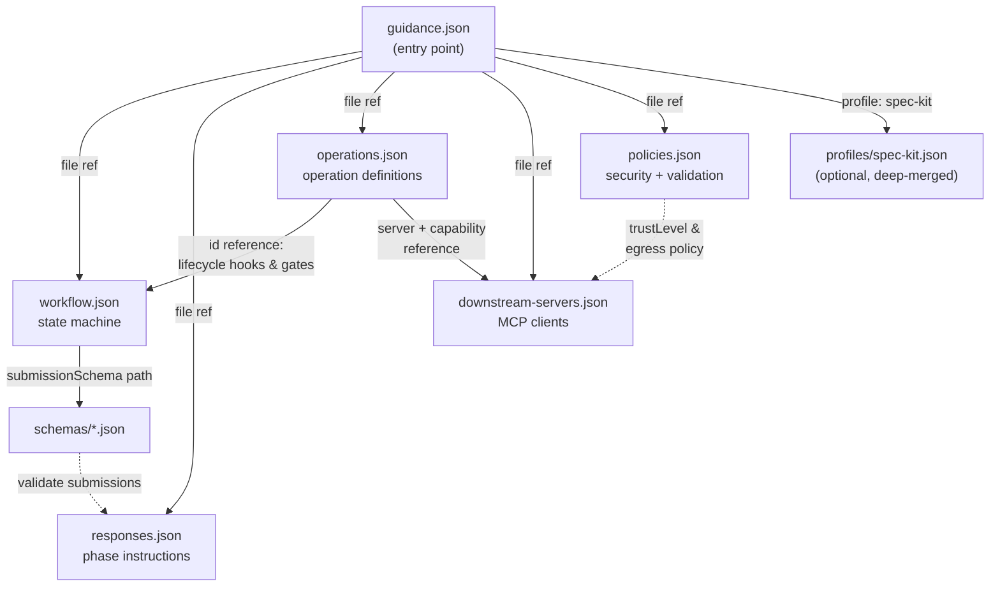
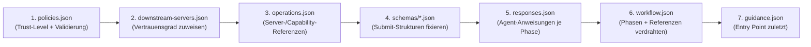

# Guidance MCP Server (`@paschbaer/guidance`)

Configurable MCP **workflow orchestrator** with an optional Spec-Kit integration
profile. Guidance turns the free-form "how agents work" into **project-owned
configuration**: phases, transitions, phase instructions, validation schemas,
downstream operations and security policies all live in `.guidance/` inside your
repository — the server is a dumb, strict executor.

Dual-role:

- **MCP server** toward your coding agent (17 workflow tools + 12 Spec-Kit tools)
- **MCP client** toward configured downstream servers (GitNexus, Insight, …)
  for workflow-critical operations (lint/test/build gates, insight storage, …)

Defined by `specs/002-guidance-workflow-server/spec.md`
(v1 workflow control, v2 downstream orchestration, v2.1 Spec-Kit profile).

## Features

- **Configuration-driven workflow**: understand → plan → review → implement →
  review-fix → verify → complete — every phase, transition and instruction
  comes from `.guidance/`, never from hardcoded logic.
- **Strict submission validation**: JSON-Schema per phase; invalid submissions
  are rejected with actionable errors.
- **Lifecycle hooks**: `beforeEnter` / `afterExit` / `beforeExit` operations per
  phase; required failures block transitions (or block a new session at start).
- **Deterministic downstream orchestration**: Guidance invokes and validates
  workflow-critical operations itself (e.g. lint/test/build gates before
  completion) — with timeout enforcement, retries, drift detection and
  capability allowlists.
- **Security**: data-egress policies per trust level, risk-class approval
  gates, secret redaction (configurable patterns), injection-resistant result
  exposure (`returnToAgent` modes).
- **Robustness**: idempotent state changes (requestId ledger), crash recovery
  (running → unknown reconcile), graceful cancellation, append-only audit
  history with redaction, blocked-session semantics with blocker records.
- **Spec-Kit profile** (optional): discover/import Spec-Kit artifacts
  (spec.md, plan.md, tasks.md), dependency-aware task batches, evidence-gated
  task completion (checkboxes are hints, never proof), plan-change
  classification, traceability report, completion invariants.

## Installation

Requires Node ≥ 18.

```bash
git clone https://github.com/paschbaer/thinking-mcp
cd thinking-mcp/servers/server-guidance
npm install
npm run build
```

### Run: stdio (local agent)

```bash
npm start            # or: node dist/index.js
```

The workspace is `process.cwd()`; configuration is read from `./.guidance/`.

### Run: HTTP (Docker)

```bash
mkdir -p workspace/.guidance && sudo chown 1000:1000 workspace
# put your .guidance/ files into workspace/.guidance/
docker compose up -d
# MCP endpoint: http://localhost:3003/mcp  ·  Health: http://localhost:3003/health
```

Environment variables (HTTP):

| Variable | Default | Meaning |
|---|---|---|
| `PORT` | `3003` | HTTP port |
| `GUIDANCE_BIND_HOST` | `127.0.0.1` | Bind address. **Loopback by default (fail-closed, FR-027).** Set `0.0.0.0` explicitly for container port-mapping |
| `GUIDANCE_WORKSPACE_ROOT` | cwd | Workspace containing `.guidance/` |
| `GUIDANCE_AUTH_TOKEN` | *(unset)* | If set, `/mcp` requires `Authorization: Bearer <token>` (401 otherwise). `/health` stays open |

### Bearer authentication (HTTP)

The bearer token is a **shared secret you choose yourself** — the server does
not issue tokens. It is enforced only when `GUIDANCE_AUTH_TOKEN` is set:
unset = `/mcp` is open to everyone who can reach the port. **Always set a
token when binding to a non-loopback host** (`GUIDANCE_BIND_HOST=0.0.0.0`,
as the shipped `docker-compose.yml` does for container port-mapping).

**1. Generate a strong random token:**

```bash
openssl rand -hex 32
# → 64 hex characters, e.g. 9f1c3b7e4a2d… (never reuse across deployments)
```

**2. Configure the server** (`docker-compose.yml` or your runtime environment):

```yaml
    environment:
      - PORT=3003
      - GUIDANCE_BIND_HOST=0.0.0.0
      - GUIDANCE_WORKSPACE_ROOT=/workspace
      - GUIDANCE_AUTH_TOKEN=9f1c3b7e4a2d…   # ← your generated value
```

Environment changes require a container restart (`docker compose up -d`),
not a rebuild.

**3. Configure the client** to send the same value on every MCP call:

```json
{
  "servers": {
    "guidance": {
      "type": "http",
      "url": "http://localhost:3003/mcp",
      "headers": { "Authorization": "Bearer 9f1c3b7e4a2d…" }
    }
  }
}
```

**4. Verify it is active** (the `/health` endpoint is unauthenticated by
design and does not tell you):

```bash
# without token → 401 unauthorized (auth is ON)
curl -o /dev/null -w "%{http_code}\n" -X POST http://localhost:3003/mcp \
  -H "content-type: application/json" \
  -H "accept: application/json, text/event-stream" \
  -d '{"jsonrpc":"2.0","id":1,"method":"tools/list"}'

# with token → 200
curl -o /dev/null -w "%{http_code}\n" -X POST http://localhost:3003/mcp \
  -H "content-type: application/json" \
  -H "accept: application/json, text/event-stream" \
  -H "authorization: Bearer 9f1c3b7e4a2d…" \
  -d '{"jsonrpc":"2.0","id":1,"method":"tools/list"}'
```

Status codes on `/mcp`:

| Status | Meaning |
|---|---|
| `401` | Token configured but missing/wrong (`Authorization` header must be exactly `Bearer <token>`) |
| `405` | Token OK, but method not allowed (`GET`/`DELETE` in stateless mode) |
| `406` | Missing `accept: application/json, text/event-stream` header |
| `200` | Success |

**Properties & limits:**

- There is **no expiry, refresh or rotation mechanism** — to rotate, change the
  env variable, restart the container, and update all client headers.
- The comparison is timing-safe (constant-time on SHA-256 digests), but the
  token travels in plain headers — use it behind TLS / within a trusted
  network only.
- `GET /health` is deliberately unauthenticated (no sensitive data) so that
  Docker healthchecks and load balancers work without secrets.
- stdio transport needs no token (the agent process IS the trust boundary).

## Configuration (`.guidance/`)

All configuration is JSON, version 2. Full contract:
[`specs/002-guidance-workflow-server/contracts/downstream-config-contract.md`](../../specs/002-guidance-workflow-server/contracts/downstream-config-contract.md)
· runnable example set: [`examples/default-guidance/`](./examples/default-guidance/).

```
.guidance/
├── guidance.json            # project, profile, file references, orchestration, security
├── workflow.json            # phases, transitions, lifecycle hooks, states
├── responses.json           # per-phase agent instructions (title/instruction/requiredActions)
├── operations.json          # downstream operation definitions (type, command, validation)
├── downstream-servers.json  # downstream MCP servers: transport, capabilities, connection
├── policies.json            # trust levels, egress, validation, redaction, output defaults
└── schemas/                 # one JSON-Schema per phase submission
```

### `guidance.json` — entry point

```json
{
  "version": 2,
  "profile": "plain",
  "project": { "name": "my-project" },
  "workflow":  { "file": "workflow.json" },
  "responses": { "file": "responses.json" },
  "operations": { "file": "operations.json" },
  "downstreamServers": { "file": "downstream-servers.json" },
  "policies": { "file": "policies.json" },
  "state": { "directory": "state", "persistAfterEveryOperation": true },
  "security": {
    "allowAgentDefinedServers": false,
    "restrictWorkingDirectory": true,
    "redactSensitiveOutput": true
  }
}
```

### `workflow.json` — the state machine (excerpt)

```json
{
  "version": 2,
  "workflow": { "id": "standard-development", "initialPhase": "understand",
                "terminalStates": ["completed", "cancelled"] },
  "phases": {
    "verify": {
      "response": "verify",
      "submissionSchema": "schemas/verify.schema.json",
      "lifecycle": { "beforeExit": ["lint", "test", "build"] },
      "transitions": [
        { "to": "review_and_fix_implementation", "reason": "verification_failed" },
        { "to": "complete", "when": "required_operations_succeeded" }
      ]
    }
  }
}
```

Semantics: `when` transitions fire on success, `reason` transitions only on
failure. `lifecycle.beforeExit` gates the transition (required failures keep
the session in the phase), `lifecycle.beforeEnter` gates entering the target
phase (a required failure at session start starts the session `blocked`).

### `operations.json` — downstream gates (excerpt)

```json
{
  "version": 2,
  "operations": {
    "test": {
      "description": "run test suite",
      "type": "process",
      "executable": "npm",
      "args": ["test"],
      "required": true,
      "timeoutSeconds": 300,
      "validation": { "exitCodeMustBeZero": true },
      "output": { "returnToAgent": "summary_and_errors" }
    }
  }
}
```

### `downstream-servers.json` — MCP clients Guidance connects to (excerpt)

```json
{
  "version": 2,
  "servers": {
    "gitnexus": {
      "enabled": true, "required": true, "trustLevel": "trusted",
      "transport": { "type": "stdio", "command": { "executable": "gitnexus", "args": ["mcp"] } },
      "connection": { "requestTimeoutSeconds": 300 },
      "capabilities": { "allow": { "tools": ["analyze", "status"] } }
    }
  }
}
```

### `policies.json` — security (excerpt)

```json
{
  "version": 2,
  "trustLevels": { "restricted": { "dataEgress": "validated_inputs_only" },
                   "trusted": { "dataEgress": "project_data" } },
  "redaction": { "patterns": ["\\bapi[_-]?key\\b", "\\btoken\\b", "\\bsecret\\b"] },
  "outputDefaults": { "returnToAgent": "summary_and_errors" }
}
```

### Spec-Kit profile

Set `"profile": "spec-kit"` plus `integrations.specKit` in `guidance.json`
(or provide `.guidance/profiles/spec-kit.json`) and the 12 Spec-Kit tools are
registered in addition to the workflow tools:

```json
{
  "profile": "spec-kit",
  "integrations": {
    "specKit": { "enabled": true, "discovery": { "featureRoot": "specs", "strategy": "singleCandidate" } }
  }
}
```

## Configuration in depth

### How the files relate

`guidance.json` is the **entry point**; it references the other five files.
The loader (`loadConfig`) reads it first, then pulls in each referenced file,
validates everything and computes a deterministic `configVersion` hash over
the merged content — any change to any file changes the config version (and
thereby snapshot staleness detection).



Roles at a glance:

| File | Role | Referenced by |
|---|---|---|
| `guidance.json` | Entry point: project identity, profile selection, file references, state, orchestration defaults, security switches | — (loaded first) |
| `workflow.json` | The state machine: phases, transitions, lifecycle hooks, terminal states | `guidance.json` |
| `responses.json` | What the agent is *told* to do in each phase (title, instruction, required actions) | `guidance.json`; phase keys must match `workflow.json` phase names |
| `operations.json` | *What* runs and *how it is validated*: process/MCP operations used by lifecycle hooks and gates | `guidance.json`; operation IDs referenced from `workflow.json` |
| `downstream-servers.json` | *Where* MCP operations run: transports, allowlists, timeouts, trust levels | `guidance.json`; `server` IDs referenced from `operations.json` |
| `policies.json` | Security and validation policy: egress per trust level, submission validation strictness, redaction, output limits | `guidance.json`; trust level names referenced from `downstream-servers.json` |
| `schemas/*.json` | Submission validation per phase | `workflow.json` (`submissionSchema` path per phase) |

> **Scaffold note:** missing `guidance.json` is scaffolded on first start
> (see below) — a minimal valid default 7-phase configuration. Existing files
> are never overwritten; invalid configuration always fails closed.
>
> **Where `.guidance/` belongs:** in the workspace of the project Guidance
> orchestrates — *not* inside the server source directory
> (`servers/server-guidance/`). That directory is server code only; its
> `.guidance/` (if present, e.g. from a test run with cwd=server dir) is
> git-ignored. For Docker use the mounted `workspace/` volume instead.

### `guidance.json` — attribute reference

| Attribute | Type | Default | Meaning |
|---|---|---|---|
| `version` | number | — (**required**) | Config format version; must be `2` |
| `profile` | `"plain"` \| `"spec-kit"` | derived | Tool surface selection. If omitted: `spec-kit` when `integrations.specKit` keys are present (FR-060), else `plain` |
| `project.name` | string | — (**required**) | Project identity, used in responses/audit |
| `workflow.file` | string | — | Path to `workflow.json` (relative to `.guidance/`) |
| `responses.file` | string | — | Path to `responses.json` |
| `operations.file` | string | — | Path to `operations.json` |
| `downstreamServers.file` | string | — | Path to `downstream-servers.json` |
| `policies.file` | string | — | Path to `policies.json` |
| `state.directory` | string | `state` | State directory (sessions, audit, snapshots) |
| `state.persistAfterEveryOperation` | boolean | — | Persist session state after each mutation (crash safety) |
| `state.retainRawMcpResponses` | boolean | — | Keep raw downstream responses on disk (audit depth vs. disk usage) |
| `orchestration.defaultTimeoutSeconds` | number | — | Default timeout for operations without own `timeoutSeconds` |
| `orchestration.defaultRetryCount` | number | — | Default retry count for transient downstream failures |
| `orchestration.maximumConcurrentOperations` | number | — | Concurrency cap for parallel operations |
| `orchestration.failClosedForRequiredOperations` | boolean | — | Required operation failure ⇒ block (true) instead of continue-with-warning |
| `security.allowAgentDefinedServers` | boolean | — | May the *agent* register new downstream servers at runtime (default: no) |
| `security.allowAgentDefinedOperations` | boolean | — | May the agent define new operations at runtime |
| `security.allowAgentProvidedCommands` | boolean | — | May the agent pass raw commands to process operations |
| `security.restrictWorkingDirectory` | boolean | — | Pin process operations to the workspace root |
| `security.redactSensitiveOutput` | boolean | — | Apply policy redaction patterns to agent-facing output |
| `integrations.specKit` | object | — | Spec-Kit integration config; presence influences profile resolution (see below) |

### `workflow.json` — attribute reference

| Attribute | Type | Meaning |
|---|---|---|
| `workflow.id` | string | Workflow identifier (appears in sessions/audit) |
| `workflow.initialPhase` | string | Phase a new session starts in |
| `workflow.terminalStates` | string[] | Names of terminal states (`completed`, `cancelled`) |
| `phases.<name>.response` | string | Key into `responses.json` for this phase's agent instruction |
| `phases.<name>.submissionSchema` | string | Path to the phase's JSON-Schema (relative to `.guidance/`) |
| `phases.<name>.transitions[]` | array | Possible transitions from this phase |
| `transitions[].to` | string | Target phase |
| `transitions[].when` | string | Success condition (`submission_valid`, `required_operations_succeeded`) — fires only on success |
| `transitions[].reason` | string | Failure condition (`verification_failed`, `major_plan_revision_required`, …) — fires only on failure |
| `phases.<name>.lifecycle.beforeEnter[]` | operation IDs | Run before entering this phase; required failure blocks the transition (at session start: session starts `blocked`) |
| `phases.<name>.lifecycle.beforeExit[]` | operation IDs | Run when leaving this phase; required failure keeps the session in the phase |
| `phases.<name>.lifecycle.afterEnter[]` | operation IDs | Run after entering; failures are non-blocking and audited |
| `phases.<name>.lifecycle.afterExit[]` | operation IDs | Run after leaving; failures are non-blocking and audited |
| `states.<name>.terminal` | boolean | Marks a terminal state |
| `states.<name>.system` | boolean | System states (`blocked`) are not directly transitionable |

### `responses.json` — attribute reference

| Attribute | Type | Meaning |
|---|---|---|
| `responses.<phaseKey>.title` | string | Short phase title shown to the agent |
| `responses.<phaseKey>.instruction` | string | The full instruction for this phase (what the agent should do / not do) |
| `responses.<phaseKey>.requiredActions` | string[] | Explicit action checklist the agent must perform in this phase |

Phase keys must match the phase names in `workflow.json`.

### `operations.json` — attribute reference

| Attribute | Type | Meaning |
|---|---|---|
| `operations.<id>.description` | string | Human-readable description |
| `operations.<id>.type` | `"process"` \| MCP types | `process` runs a local executable; MCP types call downstream servers |
| `operations.<id>.executable` / `.args` | string / string[] | Command for `type: "process"` |
| `operations.<id>.server` / `.capability` | string | For MCP operations: downstream server ID + tool name |
| `operations.<id>.required` | boolean | Required operations gate transitions (`required_hook_failed` on failure); optional failures are warnings |
| `operations.<id>.timeoutSeconds` | number | Per-operation timeout; on exceed the call fails as transport error (retried per policy) |
| `operations.<id>.validation.exitCodeMustBeZero` | boolean | `process`: exit code 0 ⇒ succeeded |
| `operations.<id>.output.returnToAgent` | string | Exposure mode: `summary_and_errors` (redacted default), `status_only`, `normalized`, `raw` — controls how much reaches the agent |
| `operations.<id>.riskClass` / `.approved` | string / boolean | Risk-class approval gate: risky operations need explicit approval |

### `downstream-servers.json` — attribute reference

| Attribute | Type | Meaning |
|---|---|---|
| `servers.<id>.displayName` | string | Human-readable name |
| `servers.<id>.enabled` | boolean | `false` = server is skipped entirely |
| `servers.<id>.required` | boolean | Required servers must become ready at startup (fail otherwise) |
| `servers.<id>.trustLevel` | string | One of `policies.trustLevels` — drives egress policy |
| `servers.<id>.transport` | object | `type: "stdio"` + `command.executable/args/cwd` |
| `servers.<id>.connection.startupTimeoutSeconds` | number | Handshake timeout |
| `servers.<id>.connection.requestTimeoutSeconds` | number | Per-request timeout (positive finite; enforced as transport failure) |
| `servers.<id>.connection.reconnect` | object | `enabled`, `maximumAttempts`, `delayMilliseconds` |
| `servers.<id>.capabilities.allow.tools` | string[] | **Allowlist**: only these tools may be invoked on this server |
| `servers.<id>.capabilities.allow.resources` / `.prompts` | string[] | Same for resources/prompts |
| `servers.<id>.environment` | object | Env for the child process (`inherit`, `variables.<NAME>.fromHost`) |

### `policies.json` — attribute reference

| Attribute | Type | Meaning |
|---|---|---|
| `trustLevels.<name>.dataEgress` | string | `none` \| `validated_inputs_only` \| `project_data` \| `project_data_with_approval` — what data may flow to a server with this trust level |
| `validation.requireAcceptanceCriteria` | boolean | Understanding submissions must contain acceptance criteria |
| `validation.requireUniqueTaskIds` | boolean | Plan task IDs must be unique |
| `validation.rejectUnknownDependencies` | boolean | Task dependencies must reference known tasks |
| `validation.rejectDependencyCycles` | boolean | Reject cycles in the task dependency graph |
| `validation.rejectEmptyArtifacts` | boolean | Reject empty Spec-Kit artifacts at import |
| `reviewFindings.blockingSeverities` | string[] | Review severities that block advancement (e.g. `high`, `critical`) |
| `redaction.patterns` | string[] | Regex patterns redacted from agent-facing operation output |
| `outputDefaults.returnToAgent` | string | Default exposure mode for operations without own setting |
| `outputDefaults.maxExcerptBytes` | number | Max excerpt size returned to the agent |
| `outputDefaults.maxArtifactBytes` | number | Max artifact size accepted at import |
| `outputDefaults.maximumTasks` / `.maximumEntities` | number | Import size limits |

### Best practice: configuration order

Configure **inside-out, dependency-first** — each step only references things
that already exist, so you can validate as you go:



1. **`policies.json` first.** Decide the security posture before anything
   exists that could leak: trust levels, egress, redaction patterns, blocking
   severities, validation strictness. Everything later refers to these names.
2. **`downstream-servers.json`.** Register the servers you actually run, each
   with a trust level from step 1 and tight allowlists. Start with zero servers
   if unsure — `{"version":2,"servers":{}}` is valid.
3. **`operations.json`.** Define gates (lint/test/build) as `process`
   operations, and downstream operations against the servers from step 2
   (`server` + `capability` must exist there). Mark only what truly gates the
   transition as `required: true`.
4. **`schemas/*.json`.** Fix what each phase submission must contain. Keep
   schemas minimal (`additionalProperties: false`) — they are the contract
   that keeps agent output reviewable.
5. **`responses.json`.** Write the agent instructions per phase, keyed exactly
   by your future workflow phase names. This is where the process quality
   lives — invest here.
6. **`workflow.json`.** Now wire phases, transitions and lifecycle hooks. Only
   reference operation IDs from step 3 and schema paths from step 4 — the
   engine throws `operation_not_configured` otherwise (non-recoverable).
7. **`guidance.json` last.** It is trivial once everything exists: set project
   name, profile and the five file references.

**Working rules:**

- Validate after every step: the server either starts (config valid) or fails
  with a precise `configuration_invalid` message pointing at the offending
  attribute. `mcp-server-guidance-init` scaffolds a working baseline to start
  from instead of a blank page.
- Change one file at a time; the deterministic `configVersion` hash makes every
  change visible (and invalidates Spec-Kit snapshots deliberately).
- Keep gates honest: `required: true` means "the workflow must not pass
  without this". Optional gates (`required: false`) are signals, not fences.
- Treat `operations.<id>.output.returnToAgent: "raw"` as an exception with
  review — `summary_and_errors` + redaction is the safe default.
- In Docker: put `.guidance/` into the mounted `workspace/` volume; scaffold
  creates a default there automatically on first start.

## Using Guidance inside an agent (chat)

Register the server in your MCP client:

**stdio (Claude Code, VS Code, …):**

```json
{
  "mcpServers": {
    "guidance": {
      "command": "node",
      "args": ["/path/to/thinking-mcp/servers/server-guidance/dist/index.js"]
    }
  }
}
```

**HTTP (Docker):**

```json
{
  "mcpServers": {
    "guidance": {
      "type": "http",
      "url": "http://localhost:3003/mcp",
      "headers": { "Authorization": "Bearer <your-token>" }
    }
  }
}
```

### The agent loop

Guidance drives the agent through your configured phases. The protocol is
always: **start → read guidance → do the work → submit → repeat**.

1. **`start_workflow`** — starts a session and returns the instruction for the
   initial phase (from `responses.json`).
2. **`get_current_guidance`** — re-reads the current phase instruction at any
   time (idempotent, read-only).
3. **`submit_<phase>`** — submits the phase work; strict JSON-Schema validation;
   on acceptance you get the *next* phase instruction plus the results of any
   lifecycle operations.
4. **`report_blocker` / `resume_workflow`** — blocked sessions are paused until
   the user decides.
5. **`complete_workflow`** — final report; required completion gates run.

### Example: one full pass (plain profile)

**Agent:** `start_workflow { "workspaceRoot": "/repo", "request": "Add rate limiting to the API" }`

```json
{
  "accepted": true, "sessionId": "session-…", "currentPhase": "understand",
  "guidance": {
    "title": "Understand the Request",
    "instruction": "Analyze the development request … Do not create an implementation plan yet.",
    "requiredActions": ["Inspect the relevant repository context.", "…"]
  }
}
```

**Agent** (explores the repo, then):
`submit_understanding { "sessionId": "session-…", "summary": "…", "assumptions": ["…"], "acceptanceCriteria": ["429 responses after 100 req/min per key"] }`

```json
{ "accepted": true, "currentPhase": "plan", "guidance": { "title": "Create the Implementation Plan", … } }
```

**Agent:** `submit_plan { "sessionId": "…", "tasks": [ { "id": "T001", … }, … ] }`
→ phase `review_and_adjust_plan` → `submit_plan_review` → … → `implement` →
`submit_implementation` (changed files, tests) → review-fix loop → `verify`.

**At `verify`** the configured gates run automatically (`beforeExit`:
lint, test, build). All succeed → transition to `complete`.

**Agent:** `complete_workflow { "sessionId": "…", "summary": "…" }` — required
completion operations (e.g. the configured GitNexus repository analysis) run;
success closes the workflow, failures record blockers.

### Example: blocked session + user decision

If a required lifecycle operation fails (e.g. the test gate), the session stays
in its phase and records a blocker:

```json
{ "accepted": false, "error": { "code": "required_hook_failed",
  "message": "required lifecycle operations failed; remaining in phase" },
  "currentPhase": "verify", "operations": [ { "id": "test", "status": "failed", "summary": "…" } ] }
```

The agent reports the failure to the user, fixes the code, re-submits. For
decisions the agent cannot make (risk-class approvals, ambiguous blockers):

**Agent:** `report_blocker { "sessionId": "…", "category": "user_decision_required", "description": "…" }`
→ session `blocked` → after the user decides:
`resume_workflow { "sessionId": "…" }`.

### Example: Spec-Kit profile

With `profile: "spec-kit"` the agent orchestrates an existing feature folder:

```
discover_spec_kit_feature { "sessionId": "…" }            → { "featureId": "001-rate-limit", "directory": "…" }
import_spec_kit_artifacts { "sessionId": "…" }            → snapshot + validated task entities
get_next_task { "sessionId": "…" }                        → { "nextTaskId": "T001" }
start_task { "sessionId": "…", "taskIds": ["T001"] }      → batch state machine
submit_task_implementation { "sessionId": "…", "evidence": [ { "taskId": "T001", "summary": "…", "changedFiles": [...], "testsAddedOrUpdated": [...] } ] }
complete_task { "sessionId": "…", "taskId": "T001" }      → evidence-gated (checkbox ≠ proof)
get_traceability_report { "sessionId": "…" }              → criteria ↔ task coverage
validate_spec_kit_completion { "sessionId": "…", … }      → completion invariants
```

Plan deviations go through `propose_plan_change` (deterministic minor/major
classification, approval + artifact-update lifecycle instead of silent edits).

## Tool reference

Common conventions: every tool returns a JSON text payload. `sessionId` refers
to a started workflow session. `requestId` (optional on all mutating tools)
makes the call idempotent — repeating a call with the same `requestId` does not
apply the change twice (request ledger). Submissions are validated against the
phase's JSON-Schema; validation failures return `submission_invalid` with
details.

### Workflow tools (17)

| Tool | Parameters | Purpose |
|---|---|---|
| `start_workflow` | `workspaceRoot`, `request`, `workflowId?`, `metadata?` | Starts a session, runs initial-phase `beforeEnter` operations (a required failure starts the session `blocked`) and returns the initial phase instruction. `workspaceRoot` must be inside the server-configured workspace |
| `get_current_guidance` | `sessionId` | Read-only: title, instruction and required actions of the current phase (from `responses.json`). Call after every transition |
| `submit_understanding` | `sessionId`, `requestId?`, `summary`, `assumptions?`, `acceptanceCriteria?` | Submits the *understand* phase: request analysis, assumptions, measurable acceptance criteria |
| `submit_plan` | `sessionId`, `requestId?`, `tasks` | Submits the implementation plan: stable task IDs, dependencies, affected files, planned tests |
| `submit_plan_review` | `sessionId`, `requestId?`, `findings?`, `approvedPlan?` | Plan review; blocking findings (per policy severities) loop back to `plan`, approval advances to `implement` |
| `submit_implementation` | `sessionId`, `requestId?`, `implementedTasks`, `changedFiles` | Implementation evidence: which tasks were implemented and which files changed |
| `submit_implementation_review` | `sessionId`, `requestId?`, `findings?`, `filesChangedDuringReview?` | Code-review results; `implementation_changes_required` loops back to `implement` |
| `submit_verification` | `sessionId`, `requestId?`, `verificationSummary` | Verification report; the phase's `beforeExit` gates (lint/test/build) run on transition |
| `complete_workflow` | `sessionId`, `requestId?`, `summary` | Final report; runs required completion operations (e.g. repository analysis). Success moves the session to the terminal state |
| `get_workflow_state` | `sessionId`, `includeHistory?` | Read-only: full persisted session state (phases, downstream operation states, blockers). Reconciles stale `running` operations to `unknown` under a lock |
| `report_blocker` | `sessionId`, `category`, `description`, `requiresUserDecision?`, `options?` | Reports a blocker the agent cannot resolve; the session enters `blocked` until `resume_workflow` |
| `resume_workflow` | `sessionId`, `decision`, `notes?` | Ends `blocked` and returns the session to its previous phase with the user decision recorded |
| `cancel_workflow` | `sessionId` | Graceful cancellation (FR-057): no new operations run, state moves to the `cancelled` terminal state |
| `get_orchestration_status` | `sessionId` | Read-only: status of the operations of the active phase (running / succeeded / failed / timed_out) |
| `list_configured_operations` | — | Read-only: all operations defined in `operations.json` (no session needed) |
| `retry_operation` | `sessionId` | Re-runs failed **required** operations of the current phase (transient downstream failures) |
| `get_downstream_status` | — | Read-only: connection health of all configured downstream servers |

### Spec-Kit tools (12, profile `spec-kit` only)

All tools operate on the Spec-Kit state of the session (created by
`import_spec_kit_artifacts` and persisted per session).

| Tool | Parameters | Purpose |
|---|---|---|
| `discover_spec_kit_feature` | `sessionId`, `featureId?` | Locates the feature directory under the configured `featureRoot` (strategy-aware: explicit ID, single candidate, …). Workspace-boundary checked |
| `import_spec_kit_artifacts` | `sessionId`, `featureId?` | Imports spec.md / plan.md / tasks.md (+ optional research, data-model, contracts, checklists), validates structure (unique task IDs, dependency graph, cycles) and creates an **immutable hash-pinned snapshot** |
| `get_spec_kit_status` | `sessionId` | Read-only: feature, active snapshot, active batch, validation findings, task-status counts, open plan changes |
| `get_next_task` | `sessionId` | Read-only: tasks that are release-ready (dependencies satisfied) and the recommended next task |
| `start_task` | `sessionId`, `batchId?`, `taskIds[]` | Moves tasks into `in_progress` within a batch (batch release semantics, defaults to the active batch) |
| `submit_task_implementation` | `sessionId`, `batchId?`, `evidence[]` | Per-task evidence: summary, changed files, tests added/updated, deviations, unresolved issues. Checkboxes in tasks.md are hints — only this evidence counts |
| `submit_task_review` | `sessionId`, `batchId?`, `findings[]` | Review findings per task (`severity`, `fixRequired`, `fixApplied`); blocking severities gate completion |
| `complete_task` | `sessionId`, `taskId` | Marks a task completed — only after implementation + review evidence and satisfied dependencies; otherwise `spec_kit_task_*` errors explain what is missing |
| `propose_plan_change` | `sessionId`, `changeType`, `reason`, `affectedTasks`, `impact` | Proposes a plan deviation; deterministic `minor`/`major` classification from the change type and impact flags; major changes require artifact update + approval before completion |
| `refresh_spec_kit_artifacts` | `sessionId` | Re-imports the artifacts and activates a fresh snapshot (for approved plan changes / external edits) |
| `get_traceability_report` | `sessionId` | Read-only: acceptance criteria ↔ task coverage |
| `validate_spec_kit_completion` | `sessionId`, `snapshotCurrent`, `requiredVerificationSucceeded`, `completionOpsSucceeded` | Evaluates the completion invariants (no uncompleted tasks, no open plan changes, criteria coverage, verification) and returns violations |

## Build & test

```bash
npm install
npm run build
npm test        # 142 tests
npm run typecheck
```

## Further documentation

- Spec: [`specs/002-guidance-workflow-server/spec.md`](../../specs/002-guidance-workflow-server/spec.md)
- Contracts: [`specs/002-guidance-workflow-server/contracts/`](../../specs/002-guidance-workflow-server/contracts/)
- Example configuration: [`examples/default-guidance/`](./examples/default-guidance/)
