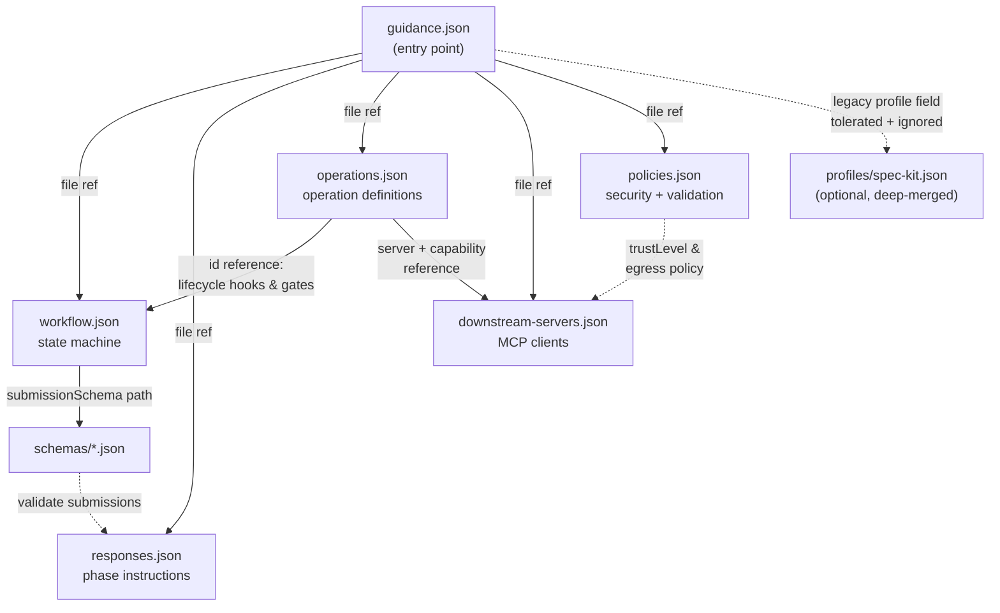
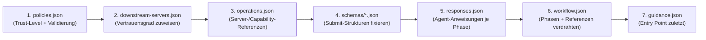
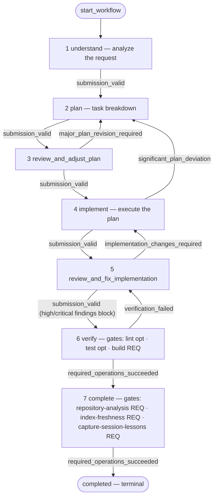

# Guidance MCP Server (`@paschbaer/guidance`)

Configurable MCP **workflow orchestrator** with an optional Spec-Kit integration
profile. Guidance turns the free-form "how agents work" into **project-owned
configuration**: phases, transitions, phase instructions, validation schemas,
downstream operations and security policies all live in `.guidance/` inside your
repository — the server is a dumb, strict executor.

Dual-role:

- **MCP server** toward your coding agent (20 workflow tools + 16 Spec-Kit tools, all registered unconditionally)
- **MCP client** toward configured downstream servers (GitNexus, Insight, …)
  for workflow-critical operations (lint/test/build gates, insight storage, …)

Why this design? See [Why Guidance?](#why-guidance).

(v1 workflow control, v2 downstream orchestration, v2.1 Spec-Kit profile).

## Why Guidance?

Coding agents lose long-lived behavioral rules: a large instructions file
(`AGENTS.md`, `CLAUDE.md`) is read at session start, but by step twelve of a
task the details are far outside the attention window — the agent still
_knows_ rule 47 exists, it just no longer _applies_ it. Guidance attacks that
problem structurally instead of with longer files:

- **Just-in-time rules.** The agent receives only the instruction and
  required actions for the phase it is currently in — rule salience stays at
  100% because nothing else competes for attention. Phases are small, so
  instructions are short by construction.
- **`AGENTS.md` shrinks and stabilizes.** Process rules move into
  `.guidance/` responses and policies; the instructions file keeps only
  general principles and deployment notes. Fewer, stable rules mean fewer
  edits — and the file stops growing with every lesson learned.
- **Gates instead of self-reporting.** Verification (`lint`/`test`/`build`),
  repository analysis and lessons capture run server-side on the transition
  out of a phase. A required failure blocks completion — "done" is not
  something the agent can merely claim (see
  [Working sample](#working-sample-this-repositorys-own-guidance)).
- **Schema-validated submissions.** Every phase has a strict JSON-Schema;
  required fields force completeness (acceptance criteria, deviations,
  unresolved issues) instead of trusting prose.
- **Persistent session state.** Sessions survive restarts; blockers, user
  decisions and operation results are recorded and auditable — a long task
  can pause and resume instead of being re-explained.
- **Experience-based refinement.** The `capture-session-lessons` gate seeds
  validated lessons into the experience-memory server, so the process gets
  better with every run (requires a reachable Insight instance). In this
  repository's first three production runs
  the gates surfaced four real bugs (an ESM crash, unresolved template
  placeholders, a missing environment contract, and an index-freshness gap).

|                | Static instructions file      | Guidance                                               |
| -------------- | ----------------------------- | ------------------------------------------------------ |
| Rule delivery  | all at once, at session start | just-in-time, per phase                                |
| Rule adherence | fades with context distance   | enforced per phase (`requiredActions`, review-checked) |
| Verification   | agent self-reporting          | server-enforced gates; blocking                        |
| Completeness   | prose, easy to skip           | schema-validated submissions                           |
| State          | in the model's context        | persisted, restart-safe, auditable                     |
| Improvement    | manual file edits             | automatic lesson capture (idempotent)                  |

Static instruction files still do valuable work — general principles, repo
conventions, tool availability — and Guidance is designed to complement
them, not replace them: keep principles in `AGENTS.md`, put process in
`.guidance/`. One honest boundary: duties that live on the agent side
(e.g. the Clear-Thought reasoning passes) are instruction-enforced and
review-checked — Guidance can only gate deterministic, observable checks.

## Features

- **Configuration-driven workflow**: understand → plan → review → implement →
  review-fix → verify → complete — every phase, transition and instruction
  comes from `.guidance/`, never from hardcoded logic.
- **Strict submission validation**: JSON-Schema per phase; invalid submissions
  are rejected with actionable errors.
- **Lifecycle hooks**: `beforeEnter` / `afterExit` / `beforeExit` operations per
  phase; required failures block transitions (or block a new session at start).
- **Deterministic downstream orchestration**: Guidance invokes and validates
  workflow-critical operations itself (e.g. lint/test/build gates before
  completion) — with timeout enforcement, retries, drift detection and
  capability allowlists.
- **Security**: data-egress policies per trust level, risk-class approval
  gates, secret redaction (configurable patterns), injection-resistant result
  exposure (`returnToAgent` modes).
- **Robustness**: idempotent state changes (requestId ledger), crash recovery
  (running → unknown reconcile), graceful cancellation, append-only audit
  history with redaction, blocked-session semantics with blocker records.
- **Spec-Kit integration** (always available): discover/import Spec-Kit artifacts
  (spec.md, plan.md, tasks.md), dependency-aware task batches, evidence-gated
  task completion (checkboxes are hints, never proof), plan-change
  classification, traceability report, completion invariants. Sessions on
  workflows work without imported artifacts too: the spec-kit task tools
  require `import_spec_kit_artifacts` first, but the workflow can equally be
  driven via plan-level submissions (`submit_plan`/`submit_implementation`/
  `submit_verification`), which need no spec-kit state.

## Installation

Requires Node ≥ 18.

```bash
git clone https://github.com/paschbaer/thinking-mcp
cd thinking-mcp/servers/server-guidance
npm install
npm run build
```

### Run: stdio (local agent)

```bash
npm start            # or: node dist/index.js
```

The workspace is `process.cwd()`; configuration is read from `./.guidance/`.

### Run: HTTP (Docker)

Single-repo (mount your workspace, classic deployment):

```bash
mkdir -p workspace/.guidance && sudo chown 1000:1000 workspace
# put your .guidance/ files into workspace/.guidance/
docker compose -f docker-compose.yml -f your-override.yml up -d
# MCP endpoint: http://localhost:3003/mcp  ·  Health: http://localhost:3003/health
```

The base compose file mounts nothing and sets no workspace root — provide
both via your override. For the multi-repo pool deployment use
the shipped override as-is:

Environment variables (HTTP):

| Variable                  | Default     | Meaning                                                                                                  |
| ------------------------- | ----------- | -------------------------------------------------------------------------------------------------------- |
| `PORT`                    | `3003`      | HTTP port                                                                                                |
| `GUIDANCE_BIND_HOST`      | `127.0.0.1` | Bind address. **Loopback by default (fail-closed).** Set `0.0.0.0` explicitly for container port-mapping |
| `GUIDANCE_WORKSPACE_ROOT` | cwd         | Workspace containing `.guidance/`                                                                        |
| `GUIDANCE_AUTH_TOKEN`     | _(unset)_   | If set, `/mcp` requires `Authorization: Bearer <token>` (401 otherwise). `/health` stays open            |

### New-system setup checklist (HTTP + multi-workspace)

From a bare machine to a running multi-workspace instance:

1. **Prerequisites**: Docker Desktop (with file sharing for the drive that
   hosts the checkout), git, Node ≥ 18 (host-side builds/tests optional —
   the container brings its own toolchain). Optional: a host-side
   `gitnexus` CLI (e.g. via WSL) for index refreshes, and the
   experience-memory + clear-thought downstream services if you use them.
2. **Clone & build** (see above) — then start HTTP via
   `docker compose -f docker-compose.yml -f docker-compose.override.yml up -d`.
   The override mounts the **repos pool** via a relative path (`../../../` →
   `/workspaces` — the only volume mount) and sets
   `GUIDANCE_WORKSPACE_ROOT=/workspaces` — no absolute host paths to adapt
   when the checkout moves.
3. **First boot**: the instance `.guidance/` at the served root is expected
   to be **registry-only** (`workspaces[]` + project/state; the
   generic scaffold creates a legacy full config, which is served with a
   boot warning). Verify: `curl localhost:3003/health` → `"configured": true`
   plus the workspace list.
4. **Register additional repos**: add entries to the instance
   `.guidance/guidance.json` → `workspaces[]` (container path
   `/workspaces/<Repo>`, see
   [Multi-Workspace Operation](#multi-workspace-operation-specs008)) and
   create each repo's own `.guidance/` (config assistant, target
   `repo-config`). **Restart the container afterwards** — the registry is
   read at boot. **Add `.guidance/state/` to each repo's `.gitignore`.**
5. **Per-repo analysis index**: run `gitnexus analyze --no-stats` inside
   each registered repo (host-side pre-complete step; the freshness gate
   checks `<root>/.gitnexus/meta.json` against git HEAD). The freshness
   scan ignores build/test-tooling artifacts (`node_modules`, `dist`,
   `coverage` — at any depth, so `.vite` vitest results under a nested
   `node_modules` do not count): a test run after a reindex no longer
   makes the index look stale. Deterministic ordering still applies:
   reindex after the last test run, immediately before
   `complete_workflow`.

   **Dual-index procedure**: the index-freshness gate reads the
   **repo-local** `.gitnexus/` storage, which is owned by the exact path
   identity it was created with (e.g. `/mnt/d/repos/thinking-mcp` —
   lowercase). Deterministic refresh:

   ```bash
   wsl.exe -e bash -lc 'export NVM_DIR=$HOME/.nvm && . $NVM_DIR/nvm.sh && \
     cd /mnt/d/repos/thinking-mcp && gitnexus analyze --no-stats --skip-skills'
   ```

   - Run it from the **exact registered path** (case-sensitive) — a
     different case yields `StorageRequirementError: storage "foreign"`.
   - `gitnexus-server` (container, `GITNEXUS_HOME=/data/gitnexus`) refreshes
     only its **own** storage — it does NOT update the repo-local index the
     gate reads.
   - If analyze reports `Already up to date` it writes nothing; when only
     file mtimes moved (e.g. a `git checkout` of identical content), re-run
     with `--force`.
   - Never omit `--skip-skills`: a plain analyze rewrites `AGENTS.md`/
     `CLAUDE.md` (skill-template refresh) and dirties the tree.

6. **Hardening (optional)**: set `GUIDANCE_AUTH_TOKEN` for bearer auth on
   `/mcp`; keep `GUIDANCE_BIND_HOST` at loopback unless the instance must
   be reachable from other hosts.

Known environment caveats: Linux containers on Windows/Docker Desktop need
the drive enabled for file sharing; **host-installed `node_modules` must be
Linux/ABI-compatible with the container** — install repo dependencies under
WSL (Node 24 matches the image; Windows-native installs fail the boot
node-deps warning and the gates). A git
**worktree** checkout has a `.git` _file_ instead of a directory, which
breaks git-reading gates run from inside that worktree.

### Container route (timeout fallback)

The **container route** is a per-downstream-server escape hatch: when a
read-only operation times out on its primary transport, Guidance makes
**exactly one** automatic invocation over a transient HTTP endpoint (the
server's `containerRoute`) before surfacing the failure. It never retries and
never touches the primary client for that server.

**Configuration** — in the repo's `.guidance/downstream-servers.json`:

```json
{
  "version": 2,
  "servers": {
    "myservice": {
      "enabled": true,
      "trustLevel": "trusted",
      "transport": {
        "type": "http",
        "http": { "url": "http://host.docker.internal:4747/api/mcp" }
      },
      "capabilities": {
        "allow": { "tools": ["*"], "resources": [], "prompts": [] }
      },
      "connection": {
        "requestTimeoutSeconds": 300,
        "reconnect": {
          "enabled": true,
          "maximumAttempts": 2,
          "delayMilliseconds": 1000
        }
      },
      "containerRoute": {
        "url": "http://host.docker.internal:4747/api/mcp",
        "headers": { "authorization": "Bearer ${MY_TOKEN}" }
      }
    }
  }
}
```

For a **stdio** server the same `containerRoute` block works — this is the
typical case where the fallback adds real value, because stdio has no HTTP
endpoint of its own.

**Fail-closed requirements (validation fails the config load otherwise):**

1. `containerRoute.url` must be a valid `http(s)` URL (same rules as
   `transport.http.url`).
2. The URL host **must appear in `policies.json` → `egress.httpHostAllowlist`**.
   The container route counts as HTTP egress even for stdio servers — a stdio
   server's containerRoute cannot bypass egress policy. An absent allowlist is
   a configuration error (egress denied by default).
3. A wildcard tool allowlist ("*" as the **sole** entry — mixed lists are
   rejected) requires `trustLevel: "trusted"`, because tools without an
   operations entry can never trigger the risk-class approval gate.
4. `${ENV_VAR}` references in `containerRoute.headers` are resolved from the
   process environment at load time; unset variables fail the config load.
   Resolved secrets never enter the configuration hash.

**Runtime gating** — the fallback fires only when ALL of these hold:

- the primary call failed with a **transport timeout** (`timedOut`),
- the invoked tool has an `operations.json` entry (`server` + `capability`
  match) whose `riskClass` is **`read_only`** — non-idempotent calls are never
  auto-replayed (the call may already have run on the primary path),
- the server has a `containerRoute.url` configured.

If the route itself fails, the error message names the container-route
failure; per-server outcome counters are exposed in `get_metrics` under
`containerRouteFallbacks` (`attempted`/`succeeded`/`failed`).

**Operation entry** — the `read_only` risk class comes from the operation
definition (`.guidance/operations.json`); tools without such an entry get no
fallback (and on a wildcard server they are rejected outright):

```json
{
  "my-check": {
    "type": "mcpTool",
    "server": "myservice",
    "capability": "check",
    "invocableByAgent": true,
    "required": false,
    "timeoutSeconds": 60,
    "riskClass": "read_only",
    "validation": {
      "protocolRequestMustSucceed": true,
      "toolResultMustNotBeError": true
    },
    "output": { "retainRawResult": true }
  }
}
```

Note that `run_operation` passes no agent-supplied arguments — argument values
come from the operation definition itself (`arguments` with mode
`fixed`/`template`).

#### `call_downstream`: gated downstream tool passthrough

For ad-hoc calls with **agent-supplied arguments**, `call_downstream`
invokes an arbitrary configured downstream tool directly:

```json
{
  "sessionId": "session-…",
  "serverId": "clearthought",
  "toolName": "assumption_xray",
  "args": { "claim": "the build is flaky", "context": "vitest workers" }
}
```

It is a **transparent proxy** (raw response, identical schema to a
direct tool call) but runs through the same fail-closed stack as operations:

- Tool allowlist (`capabilities.allow.tools`, wildcard `"*"` permitted),
- Rejection of tools **without an operations entry** on wildcard
  servers — register a read-only operation entry (see above) to unlock a tool,
- Egress/approval gate per risk class,
- capability-pin drift check, reconnect semantics, and the containerRoute
  timeout fallback for `read_only` tools,
- per-session single-flight guard and workspace lock (same as `run_operation`),
- audit events (`operation_invoked` / `operation_invocation_denied`),
  downstream content redacted before exposure.

Input validation is **not** performed by Guidance — args are passed verbatim
and the downstream tool validates its own schema (violations surface as
`tool_reported` errors). Residual note: a tool that is **explicitly**
allowlisted but has no `operations.json` entry runs without a risk class (the
approval gate cannot fire) — operator-controlled allowlists are the opt-in;
register an operation entry to classify the tool.

`call_downstream` is not registered in remote mode (`remote-tools.ts`),
consistent with `run_operation` — fail-closed.

#### `run_operation` with argument overrides

`run_operation` accepts an optional `arguments` record for `mcpTool`
operations. Agent keys are **deep-merged over** the operation's resolved
`fixed`/`template` arguments (agent keys win per-key, operation-only keys are
retained):

```json
{
  "sessionId": "session-…",
  "operationId": "ct-existing-tool-example",
  "arguments": { "text": "smoke" }
}
```

- Template resolution runs first; overrides apply after — so
  `${session.request}` templates can still be partially overridden.
- Operations that pin safety-relevant values can declare
  `"argumentsLocked": true` in `operations.json`; overrides are then rejected
  fail-closed (`operation_arguments_invalid`).
- `process`/`composite` operations ignore overrides and return an
  `argument_overrides_ignored` warning (no argv injection from agent input).

### Bearer authentication (HTTP)

The bearer token is a **shared secret you choose yourself** — the server does
not issue tokens. It is enforced only when `GUIDANCE_AUTH_TOKEN` is set:
unset = `/mcp` is open to everyone who can reach the port. **Always set a
token when binding to a non-loopback host** (`GUIDANCE_BIND_HOST=0.0.0.0`,
as the shipped `docker-compose.yml` does for container port-mapping).

**1. Generate a strong random token:**

```bash
openssl rand -hex 32
# → 64 hex characters, e.g. 9f1c3b7e4a2d… (never reuse across deployments)
```

**2. Configure the server** (`docker-compose.yml` or your runtime environment):

```yaml
environment:
  - PORT=3003
  - GUIDANCE_BIND_HOST=0.0.0.0
  - GUIDANCE_WORKSPACE_ROOT=/workspaces
  - GUIDANCE_AUTH_TOKEN=9f1c3b7e4a2d… # ← your generated value
```

Environment changes require a container restart (`docker compose up -d`),
not a rebuild.

**3. Configure the client** to send the same value on every MCP call:

```json
{
  "servers": {
    "guidance": {
      "type": "http",
      "url": "http://localhost:3003/mcp",
      "headers": { "Authorization": "Bearer 9f1c3b7e4a2d…" }
    }
  }
}
```

**4. Verify it is active** (the `/health` endpoint is unauthenticated by
design and does not tell you):

```bash
# without token → 401 unauthorized (auth is ON)
curl -o /dev/null -w "%{http_code}\n" -X POST http://localhost:3003/mcp \
  -H "content-type: application/json" \
  -H "accept: application/json, text/event-stream" \
  -d '{"jsonrpc":"2.0","id":1,"method":"tools/list"}'

# with token → 200
curl -o /dev/null -w "%{http_code}\n" -X POST http://localhost:3003/mcp \
  -H "content-type: application/json" \
  -H "accept: application/json, text/event-stream" \
  -H "authorization: Bearer 9f1c3b7e4a2d…" \
  -d '{"jsonrpc":"2.0","id":1,"method":"tools/list"}'
```

Status codes on `/mcp`:

| Status | Meaning                                                                                      |
| ------ | -------------------------------------------------------------------------------------------- |
| `401`  | Token configured but missing/wrong (`Authorization` header must be exactly `Bearer <token>`) |
| `405`  | Token OK, but method not allowed (`GET`/`DELETE` in stateless mode)                          |
| `406`  | Missing `accept: application/json, text/event-stream` header                                 |
| `200`  | Success                                                                                      |

**Properties & limits:**

- There is **no expiry, refresh or rotation mechanism** — to rotate, change the
  env variable, restart the container, and update all client headers.
- The comparison is timing-safe (constant-time on SHA-256 digests), but the
  token travels in plain headers — use it behind TLS / within a trusted
  network only.
- `GET /health` is deliberately unauthenticated (no sensitive data) so that
  Docker healthchecks and load balancers work without secrets.
- stdio transport needs no token (the agent process IS the trust boundary).

## Configuration assistant

Instead of assembling `.guidance/` by hand, the built-in configuration
assistant walks you through the design step by step — question by question,
with options, rationale, and config references. The assistant is
**stateless**: the agent accumulates the answers and passes them on every
call. Flow (which tool when) — the full configuration reference follows in
[Configuration](#configuration-guidance) below:

| Step | Tool                                  | Purpose                                                                                                     |
| ---- | ------------------------------------- | ----------------------------------------------------------------------------------------------------------- |
| 1    | `setup_guidance_start`                | Returns the question catalog (10 questions) and the first question with help text and options               |
| 2    | `setup_guidance_answer` `{answers}`   | Takes the accumulated answers, validates them, and returns the next open question                           |
| 3    | … repeat `setup_guidance_answer`      | Until `done: true` — then `nextTool` points to `setup_guidance_generate`                                    |
| 4    | `setup_guidance_generate` `{answers}` | Checks completeness and returns the complete `.guidance/` file set as a payload                             |
| 5    | Agent writes the files                | The server deliberately writes nothing — the agent places the files in the project root with its file tools |
| 6    | Restart the server / new session      | Config is snapshotted per session (`configurationVersion`)                                                  |

Question catalog: `configSource` (**fresh / adopt** — see below),
`projectName` (auto-suggested from the `workspaceNameHint`),
`transport` (stdio / http-docker — controls `localhost` vs.
`host.docker.internal` URLs and the egress allowlist), `referencePath`
(adopt only: `builtin` — the shipped baseline template — or a path to the
reference `.guidance/` directory), `shell`
(optional, agent-facing — placed in `workflow.json` `instructions.global`
and injected into EVERY phase instruction), `workspaceRoot` (the
absolute container path where THIS repo is mounted, e.g.
`/workspaces/Thinking-MCP` — auto-suggested from
`GUIDANCE_WORKSPACE_ROOT` + the name hint), `registerWorkspace`
(yes/no — emits a `workspaces[]` merge snippet, see below),
`insight` and `gitnexus` (on/off — control the downstream entries and
their gates) and the `gates` preset (`standard`: lint opt + test opt +
build REQ · `minimal`: build REQ only). Generation returns all six config
files plus the seven submission schemas (from
`examples/default-guidance/schemas`; if the directory is missing from the
installation, the agent receives a copy hint instead of an error).

**`projectName` default:** the same `workspaceNameHint` parameter
also seeds the `projectName` question. The server normalizes the hint to a
kebab-case name (strips a leading npm scope — `@scope/pkg` becomes `pkg`,
lowercases, maps whitespace/underscores/dots to single dashes, collapses
repeated dashes and trims leading/trailing dashes) and injects it as the `projectName` default when the
result satisfies the registry name pattern (`^[a-z][a-z0-9-]{0,63}$`,
`default` reserved). The normalized name is safe to double-use as the
workspace registry name. **Confirmation duty:** the agent must never
answer `projectName` on the operator's behalf — present the suggestion,
let the operator confirm or override. When the hint is missing or
cannot be normalized, the question carries no default.

**`workspaceRoot` default:** `setup_guidance_start` accepts an
optional `workspaceNameHint` parameter — the workspace/project name the
agent derives from the repo (package manifest `name` field, otherwise the
repo directory name). When BOTH the hint and the server environment
variable `GUIDANCE_WORKSPACE_ROOT` are present, the `workspaceRoot`
question carries the composed default `<GUIDANCE_WORKSPACE_ROOT>/<hint>`
(e.g. `/workspaces/thinking-mcp`). This is a suggestion only — no
plausibility logic is applied; the operator confirms or overrides the
value, and path existence is validated later in the setup flow, not here.
When either input is missing, the question carries no default and the
behavior is unchanged.

**Workspace registration (merged target modes):** with
`registerWorkspace: yes` one assistant run produces BOTH the repo process
config AND a `workspaces[]` merge snippet in the payload notes:
`{ name, root, projectName }`. `name` derives from `projectName` (which
must satisfy `^[a-z][a-z0-9-]{0,63}$` — `default` is reserved — when
registering); `root` is the `workspaceRoot` answer (absolute container
path where THIS repo is mounted). The AGENT performs the merge into
`${GUIDANCE_WORKSPACE_ROOT}/.guidance/guidance.json` on the operator's
behalf (the server never writes files); when no instance registry exists
yet, the agent creates it from the documented skeleton after confirming
with the operator. The repo root's existence is validated BEFORE the
payload is emitted (the agent must be able to access the path later) and
again fail-closed at config load. With `registerWorkspace: no` no
registry step is emitted. Remote mode: the registry step is replaced by a
hint to register the repo config via `init_session` (the registry is per
session there). In adopt mode the question is asked normally; reference
`workspaces[]` blocks are never inherited (repo-specific paths would leak
into the target).

**Adopt mode (`configSource: "adopt"`):** instead of building everything
from answers, the proven reference configuration is used as the base —
`workflow.json` and `schemas/` are copied (with the shell answer placed in
`instructions.global`), `operations.json` / `policies.json` /
`downstream-servers.json` are **regenerated** from your remaining answers,
and an `adoption` block records the source. Repo-specific values (paths,
project name, workspaces, shell) are **never inherited** — they always come
from your answers. Non-generic reference operations are **copied** into the
generated `operations.json` with an `[adopted from reference]` marker in
their description — review their args/paths before relying on them.

**Genericity rule (structural):** well-known generated operations (`lint`,
`test`, `build`, `repository-analysis`, `query-project-insights`,
`capture-session-lessons`) are **always regenerated** from the target-fresh
template — never copied from the reference. This is safe in both directions:
repo-specific args under a generic name (e.g. a `lint` op hard-coding
`servers/*/src/**/*.{ts,tsx}`) cannot leak into a generated workspace config,
and target-derived args (scopes, URLs) cannot be replaced by the reference's
deployment values. When the reference invocation differs from the fresh one
(divergence fingerprint over process `args`, mcpTool `arguments` and composite
`steps`, with `${project.name}` placeholders normalized), the result notes the
divergence loudly (`REGENERATED ... reference args
discarded`) for review; the divergent op ids are also exposed in the
`adoption.divergentOps` field of `guidance.json`. All other (non-preset)
reference operations are
copied with an `[adopted from reference — review args/paths]` marker.
Fresh generation itself is target-agnostic: the lint gate delegates to the
project (`npm run lint`, non-blocking) and all process ops assume the
npm/npx/sh convention with `package.json` scripts. `lint` and `test` are
non-blocking (`required: false`), so a target without the matching script
degrades gracefully; `build` stays blocking (`required: true`).

`responses.json` is **adopted from the reference**: the
reference's phase instructions — including any process wisdom they carry —
are kept, and only the `instructions.global` slot is swapped to the target's
own shell answer (removed when no shell answer is given).
A proven builtin reference ships with the guidance package at
`examples/default-guidance` — use `referencePath: "builtin"` (or leave it
empty in adopt mode) to select it; `GUIDANCE_BUILTIN_TEMPLATE_DIR` can point
the resolver at a different template directory. Generation returns all six
config files plus the seven submission schemas (from the resolved template's
`schemas/`; if the directory is missing from the installation, the agent
receives a copy hint instead of an error). The builtin template also ships a
generic **spec drift gate**: a `docs-drift` operation
(`.guidance/scripts/check-spec-drift.mjs`) runs in the `complete` phase
before the final-review gate and fails when a `specs/*/spec.md` is still
marked Draft while its `tasks.md` has no open checkboxes (escape hatch: a
`docs-drift: status ok` comment in the spec).

> **Two response baselines:** `responses.json` is the generic
> baseline — byte-identical to what a fresh generation produces (a drift
> guard test enforces this). `responses-wisdom.json` is the curated
> **wisdom baseline** used by adopt mode: it carries accumulated process
> wisdom and contains placeholders (`{{CLEARTHOUGHT_URL}}`,
> `{{INSIGHT_URL}}`, `{{GITNEXUS_URL}}`, `{{PROJECT_NAME}}`) plus
> server-conditional paragraphs (`{{#server:insight}}…{{/server:insight}}`)
> that the config assistant renders onto the target (transport-dependent
> URLs, enabled servers, shell slot). Mounted references use their
> `responses-wisdom.json` when present, otherwise their `responses.json`.

Example prompt (fresh):

> Use the configuration assistant to create a `.guidance/` configuration for
> this project: run `setup_guidance_start`, ask me each question one at a
> time and WAIT for my answer before continuing — do not answer on my behalf
> and do not assume defaults. Once complete, generate the files and write
> them to the project root.

Example prompt (adopt the builtin template — generic baseline, works in
container-only deployments without any mounted reference):

> This repo should work with Guidance. Run `setup_guidance_start`, answer
> `configSource` with `adopt` and leave `referencePath` empty (or set it to
> `builtin`). Then ask me the remaining questions one at a time and WAIT for
> my answer before continuing — do not answer on my behalf and do not assume
> defaults (insight/gitnexus/gates are derived from the template and
> will not be asked). Once complete, generate the files and write them to
> the project root. Then add `.guidance/state/` to the `.gitignore` and
> remind me to run `gitnexus analyze --no-stats` here.

Example prompt (adopt the proven reference configuration — self-hosting
pool deployment where `/workspaces/Thinking-MCP/.guidance/` is the
reference):

> This repo should work with Guidance using the proven reference
> configuration instead of a fresh one. Run `setup_guidance_start`, answer
> `configSource` with `adopt`, use `/workspaces/Thinking-MCP/.guidance/` as
> the reference path. Then ask me the remaining questions one at a time and WAIT
> for my answer before continuing — do not answer on my behalf and do not
> assume defaults (insight/gitnexus/gates are derived from the
> reference and will not be asked). Once complete, generate the files and
> write them to this project's root. Then add `.guidance/state/` to the
> `.gitignore` and remind me to run `gitnexus analyze --no-stats` here.

Example prompt (regenerate an existing configuration — e.g. after upgrading
the guidance server so the target repo picks up the new wizard behavior):

> This repo should have its Guidance configuration regenerated with the
> current wizard. Run `setup_guidance_start`, answer `configSource` with
> `adopt` and leave `referencePath` empty (or set it to `builtin`). Then ask
> me the remaining questions one at a time and wait for my answer before
> continuing — do not answer on my behalf and do not assume defaults
> (insight/gitnexus/gates are derived from the template and will not
> be asked). Once complete, generate the files and write them to the project
> root. Then add `.guidance/state/` to the `.gitignore` and remind me to run
> `gitnexus analyze --no-stats` here.
>
> Notes for regeneration:
>
> - Replace the old `.guidance/` directory instead of merging into it — the
>   previous fileset may reference scripts inside the guidance package that
>   no longer exist in this repo. Keep `.guidance/state/` if present.
> - The regenerated configuration must be self-contained: the only allowed
>   occurrences of guidance-package paths are provenance metadata
>   (`adoption.resolvedPath` in `guidance.json`); gate helper scripts are
>   embedded under `.guidance/scripts/` and referenced target-locally.
> - Old sessions die by design: configurations are snapshotted per session
>   (`configurationVersion`), so a restart/new session is required and prior
>   sessions fail closed after regeneration.

> **Self-containment rule (container-only):** a generated configuration must
> not depend on files outside the target repository. Gate helper scripts
> (`.guidance/scripts/check-final-review.mjs`,
> `.guidance/scripts/seed-lessons.mjs`) are embedded into the generated
> fileset at generation time, and generated operations reference only these
> target-local copies. Adopting a mounted reference whose operations still
> point at guidance-package paths produces a loud warning note — rewrite or
> drop such ops.
>
> **Deployment note:** a mounted reference path only works when that path
> is actually served by the deployment. In the pool deployment
> the served root is `/workspaces` — a reference in a pool repo would be
> `/workspaces/Thinking-MCP/.guidance/` (this repo). In a container-only
> deployment (`docker compose up` from the package) there is no proven
> reference — use the **builtin template** instead (see below): answer
> `referencePath` with `builtin` or leave it empty. An explicitly mounted
> reference directory also still works. `validateAdoptReference` fails
> closed with `adopt source: missing/unreadable file guidance.json` if the
> chosen reference (mounted or builtin) is incomplete.
>
> **Builtin template:** `referencePath: "builtin"` (or an
> omitted `referencePath` in adopt mode) resolves to the generic baseline
> template shipped with the guidance package
> (`examples/default-guidance/`). Note the distinction: the builtin
> template is the **generic baseline** (minimal configuration), NOT the
> Thinking-MCP reference configuration — the latter remains specific to
> the self-hosting deployment. The resolution base can be overridden with
> the `GUIDANCE_BUILTIN_TEMPLATE_DIR` environment variable (useful for
> deployments that ship a different template volume). The generated
> `adoption` block records `source: "builtin"` plus the resolved path.

### Error codes

All registered `ERROR_CODES` (exact-surface snapshot):

| Code                                       | Meaning                                                                                                                               |
| ------------------------------------------ | ------------------------------------------------------------------------------------------------------------------------------------- |
| `configuration_not_found`                  | Configuration Not Found                                                                                                               |
| `configuration_invalid`                    | Configuration Invalid                                                                                                                 |
| `workflow_not_found`                       | Workflow Not Found                                                                                                                    |
| `session_not_found`                        | Session Not Found                                                                                                                     |
| `session_locked`                           | Session Locked                                                                                                                        |
| `workspace_not_registered`                 | Workspace Not Registered                                                                                                              |
| `workspace_process_config_missing`         | Workspace Process Config Missing (registered workspace without its own `.guidance/guidance.json`; the former silent copy was removed) |
| `invalid_active_phase`                     | Invalid Active Phase                                                                                                                  |
| `invalid_transition`                       | Invalid Transition                                                                                                                    |
| `submission_invalid`                       | Submission Invalid                                                                                                                    |
| `required_field_missing`                   | Required Field Missing                                                                                                                |
| `required_hook_failed`                     | Required Hook Failed                                                                                                                  |
| `hook_not_found`                           | Hook Not Found                                                                                                                        |
| `hook_retry_not_allowed`                   | Hook Retry Not Allowed                                                                                                                |
| `hook_timed_out`                           | Hook Timed Out                                                                                                                        |
| `command_not_found`                        | Command Not Found                                                                                                                     |
| `working_directory_invalid`                | Working Directory Invalid                                                                                                             |
| `workspace_boundary_violation`             | Workspace Boundary Violation                                                                                                          |
| `state_persistence_failed`                 | State Persistence Failed                                                                                                              |
| `workflow_already_completed`               | Workflow Already Completed                                                                                                            |
| `workflow_cancelled`                       | Workflow Cancelled                                                                                                                    |
| `workflow_blocked`                         | Workflow Blocked                                                                                                                      |
| `chain_activation_incomplete`              | Chain Activation Incomplete                                                                                                           |
| `internal_error`                           | Internal Error                                                                                                                        |
| `downstream_server_not_configured`         | Downstream Server Not Configured                                                                                                      |
| `downstream_server_disabled`               | Downstream Server Disabled                                                                                                            |
| `downstream_server_unavailable`            | Downstream Server Unavailable                                                                                                         |
| `downstream_connection_failed`             | Downstream Connection Failed                                                                                                          |
| `downstream_protocol_error`                | Downstream Protocol Error                                                                                                             |
| `downstream_capability_missing`            | Downstream Capability Missing                                                                                                         |
| `downstream_capability_not_allowed`        | Downstream Capability Not Allowed                                                                                                     |
| `downstream_capability_changed`            | Downstream Capability Changed                                                                                                         |
| `operation_not_configured`                 | Operation Not Configured                                                                                                              |
| `operation_not_allowed_in_phase`           | Operation Not Allowed In Phase                                                                                                        |
| `operation_arguments_invalid`              | Operation Arguments Invalid                                                                                                           |
| `operation_input_required`                 | Operation Input Required                                                                                                              |
| `operation_cancelled`                      | Operation Cancelled                                                                                                                   |
| `operation_timed_out`                      | Operation Timed Out                                                                                                                   |
| `operation_result_invalid`                 | Operation Result Invalid                                                                                                              |
| `operation_result_too_large`               | Operation Result Too Large                                                                                                            |
| `operation_retry_not_allowed`              | Operation Retry Not Allowed                                                                                                           |
| `operation_retry_limit_exceeded`           | Operation Retry Limit Exceeded                                                                                                        |
| `authorization_required`                   | Authorization Required                                                                                                                |
| `authorization_failed`                     | Authorization Failed                                                                                                                  |
| `user_approval_required`                   | User Approval Required                                                                                                                |
| `user_approval_declined`                   | User Approval Declined                                                                                                                |
| `data_egress_denied`                       | Data Egress Denied                                                                                                                    |
| `fallback_unavailable`                     | Fallback Unavailable                                                                                                                  |
| `nested_request_limit_exceeded`            | Nested Request Limit Exceeded                                                                                                         |
| `agent_invocation_denied`                  | Agent Invocation Denied                                                                                                               |
| `operation_in_progress`                    | Operation In Progress                                                                                                                 |
| `workspace_lock_unavailable`               | Workspace Lock Unavailable                                                                                                            |
| `client_report_invalid`                    | Client Report Invalid                                                                                                                 |
| `spec_kit_feature_in_use`                  | Spec Kit Feature In Use                                                                                                               |
| `spec_kit_not_enabled`                     | Spec Kit Not Enabled                                                                                                                  |
| `spec_kit_feature_not_found`               | Spec Kit Feature Not Found                                                                                                            |
| `spec_kit_feature_ambiguous`               | Spec Kit Feature Ambiguous                                                                                                            |
| `spec_kit_feature_outside_workspace`       | Spec Kit Feature Outside Workspace                                                                                                    |
| `spec_kit_artifact_missing`                | Spec Kit Artifact Missing                                                                                                             |
| `spec_kit_artifact_unreadable`             | Spec Kit Artifact Unreadable                                                                                                          |
| `spec_kit_artifact_empty`                  | Spec Kit Artifact Empty                                                                                                               |
| `spec_kit_artifact_invalid`                | Spec Kit Artifact Invalid                                                                                                             |
| `spec_kit_required_section_missing`        | Spec Kit Required Section Missing                                                                                                     |
| `spec_kit_task_id_missing`                 | Spec Kit Task Id Missing                                                                                                              |
| `spec_kit_duplicate_task_id`               | Spec Kit Duplicate Task Id                                                                                                            |
| `spec_kit_unknown_dependency`              | Spec Kit Unknown Dependency                                                                                                           |
| `spec_kit_dependency_cycle`                | Spec Kit Dependency Cycle                                                                                                             |
| `spec_kit_snapshot_stale`                  | Spec Kit Snapshot Stale                                                                                                               |
| `spec_kit_reconciliation_required`         | Spec Kit Reconciliation Required                                                                                                      |
| `spec_kit_task_not_found`                  | Spec Kit Task Not Found                                                                                                               |
| `spec_kit_task_not_ready`                  | Spec Kit Task Not Ready                                                                                                               |
| `spec_kit_task_not_released`               | Spec Kit Task Not Released                                                                                                            |
| `spec_kit_task_already_active`             | Spec Kit Task Already Active                                                                                                          |
| `spec_kit_task_dependency_unsatisfied`     | Spec Kit Task Dependency Unsatisfied                                                                                                  |
| `spec_kit_task_review_required`            | Spec Kit Task Review Required                                                                                                         |
| `spec_kit_task_verification_required`      | Spec Kit Task Verification Required                                                                                                   |
| `spec_kit_plan_change_required`            | Spec Kit Plan Change Required                                                                                                         |
| `spec_kit_plan_change_pending`             | Spec Kit Plan Change Pending                                                                                                          |
| `spec_kit_traceability_incomplete`         | Spec Kit Traceability Incomplete                                                                                                      |
| `spec_kit_acceptance_criterion_unverified` | Spec Kit Acceptance Criterion Unverified                                                                                              |
| `spec_kit_completion_invariant_failed`     | Spec Kit Completion Invariant Failed                                                                                                  |

## Using Guidance inside an agent (chat)

Register the server in your MCP client:

**stdio (Claude Code, VS Code, …):**

```json
{
  "mcpServers": {
    "guidance": {
      "command": "node",
      "args": ["/path/to/thinking-mcp/servers/server-guidance/dist/index.js"]
    }
  }
}
```

**HTTP (Docker):**

```json
{
  "mcpServers": {
    "guidance": {
      "type": "http",
      "url": "http://localhost:3003/mcp",
      "headers": { "Authorization": "Bearer <your-token>" }
    }
  }
}
```

### The agent loop

Guidance drives the agent through your configured phases. The protocol is
always: **start → read guidance → do the work → submit → repeat**.

1. **`start_workflow`** — starts a session and returns the instruction for the
   initial phase (from `responses.json`).
2. **`get_current_guidance`** — re-reads the current phase instruction at any
   time (idempotent, read-only).
3. **`submit_<phase>`** — submits the phase work; strict JSON-Schema validation;
   on acceptance you get the _next_ phase instruction plus the results of any
   lifecycle operations.
4. **`report_blocker` / `resume_workflow`** — blocked sessions are paused until
   the user decides.
5. **`complete_workflow`** — final report; required completion gates run.

### Error recovery & session continuation

Errors fall into four distinct cases — each with a different correct next
move. The common rule first: **a client-side timeout does not mean the
operation did not run.** The orchestrator executes operations server-side and
persists session state after every mutation; when a call times out or the
connection drops, check the actual state before acting:

```json
get_workflow_state { "sessionId": "…" }
```

returns the current phase, the recorded submissions and the last operation
outcomes — then pick the matching case:

| Symptom                                                                                                         | What actually happened                                                                                         | Correct next step                                                                                                                                                                                                                                 |
| --------------------------------------------------------------------------------------------------------------- | -------------------------------------------------------------------------------------------------------------- | ------------------------------------------------------------------------------------------------------------------------------------------------------------------------------------------------------------------------------------------------- |
| Phase gate operation failed (exit ≠ 0)                                                                          | Session **stayed in the phase**; failed required operations are recorded                                       | Fix the cause, then `retry_operation { "sessionId": "…" }` re-runs the failed required operations; the gate re-evaluates                                                                                                                          |
| Session status `blocked` (via `report_blocker`, or a required `beforeEnter` failure at session/successor start) | Session is paused on the system state `blocked`; the previous phase is preserved                               | Get the user decision, then `resume_workflow { "sessionId": "…", "decision": "…" }` returns to the previous phase                                                                                                                                 |
| Client timeout on a submission or on `retry_operation`/`complete_workflow`                                      | The orchestrator may **have executed** the operation anyway (state is persisted per mutation)                  | Do **not** blindly resubmit: check `get_workflow_state` first. Re-submitting the same phase payload is safe (requestId replay returns the recorded result instead of double-executing), but a changed payload may be rejected by the reuse policy |
| Server or container restarted mid-session                                                                       | Sessions persist in the workspace bind mount (`.guidance/state/`); `configurationVersion` is image-independent | Continue by `sessionId`: `get_workflow_state` / `get_current_guidance` return the exact position. A `.guidance/` config change, however, invalidates persisted sessions (fail-closed)                                                             |

### Long state transitions: submit once, then poll

Verification and completion hooks (lint, build, final-review,
index-freshness) can run for minutes and may outlive the MCP client's
request timeout. The transition still completes server-side while the
client sees a timeout, and the single-flight lock queues any parallel
retry into more timeouts. Therefore, for phase calls that trigger hooks
(`submit_verification`, `complete_workflow`, `retry_operation`):

1. Submit the call **once**.
2. If it times out, do **not** retry it — poll
   `get_workflow_state { "sessionId": "…" }` instead (with a pause between
   polls) until the phase and operation outcomes reflect the transition.

The same discipline applies to gated downstream calls: never replay a call
after a transport timeout — route it once via the container route instead
(see "Container route (timeout fallback)" above).

Instead of relying on this timeout-recovery discipline, clients can opt into
first-class async acceptance and/or live progress — see "Async acceptance
and progress notifications" below.

Re-submission semantics (requestId ledger): every phase submission carries a
`requestId`. Replaying the **same** payload with the **same** `requestId`
returns the recorded result marked `replayed` — it never re-executes work. A
**changed** payload under the same `requestId` is governed by
`policies.submission.requestIdReuse` (`warn` default, `reject-mismatch` for
fail-closed setups). When in doubt after an unclear failure:
new `requestId`, state first via `get_workflow_state`.

Operations can tune their failure behavior in `operations.json` via the
`failure` block (`remainInPhase`, `allowManualRetry`, `reportToAgent`) — this
is how non-blocking gates (`required: false`) report failures without keeping
the session in the phase.

### Async acceptance and progress notifications

By default every tool call answers synchronously with a single JSON response
— exactly as described above. Two opt-in mechanisms exist for long-running
phase transitions (`submit_*`, `complete_workflow`, `run_operation`):

**Async acceptance.** Set `_meta.async: true` on a tool call (or start the
server with `GUIDANCE_ASYNC_ACCEPTANCE=1` to make async the default;
`_meta.async: false` opts a single call back out). The call then returns
promptly with an acceptance payload:

```json
{
  "accepted": true,
  "asyncAccepted": true,
  "sessionId": "session-…",
  "tool": "submit_verification",
  "operationId": "op-…",
  "status": "in_flight",
  "retry": false,
  "pollWith": "get_workflow_state"
}
```

Execution continues server-side under the same per-session single-flight
lock as a synchronous call. A retry of the same submit while the transition
is in flight is **idempotent**: it returns the current in-flight state (with
`retry: true`) instead of queueing a second execution. The terminal outcome
— success or failure, including which gate failed and why — is retrievable
via `get_workflow_state` under the `asyncOperations` key until the next
transition of the same tool supersedes it.

**Progress notifications (SSE).** A client that wants live progress sends a
tool call with `Accept: text/event-stream` (as required by Streamable HTTP)
and a `_meta.progressToken`. The server then answers that call as an SSE
stream carrying:

- one `notifications/progress` event per gate — started, succeeded, or
  failed — with a monotonically increasing `progress`, the gate `total`, and
  a short status-only `message` (progress events never contain gate output,
  environment data, or credentials), and
- the terminal JSON-RPC result as the final `message` event.

During periods without progress events the server emits keepalive comment
frames (`: keepalive`) every 15 seconds (configurable via
`GUIDANCE_SSE_KEEP_ALIVE_MS`), so silence can always be distinguished from a
hang.

Requests without a `progressToken` — including clients that merely include
`text/event-stream` in their `Accept` header, as Streamable HTTP requires —
continue to receive plain JSON responses, byte-identical to the synchronous
default.

### Example: one full pass

**Agent:** `start_workflow { "workspaceRoot": "/repo", "request": "Add rate limiting to the API" }`

```json
{
  "accepted": true,
  "sessionId": "session-…",
  "currentPhase": "understand",
  "guidance": {
    "title": "Understand the Request",
    "instruction": "Analyze the development request … Do not create an implementation plan yet.",
    "requiredActions": ["Inspect the relevant repository context.", "…"]
  }
}
```

**Agent** (explores the repo, then):
`submit_understanding { "sessionId": "session-…", "summary": "…", "assumptions": ["…"], "acceptanceCriteria": ["429 responses after 100 req/min per key"] }`

```json
{ "accepted": true, "currentPhase": "plan", "guidance": { "title": "Create the Implementation Plan", … } }
```

**Agent:** `submit_plan { "sessionId": "…", "tasks": [ { "id": "T001", … }, … ] }`
→ phase `review_and_adjust_plan` → `submit_plan_review` → … → `implement` →
`submit_implementation` (changed files, tests) → review-fix loop → `verify`.

**At `verify`** the configured gates run automatically (`beforeExit`:
lint, test, build). All succeed → transition to `complete`.

**Agent:** `complete_workflow { "sessionId": "…", "summary": "…" }` — required
completion operations (e.g. the configured GitNexus repository analysis) run;
success closes the workflow, failures record blockers.

### Example: blocked session + user decision

If a required lifecycle operation fails (e.g. the test gate), the session stays
in its phase and records a blocker:

```json
{
  "accepted": false,
  "error": {
    "code": "required_hook_failed",
    "message": "required lifecycle operations failed; remaining in phase"
  },
  "currentPhase": "verify",
  "operations": [{ "id": "test", "status": "failed", "summary": "…" }]
}
```

The agent reports the failure to the user, fixes the code, re-submits. For
decisions the agent cannot make (risk-class approvals, ambiguous blockers):

**Agent:** `report_blocker { "sessionId": "…", "category": "user_decision_required", "description": "…" }`
→ session `blocked` → after the user decides:
`resume_workflow { "sessionId": "…" }`.

### Approval policy (config-based, unattended)

The approval decision resolves from **`policies.json` → `policies.approvals`**
— the operator's trust decision lives in config, not in runtime clicks, so
workflows run **unattended**. Defaults (absent `approvals` object):

| riskClass                                        | default   | ceremony? |
| ------------------------------------------------ | --------- | --------- |
| `read_only`, `workspace_write`, `external_write` | `allow`   | no        |
| `destructive`, `credential_sensitive`            | `require` | yes       |

An explicit entry overrides the default per class:

```jsonc
// policies.json
{ "version": 2, "approvals": { "workspace_write": "require" } }
```

Classes resolving to `require` fail **before any side effect** with a
recoverable `authorization_required` (audited `operation_invocation_denied`),
on `run_operation` AND on lifecycle executions. The agent escalates:

```
report_blocker { "sessionId": "…", "category": "approval",
                 "requiresUserDecision": true,
                 "options": ["approve <operation-id>", "deny"] }
→ session blocked
resume_workflow { "sessionId": "…", "decision": "approve <operation-id>" }
→ grant stored on the session (audit: approval_granted), session active again
```

The grant is consumed **after a successful execution** only (audit:
`approval_consumed`) — a failed run keeps its grant, so the retry works
without re-approval. Op-by-op hook lists validate the WHOLE list before any
op executes (all-or-nothing). Unknown risk classes or values in
`policies.approvals` fail the config load (`configuration_invalid`).
Note: enforcement is engine code — a running guidance container enforces the
gate only after it runs the deployed build.

### Platform note for the dependency operations

`deps-install` / `deps-reinstall` spawn `npm` directly (no shell). They are
supported on Linux/container hosts; Windows hosts are not supported
without shell adaptation (`npm.cmd` resolution).

Profile change: the python-guidance profile no longer auto-runs
`toolchain-sync` at `understand.afterEnter` — an auto-executed
`workspace_write` op is incompatible with the approval ceremony (the session
could not even start without a grant). The agent invokes `toolchain-sync`
explicitly via `run_operation` instead (the E2E suite models this flow).

### Example: Spec-Kit feature orchestration

With the Spec-Kit integration configured (`integrations.specKit`) the agent
orchestrates an existing feature folder:

```
discover_spec_kit_feature { "sessionId": "…" }            → { "featureId": "001-rate-limit", "directory": "…" }
import_spec_kit_artifacts { "sessionId": "…" }            → snapshot + validated task entities
get_next_task { "sessionId": "…" }                        → { "nextTaskId": "T001" }
release_batch { "sessionId": "…", "mode?": "single|batch|allReady|phaseGroup", "batchId?": "…" } → { "batchId": "…", "taskIds": [...] }
start_task { "sessionId": "…", "taskIds": ["T001"] }      → batch state machine
submit_task_implementation { "sessionId": "…", "evidence": [ { "taskId": "T001", "summary": "…", "changedFiles": [...], "testsAddedOrUpdated": [...] } ] }
complete_task { "sessionId": "…", "taskId": "T001" }      → evidence-gated (checkbox ≠ proof)
get_traceability_report { "sessionId": "…" }              → criteria ↔ task coverage
validate_spec_kit_completion { "sessionId": "…", … }      → completion invariants
```

Plan deviations go through `propose_plan_change` (deterministic minor/major
classification, approval + artifact-update lifecycle instead of silent edits).

### Example prompts for starting a workflow

Everything above is triggered by a single chat message to the agent. Two
variants:

> Start a Guidance workflow for: **(detailed description of the task)**

The more detail the `understand` phase gets, the sharper the plan — name the
affected files, the expected behavior, and any constraints.

> Start a Guidance workflow for: **(short description of the task)**. Ask
> concrete follow-up questions if anything is unclear.

The short variant delegates scoping to the agent: it will ask targeted
questions in the `understand` phase before committing to a plan.

## Workflow Chaining

Chaining runs **multiple workflows back-to-back without user input**. The
head workflow declares a chain manifest at `start_workflow`; when it
completes, Guidance lazily creates the successor session and returns its
`sessionId` in the completion response. Successors are created one step at a
time — every session only decides about its _own_ next step, so a chain
cannot outlive its configuration.

Enable it in `guidance.json` (default is **off**, fail-closed):

```json
{ "chain": { "enabled": true, "maxChainDepth": 8, "maxStepsPerManifest": 16 } }
```

### Client loop

```
start_workflow   { "request": "A", "chain": { … } }
→ phase loop (get_current_guidance → submit_*), exactly as a single workflow
complete_workflow { … }
→ response carries "nextSessionId" (and "chain": [{ sessionId, request, status }])
get_current_guidance { "sessionId": "<nextSessionId>" }
→ next chain step runs as a normal workflow
→ … until a completion response has NO nextSessionId (chain ended)
```

The chain ends deterministically (and silently) when all steps are consumed,
when `maxChainDepth` is reached, or when a successor cannot be created. A
successor that fails a mandatory `beforeEnter` gate starts `blocked` — the
predecessor **stays `completed`** (no rollback), and the chain halts there.

The head session's top-level `request` runs the head itself; steps are
consumed by the successors. A top-level `request` that duplicates the first
step's text is therefore rejected fail-closed at `start_workflow`
(`configuration_invalid`) — step 0 would otherwise run twice. Give the head
request its own scope or drop the duplicated step.

If a required completion hook fails, the session keeps the completion report;
a later successful `retry_operation` **finalizes the workflow** (terminal
phase, `workflow_completed` audit, `completedAt`) and still creates/activates
the chain successor from the retained report — the session no longer wedges
in `active`/`completed`.

### Form A — explicit steps

Each step declares its own request text. Templates pull context from the
finished predecessor: `${chain.parentRequest}`, `${chain.completionSummary}`
(from the completion report), `${chain.changedFiles}` (from the
`implement` submission). Unresolved template variables are **rejected** — no
successor is created, the predecessor stays `completed`, and the response
reports `chain: [{ "status": "failed", "error": "chain_template_unresolved: …" }]`.

```jsonc
// start_workflow — fix-then-review pattern
{
  "workspace": "thinking-mcp",
  "request": "Add rate limiting to the API gateway",
  "chain": {
    "steps": [
      {
        "request": "Fix the failing tests reported by the verification run for: ${chain.parentRequest}. Completion summary: ${chain.completionSummary}",
      },
      {
        "request": "Run a full regression review after the fix covering: ${chain.changedFiles}",
      },
    ],
  },
}
// complete_workflow (head)   → { "status": "completed", "nextSessionId": "session-…",
//                               "chain": [{ "sessionId": "session-…", "request": "Fix the failing tests … for: Add rate limiting …", "status": "active" }] }
// complete_workflow (step 1) → nextSessionId = session for step 2
// complete_workflow (step 2) → no nextSessionId — chain ended
```

### Form B — task-derived chain (`"source": "spec_kit_tasks"`)

Instead of declaring steps, let Guidance derive them from the feature's
task list (`speckit.tasks`). The task list is already dependency-ordered —
the chain inherits that order. At each completion the engine picks the first
pending task (not yet chained) and starts **one full workflow per task**
(understand → … → verify → complete, i.e. per-task lint/test/build gates).
Use task batches for small tasks; use Form B when every task deserves its
own verification pass.

```jsonc
// start_workflow — one workflow per task
{
  "workspace": "thinking-mcp",
  "request": "Execute the rate-limiting feature task by task",
  "chain": {
    "source": "spec_kit_tasks",
    "requestTemplate": "Execute task ${chain.taskId} (${chain.taskTitle}) of feature ${chain.featureId} exactly as specified in the imported artifacts",
    "featureId": "001-rate-limit",
    "taskFilter": { "statuses": ["pending"] },
  },
}
```

Every Form-B successor carries a **task scope**
(`chainTaskScope: { taskId, featureId }`). Guidance appends a scope annex to
every phase instruction: _import the artifacts first
(`import_spec_kit_artifacts`), then start/submit/complete exactly this task;
do not touch other tasks._ When no pending tasks remain, the chain ends
silently — that is the normal Form-B termination, not an error.

### Mixed manifests (steps + source)

`steps` and `source` may be **combined**: the explicit steps run first, then
the chain falls through to task derivation. At least one of both is required.
The depth limit counts globally across both forms.

```jsonc
// one prep workflow, then one workflow per pending task
{
  "request": "Prepare and execute the rate-limiting feature",
  "chain": {
    "steps": [
      {
        "request": "Prepare the workspace for: ${chain.parentRequest}. Completion summary: ${chain.completionSummary}",
      },
    ],
    "source": "spec_kit_tasks",
    "requestTemplate": "Execute task ${chain.taskId} (${chain.taskTitle}) of feature ${chain.featureId}",
    "featureId": "001-rate-limit",
  },
}
```

A manifest containing `source` no longer requires any profile:
both chain forms are available whenever `chain.enabled` is true — the form
follows the manifest.

### Guardrails

| Rule                               | Behavior                                                                            |
| ---------------------------------- | ----------------------------------------------------------------------------------- |
| `chain.enabled: false` (default)   | `start_workflow` with `chain` → `configuration_invalid`                             |
| `maxChainDepth` (default 8)        | successor creation refused beyond the depth limit → `chain_depth_exceeded`          |
| `maxStepsPerManifest` (default 16) | manifests whose explicit `steps` exceed the limit rejected                          |
| Mixed manifest                     | accepted (Amendment 002 v1.1): explicit `steps` run first, then task-derived Form B |
| Unresolved template variable       | no successor created; predecessor stays `completed`                                 |
| Successor gate failure             | successor starts `blocked`; predecessor stays `completed`; chain halts              |

### Runtime registry registration

Workspace registration is an **instance-level, one-time infrastructure concern**
is therefore **instance-level**: which workflow type a session runs is
decided per `start_workflow` call, not by any registration attribute
under. The `registry_register` tool is gated by the config flag only.

| Rule                                        | Behavior                                                                                                                                                           |
| ------------------------------------------- | ------------------------------------------------------------------------------------------------------------------------------------------------------------------ |
| `registryRegister.enabled` (default `true`) | register/remove one root at runtime; full `WorkspaceRegistry.build` validation, atomic `guidance.json` write, `registry_changed` audit, new `configurationVersion` |
| `registryRegister.enabled: false` (opt-out) | `registry_register` tool not exposed; engine calls fail closed with `configuration_invalid`                                                                        |
| `preFlight.enabled` (default `true`)        | automatic `deps-install` pre-flight before gates when `node_modules` is missing/stale (see "Automatic dependency pre-flight"); opt-out via `false`                 |
| Registration                                | none — available on every instance; only the instance engine may mutate the registry                                                                               |
| Session semantics on any config change      | `completed` survives; `active`/`blocked` rebind after successful re-validation (`session_rebound` audit); failed re-validation stays fail-closed                   |
| User decision required                      | chain halts — chaining never bypasses `report_blocker`                                                                                                             |

Chained sessions are fully audited: `chain_successor_created`,
`chain_failed` (with reason), plus the regular per-session event streams.
The rest of the chain is **copied into each successor**, so chains survive
pruning of the head session.

### Head-session scope rules

The head session runs the top-level request; successors always start at
`steps[0]` — there is no implicit offset. Two engine-side guards make the
resulting duplication trap fail-safe:

- **Duplicate guard (fail-closed):** `start_workflow` rejects a manifest
  whose top-level request equals `steps[0].request` (whitespace-trimmed
  comparison) — step 0 would run
  twice (head + first successor). Give the head request its own scope and
  omit the duplicated step, or run the head as a verification-only cycle.
- **Head-scope annex (guidance):** a chained head session carries a
  `CHAIN HEAD SCOPE` note on every phase instruction: never implement a
  `steps[]` scope under the head session, even when the request texts
  differ — the first successor would repeat that work.

### Example prompts for a chained workflow

Everything above is tool-level; in chat you only need one message. The agent
then declares the `chain` manifest at `start_workflow` itself and follows the
`nextSessionId` responses until the chain ends:

> Start a Guidance workflow for: **add rate limiting to the API gateway**.
> Chain it: first fix whatever the verification run reports, then run a full
> regression review of the changed files — no user input in between.

Expected behavior: the head workflow runs all phases; at `complete_workflow`
the agent declares a Form-A manifest with the two chained steps (using the
`${chain.*}` templates) so the follow-up workflows start automatically.

For a spec-kit feature, one task per full workflow:

> Execute the feature `001-rate-limit` task by task with Guidance — one full
> workflow (own verification) per pending task, chained, without user input.

Expected behavior: `start_workflow` with `chain: { "source":
"spec_kit_tasks", … }`; each completion starts the next pending task's
workflow; the chain ends silently when no pending tasks remain.

### Chaining vs. starting workflows individually

Asking the agent to "start a Guidance workflow for task1, then task2, then
task3" produces a similar _outcome_ — several full workflows run back-to-back
— but the two modes differ in who drives the sequence and what is guaranteed:

| Aspect                  | Agent-side loop ("start a workflow each for …")                                                        | `chain` manifest                                                                                                                                                                                           |
| ----------------------- | ------------------------------------------------------------------------------------------------------ | ---------------------------------------------------------------------------------------------------------------------------------------------------------------------------------------------------------- |
| Driver                  | The agent in chat fires `start_workflow` per task                                                      | The server engine creates each successor on completion                                                                                                                                                     |
| Context handover        | Prompt text at the agent's discretion (whatever is still in context)                                   | Typed, validated templates (`${chain.parentRequest}`, `${chain.completionSummary}`, `${chain.changedFiles}`, `${chain.taskId}`) — unresolved variables fail closed instead of producing a broken successor |
| Sequencing guarantee    | None: the agent _could_ start task2 before task1 completes, or interleave tasks                        | Successor is created only inside `complete_workflow` after all completion gates passed — strict sequencing is engine semantics, not agent discipline                                                       |
| Crash / session restart | The loop lives in the chat session: a restart or context compaction silently drops the remaining tasks | The chain persists server-side (rest chain copied into every successor): after any restart `get_workflow_state` shows the position, and task3's request already exists                                     |
| Failure semantics       | Ad hoc per agent run (skip? abort? ask?)                                                               | Deterministic: a gate failure blocks the successor and halts the chain exactly there; the predecessor stays `completed`; everything audited                                                                |
| Traceability            | Three unrelated sessions in the state directory                                                        | `chainFrom`/`chainIndex` provenance, `chain_successor_created`/`chain_failed` audit events, `maxChainDepth` guard                                                                                          |
| Runaway protection      | Agent self-discipline only                                                                             | `maxChainDepth` enforced by the engine                                                                                                                                                                     |
| Flexibility             | ✅ Higher: the agent can re-plan, skip, parallelize, or vary on user input                             | Deliberately rigid: exactly the declared steps, no improvisation                                                                                                                                           |

**Rule of thumb:** an agent-side loop is fine when the tasks are _independent_
( no result flows from one into the next ), the list is short and ad hoc, or
you want to intervene between runs. Use `chain` when task2 _depends on_
task1's result (e.g. "fix the failures from the verification run" — which
needs `completionSummary` as structured data, not from memory), when the
pipeline must survive session boundaries, or when a hard hold-semantics is
required ("if task2 blocks, task3 must never start"). In short: the agent
loop is a recipe in the agent's head; `chain` is a recipe the server cooks
and checks against.

## Configuration (`.guidance/`)

All configuration is JSON, version 2. Full contract:
the shipped runnable example set: [`examples/default-guidance/`](./examples/default-guidance/).

```
.guidance/
├── guidance.json            # project, file references, orchestration, security
├── workflow.json            # phases, transitions, lifecycle hooks, states
├── responses.json           # per-phase agent instructions (title/instruction/requiredActions)
├── operations.json          # downstream operation definitions (type, command, validation)
├── downstream-servers.json  # downstream MCP servers: transport, capabilities, connection
├── policies.json            # trust levels, egress, validation, redaction, output defaults
└── schemas/                 # one JSON-Schema per phase submission
```

### `guidance.json` — entry point

```json
{
  "version": 2,
  "project": { "name": "my-project" },
  "workflow": { "file": "workflow.json" },
  "responses": { "file": "responses.json" },
  "operations": { "file": "operations.json" },
  "downstreamServers": { "file": "downstream-servers.json" },
  "policies": { "file": "policies.json" },
  "state": { "directory": "state", "persistAfterEveryOperation": true },
  "security": {
    "allowAgentDefinedServers": false,
    "restrictWorkingDirectory": true,
    "redactSensitiveOutput": true
  }
}
```

### `workflow.json` — the state machine (excerpt)

```json
{
  "version": 2,
  "workflow": {
    "id": "standard-development",
    "initialPhase": "understand",
    "terminalStates": ["completed", "cancelled"]
  },
  "phases": {
    "verify": {
      "response": "verify",
      "submissionSchema": "schemas/verify.schema.json",
      "lifecycle": { "beforeExit": ["lint", "test", "build"] },
      "transitions": [
        {
          "to": "review_and_fix_implementation",
          "reason": "verification_failed"
        },
        { "to": "complete", "when": "required_operations_succeeded" }
      ]
    }
  }
}
```

Semantics: `when` transitions fire on success, `reason` transitions only on
failure. `lifecycle.beforeExit` gates the transition (required failures keep
the session in the phase), `lifecycle.beforeEnter` gates entering the target
phase (a required failure at session start starts the session `blocked`).

### `operations.json` — downstream gates (excerpt)

```json
{
  "version": 2,
  "operations": {
    "test": {
      "description": "run test suite",
      "type": "process",
      "executable": "npm",
      "args": ["test"],
      "required": true,
      "timeoutSeconds": 300,
      "validation": { "exitCodeMustBeZero": true },
      "output": { "returnToAgent": "summary_and_errors" }
    }
  }
}
```

### `downstream-servers.json` — MCP clients Guidance connects to (excerpt)

```json
{
  "version": 2,
  "servers": {
    "gitnexus": {
      "enabled": true,
      "required": true,
      "trustLevel": "trusted",
      "transport": {
        "type": "stdio",
        "command": { "executable": "gitnexus", "args": ["mcp"] }
      },
      "connection": { "requestTimeoutSeconds": 300 },
      "capabilities": { "allow": { "tools": ["analyze", "status"] } }
    },
    "insight": {
      "enabled": true,
      "required": false,
      "trustLevel": "trusted",
      "transport": {
        "type": "http",
        "http": {
          "url": "http://host.docker.internal:3002/mcp",
          "headers": { "Authorization": "Bearer ${INSIGHT_AUTH_TOKEN}" }
        }
      },
      "connection": { "requestTimeoutSeconds": 120 },
      "capabilities": { "allow": { "tools": ["experience_search"] } }
    }
  }
}
```

## Remote sessions & downstream operations

Remote sessions execute downstream MCP operations (`server`/`capability`)
**server-side** through the same trust stack as local workflows (allowlist,
egress, capability pins, redaction, audit) with an isolated `ClientManager`
per session. Client-executable operations keep the one-time report-token
flow. `required` downstream operations block the transition like local
workflows. `get_metrics` is available per remote session and includes
connection health with `lastSuccessfulRequestAt`.

## Capture-lessons prompt from other repos (L253-Ersatz)

The `capture-lessons` prompt ships inside the npm package:
`node_modules/@paschbaer/guidance/prompts/capture-lessons.prompt.md`
(master: `.github/prompts/capture-lessons.prompt.md` in this repo — keep
the copy in sync when the master changes). No per-repo copies needed;
reference the packaged file from your agent workflow.

## Metrics

Every operation execution is recorded (counts by outcome, duration
aggregates; connection health snapshots). Query via the session-independent
`get_metrics` tool; records are appended to
`.guidance/state/metrics.jsonl` (redacted, identifiers/numbers only) and
replayed on boot.

The scaffold detects the workspace language: a `pyproject.toml` in the
workspace root generates the uv-based Python op set (`toolchain-sync`,
`lint`, `test`, `check`) instead of the npm set.

### Dependency-bootstrap operations

Node workspaces get two healing operations in the shipped catalogs
(scaffold template, config-assistant, `examples/default-guidance`):

| Operation        | Semantics                                                                                                                                                                                                                                                                                                                                                                                                                                 |
| ---------------- | ----------------------------------------------------------------------------------------------------------------------------------------------------------------------------------------------------------------------------------------------------------------------------------------------------------------------------------------------------------------------------------------------------------------------------------------- |
| `deps-install`   | composite `firstAvailable`: `npm ci` (clean semantics) with `npm install` fallback — the fallback runs whenever `npm ci` fails for ANY reason (missing lockfile, network error, dependency conflict, timeout); note `npm ci` removes `node_modules` before failing, so a masked failure leaves `node_modules` deleted. The result's `data.via` label (`npm-ci-lockfile` / `npm-install-fallback`) records which strategy ran (audit note) |
| `deps-reinstall` | deletes `node_modules` (lockfile preserved) and reinstalls in one step — workspace-scoped (runs in the workspace root, no path traversal); the remedy for `ERR_DLOPEN_FAILED` native-addon ABI mismatches (reinstall INSIDE the container for a Linux-native tree)                                                                                                                                                                        |

Both are `riskClass: workspace_write`, `required: false`,
`invocableByAgent: true` (approval semantics per the policy engine),
with exposure-filtered output (npm output can carry registry URLs with
tokens). Reactive detection: a gate failure matching `Cannot find module`
or `ERR_DLOPEN_FAILED` carries a `node_deps_hint` warning pointing at the
matching operation. The optional proactive probe
(`nodeDeps.proactiveProbe` in `guidance.json`, **default OFF**) makes the
boot diagnostics reference the deps operations so the agent can heal
before gates run.

### Automatic dependency pre-flight (`preFlight.enabled`, default ON)

Before required lifecycle operations (gates) run in a workspace, guidance
checks the workspace's dependency state and — when stale — runs the
configured `deps-install` operation automatically (healing chain:
boot warning → **pre-flight** → reactive `node_deps_hint`):

- **Trigger (deterministic):** `node_modules` missing while a
  `package.json` exists.
- **Trigger (best-effort):** `package.json` or `package-lock.json`
  newer than `node_modules`. mtime comparison over bind mounts (e.g.
  Windows `drvfs`) is coarse — a missed stale install is not silent:
  the gate then fails and the reactive `node_deps_hint` fires.
- **Not detected here:** native-addon ABI mismatches
  (`ERR_DLOPEN_FAILED`) with a fresh `node_modules` — remedy stays the
  reactive `deps-reinstall` path.
- **Semantics:** fail-open (a pre-flight failure is audited as
  `deps_preflight` and never masks the gate's own error); serialized
  per workspace root (concurrent sessions cannot race two npm runs into
  one tree); reuses the configured `deps-install` operation — no
  duplicated npm logic; no-op when the workspace has no `package.json`,
  when `deps-install` is not configured, or when disabled via
  `preFlight.enabled: false` in `guidance.json`.
- **Deliberately NOT hashed** into `configurationVersion`: the flag is a
  fail-open healing toggle and does not change gate acceptance semantics,
  so flipping it must not invalidate persisted sessions (unlike
  `chain`, which changes workflow semantics and therefore IS hashed).

## Completion final-review gate

The `complete` phase enforces the mandatory independent final review as a
machine-checkable gate (`final-review-gate`, required). Before submitting
the completion, write `.guidance/state/final-review.json`:

- strict schema (see §4): `sessionId`, `reviewerRef`
  (sub-agent/review-tool reference), `reviewScope`, `baseCommit`,
  `headCommit`, `commits[]`, `reviewedAt`, `openHighCritical`, `findings[]`
  with `id`/`severity`/`status`/`evidence` each;
- `headCommit` must equal the current git HEAD — **any commit after the
  review invalidates the gate** (re-review required);
- HIGH/CRITICAL findings count as open unless `status: "fixed"`; open ones
  block completion.

The gate is read-only and fails with a precise reason on stderr. Trust
limits (self-declared reviewer, no ancestry check) are documented in the
amendment.

## Verification in other languages (toolchain bootstrap)

The image ships bootstrap tooling — `node`/`npm`, `python3` plus a pinned
`uv` binary (`ARG UV_VERSION` in the Dockerfile), and a pinned Rust toolchain
via rustup (`ARG RUST_VERSION`, minimal profile — see the Rust section).
Project **dependencies** are not baked into the image: they are installed
lazily, server-side, from the workspace lockfile.

Two ready-made profiles exist under `examples/`:

| Profile                     | Language | Lockfile             | Bootstrap op                   | Verification ops            |
| --------------------------- | -------- | -------------------- | ------------------------------ | --------------------------- |
| `examples/python-guidance/` | Python   | `uv.lock`            | `uv sync --locked`             | ruff · pytest · mypy        |
| `examples/rust-guidance/`   | Rust     | `Cargo.lock`         | `cargo fetch --locked`         | clippy · fmt · test · check |
| `examples/csharp-guidance/` | C#       | `packages.lock.json` | `dotnet restore --locked-mode` | format · build · test       |

Shared rules for **any** language:

1. **Bootstrap op** (`toolchain-sync`): a `process` operation that installs
   the pinned environment from the lockfile. Both `uv sync --locked` and
   `cargo fetch --locked` are fail-closed: a missing **or stale** lockfile
   fails the operation instead of installing anything (verified: `uv
--frozen` would install a stale lock silently).
2. **Verification ops** (`lint`/`test`/`check`, …): `process` operations
   that never mutate the lockfile (`uv run --locked …`, `cargo … --locked`).
   Caveat (Python only): on a missing/empty venv `uv run` still installs
   from the lockfile — run the bootstrap op first.
3. **On-demand execution**: mark operations with `"invocableByAgent": true`
   to make them callable via the `run_operation` tool. Unmarked operations
   are rejected with `agent_invocation_denied` (fail-closed). On-demand
   results are advisory — the authoritative verdict remains the lifecycle
   execution in the `verify` phase.

**Toolchain availability in the image (opt-in):** `node`/`npm` and the
Python toolchain (`python3` + pinned `uv`) are always installed, along with
the **node-gyp build chain** (`make`, `g++`, `gcc`, `libc6-dev`) so native
addons (e.g. `better-sqlite3`) compile inside the container during
`deps-install`/`deps-reinstall`. The Rust and
C# toolchains are **not** installed by default (image size) — opt in at
build time:

```sh
docker build --build-arg INSTALL_RUST=true --build-arg INSTALL_CSHARP=true .
```

| Build ARG        | Default | Installs (pinned via)                                                |
| ---------------- | ------- | -------------------------------------------------------------------- |
| `INSTALL_RUST`   | `false` | rustup + minimal stable toolchain (`RUST_VERSION`, default `1.90.0`) |
| `INSTALL_CSHARP` | `false` | .NET SDK (`DOTNET_VERSION`, default `10.0`)                          |

If a verification op references `cargo`/`dotnet` in an image built
without the corresponding toolchain, the process gate fails closed
(executable not found) — the operation errors, it does not silently skip.

### Step by step: Python (`examples/python-guidance/`)

**Prerequisite:** a Python project with `pyproject.toml` and a committed
`uv.lock` in the workspace root.

1. **Copy the profile** into your project's `.guidance/` directory
   (`guidance.json`, `workflow.json`, `responses.json`, `operations.json`,
   `policies.json`, `schemas/`).
2. **Bootstrap op** — `operations.json` defines `toolchain-sync`:
   `uv sync --locked` installs the pinned environment into the workspace's
   `.venv` (cwd-relative to the project root). It is wired into
   `workflow.json` as `afterEnter` of the `understand` phase, so it runs
   once per session. It is marked `required: false` — a failure does not
   block planning; verification catches a broken environment later.
3. **Verification ops** — three required operations, all non-mutating:

   | Op      | Command                        |
   | ------- | ------------------------------ |
   | `lint`  | `uv run --locked ruff check .` |
   | `test`  | `uv run --locked pytest -q`    |
   | `check` | `uv run --locked mypy .`       |

4. **Gating** — `workflow.json` lists `lint`, `test`, `check` as
   `beforeExit` of the `verify` phase and transitions to `complete` only on
   `required_operations_succeeded`. A failing op bounces the session back
   to `review_and_fix_implementation` (`verification_failed`). All ops
   carry `invocableByAgent: true` so the agent can also run them ad hoc via
   `run_operation`.
5. **Concurrency & cancellation** — one operation per session at a time
   ; venv-mutating operations serialize across sessions **per
   workspace** via hash-suffixed lock files (different
   workspaces run in parallel); cancellation (and operation timeout)
   hard-kills the child — SIGTERM, escalating to SIGKILL after a 5 s grace
   ) — and releases the lock. A cancelled run discards its result
   and is audited as cancelled.
6. **venv caveat** — the venv lives in the workspace (`.venv`, cwd-relative
   to the project root)
   and contains Linux binaries: do not use it from a Windows host bind
   mount. `uv` rebuilds a broken/mismatched venv on the next run. To
   relocate it entirely (TRACK-Venv-C), set
   `UV_PROJECT_ENVIRONMENT=/venvs/myproject` in the container environment
   and mount a named volume at `/venvs` — see the commented block in
   `docker-compose.yml`.
7. **Network** — `toolchain-sync` accesses PyPI; it is classified
   `workspace_write`. Network egress is governed at the deployment level
   (container network policy), not by the operation approval gate, which
   only covers `destructive`/`credential_sensitive` risk classes.

### Step by step: Rust (`examples/rust-guidance/`)

**Prerequisite:** an image built with `--build-arg INSTALL_RUST=true`
(see above) and a Rust project with a committed `Cargo.lock` in the
workspace root. Unlike Python, the Rust **toolchain itself ships with the
image** (rustup + pinned stable toolchain, minimal profile — `ARG
RUST_VERSION` in the Dockerfile; `gcc`/`libc6-dev` cover crates with C
dependencies under the Debian/glibc base), so nothing has to be installed
per-workspace. Crate **dependencies** are still installed lazily from the
lockfile. A workspace can pin its own compiler version via
`rust-toolchain.toml`; rustup resolves it automatically on the first cargo
invocation.

1. **Copy the profile** into your project's `.guidance/` directory (same
   file set as the Python profile; `schemas/` and `policies.json` are
   language-agnostic and can be reused as-is).
2. **Bootstrap op** — `toolchain-sync`: `cargo fetch --locked` downloads
   all crates pinned by `Cargo.lock` into the cargo registry cache
   (`CARGO_HOME`). Fail-closed on a missing or stale lockfile. Wired as
   `afterEnter` of `understand`, `required: false` (same policy as
   Python). Classified `workspace_write` because it accesses crates.io.
3. **Verification ops** — four required operations, all non-mutating
   (`--locked` everywhere so a stale lockfile fails instead of being
   silently updated):

   | Op          | Command                                |
   | ----------- | -------------------------------------- |
   | `lint`      | `cargo clippy --locked -- -D warnings` |
   | `fmt-check` | `cargo fmt --check`                    |
   | `test`      | `cargo test --locked`                  |
   | `check`     | `cargo check --locked`                 |

4. **Gating** — identical to Python: `lint`, `fmt-check`, `test`, `check`
   are `beforeExit` of the `verify` phase; failure bounces to
   `review_and_fix_implementation`. All ops `invocableByAgent: true`.
5. **Build-artifact caveat** — by default cargo writes `target/` into the
   workspace bind mount: slow on Windows/WSL mounts and full of Linux
   binaries. Set `CARGO_TARGET_DIR=/targets/myproject` in the container
   environment and mount a named volume at `/targets` (see the commented
   block in `docker-compose.yml`) — the direct analogue of
   `UV_PROJECT_ENVIRONMENT` for Python.
6. **Timeouts** — the first `clippy`/`test` run compiles the whole
   dependency graph and can take several minutes; the example ops
   therefore use 600–900 s timeouts (vs. 300 s for Python).
7. **Concurrency** — cargo locks `target/` internally; combined with the
   per-workspace operation lock two sessions on the same
   workspace queue instead of corrupting each other's build directory.

### Step by step: C# (`examples/csharp-guidance/`)

**Prerequisite:** an image built with `--build-arg INSTALL_CSHARP=true`
(see above) and a .NET solution with a committed `packages.lock.json`
per project. Enable lockfile generation with
`<RestorePackagesWithLockFile>true</RestorePackagesWithLockFile>` in each
`.csproj` (or once, solution-wide, via `Directory.Build.props`), run
`dotnet restore` locally once, and commit the generated lock files.
Unlike Python, the .NET **SDK ships with the image** (installed via
`dot.net/v1/dotnet-install.sh`, pinned channel — `ARG DOTNET_VERSION` in
the Dockerfile), so nothing has to be installed per-workspace. NuGet
**packages** are still restored lazily from the lock files.

1. **Copy the profile** into your project's `.guidance/` directory (same
   file set as the other profiles; `schemas/` and `policies.json` are
   language-agnostic and can be reused as-is).
2. **Bootstrap op** — `toolchain-sync`: `dotnet restore --locked-mode`
   restores all packages pinned by `packages.lock.json` into the NuGet
   cache (`NUGET_PACKAGES`). Fail-closed: a missing **or stale** lock file
   fails the operation instead of silently resolving newer versions.
   Wired as `afterEnter` of `understand`, `required: false` (same policy
   as the other profiles). Classified `workspace_write` because it
   accesses nuget.org.
3. **Verification ops** — three required operations, all non-mutating
   (`--no-restore` so nothing is pulled outside the bootstrap op;
   `--verify-no-changes` so formatting is checked, not rewritten):

   | Op      | Command                             |
   | ------- | ----------------------------------- |
   | `lint`  | `dotnet format --verify-no-changes` |
   | `check` | `dotnet build --no-restore`         |
   | `test`  | `dotnet test --no-restore`          |

4. **Gating** — identical to Python/Rust: `lint`, `check`, `test` are
   `beforeExit` of the `verify` phase; failure bounces to
   `review_and_fix_implementation`. All ops `invocableByAgent: true`.
5. **Cache caveat** — the NuGet cache defaults to `~/.nuget/packages`
   inside the container and is lost on re-deploy. Set
   `NUGET_PACKAGES=/nugets/myproject` in the container environment and
   mount a named volume at `/nugets` (see the commented block in
   `docker-compose.yml`) — the direct analogue of
   `UV_PROJECT_ENVIRONMENT`/`CARGO_TARGET_DIR` for the other profiles.
6. **Timeouts** — the first `build`/`test` run restores nothing but
   compiles the full dependency graph and can take several minutes; the
   example ops therefore use 600–900 s timeouts (vs. 300 s for Python).
   Update a stale lock file deliberately: run `dotnet restore` locally
   and commit the changed `packages.lock.json`.
7. **Concurrency** — MSBuild locks `obj/`/`bin/` internally; combined
   with the per-workspace operation lock two sessions on
   the same workspace queue instead of corrupting each other's build
   outputs.

### `policies.json` — security (excerpt)

```json
{
  "version": 2,
  "trustLevels": {
    "restricted": { "dataEgress": "validated_inputs_only" },
    "trusted": { "dataEgress": "project_data" }
  },
  "redaction": {
    "patterns": ["\\bapi[_-]?key\\b", "\\btoken\\b", "\\bsecret\\b"]
  },
  "outputDefaults": { "returnToAgent": "summary_and_errors" }
}
```

### Spec-Kit integration (always registered)

The 16 Spec-Kit tools are registered on EVERY instance — no
profile switch. Tune the discovery behavior via `integrations.specKit` in
`guidance.json` (or `.guidance/profiles/spec-kit.json`, deep-merged when
present):

```json
{
  "integrations": {
    "specKit": {
      "enabled": true,
      "discovery": { "featureRoot": "specs", "strategy": "singleCandidate" }
    }
  }
}
```

Legacy `"profile": "plain" | "spec-kit"` fields in existing guidance.json
files are tolerated and ignored.

## Configuration in depth

### How the files relate

`guidance.json` is the **entry point**; it references the other five files.
The loader (`loadConfig`) reads it first, then pulls in each referenced file,
validates everything and computes a deterministic `configVersion` hash over
the merged content — any change to any file changes the config version (and
thereby snapshot staleness detection).


```mermaid
flowchart TD
    G["guidance.json<br/>(entry point)"] -->|file ref| W["workflow.json<br/>state machine"]
    G -->|file ref| R["responses.json<br/>phase instructions"]
    G -->|file ref| O["operations.json<br/>operation definitions"]
    G -->|file ref| D["downstream-servers.json<br/>MCP clients"]
    G -->|file ref| P["policies.json<br/>security + validation"]
    O -->|id reference:<br/>lifecycle hooks & gates| W
    O -->|server + capability<br/>reference| D
    P -.->|trustLevel &<br/>egress policy| D
    W -->|submissionSchema path| S["schemas/*.json"]
    S -.->|validate submissions| R
    G -.->|legacy profile field<br/>tolerated + ignored| SK["profiles/spec-kit.json<br/>(optional, deep-merged)"]
```

Roles at a glance:

| File                      | Role                                                                                                                                | Referenced by                                                                |
| ------------------------- | ----------------------------------------------------------------------------------------------------------------------------------- | ---------------------------------------------------------------------------- |
| `guidance.json`           | Entry point: project identity, file references, state, orchestration defaults, security switches (legacy `profile` field tolerated) | — (loaded first)                                                             |
| `workflow.json`           | The state machine: phases, transitions, lifecycle hooks, terminal states                                                            | `guidance.json`                                                              |
| `responses.json`          | What the agent is _told_ to do in each phase (title, instruction, required actions)                                                 | `guidance.json`; phase keys must match `workflow.json` phase names           |
| `operations.json`         | _What_ runs and _how it is validated_: process/MCP operations used by lifecycle hooks and gates                                     | `guidance.json`; operation IDs referenced from `workflow.json`               |
| `downstream-servers.json` | _Where_ MCP operations run: transports, allowlists, timeouts, trust levels                                                          | `guidance.json`; `server` IDs referenced from `operations.json`              |
| `policies.json`           | Security and validation policy: egress per trust level, submission validation strictness, redaction, output limits                  | `guidance.json`; trust level names referenced from `downstream-servers.json` |
| `schemas/*.json`          | Submission validation per phase                                                                                                     | `workflow.json` (`submissionSchema` path per phase)                          |

> **Scaffold note:** missing `guidance.json` is scaffolded on first start
> (see below) — a minimal valid default 7-phase configuration. Existing files
> are never overwritten; invalid configuration always fails closed.
>
> **Where `.guidance/` belongs:** in the workspace of the project Guidance
> orchestrates — _not_ inside the server source directory
> (`servers/server-guidance/`). That directory is server code only; its
> `.guidance/` (if present, e.g. from a test run with cwd=server dir) is
> git-ignored. In Docker, place it inside the served workspace root (see
> `docker-compose.override.yml`).

### `guidance.json` — attribute reference

| Attribute                                       | Type          | Default          | Meaning                                                                                         |
| ----------------------------------------------- | ------------- | ---------------- | ----------------------------------------------------------------------------------------------- |
| `version`                                       | number        | — (**required**) | Config format version; must be `2`                                                              |
| `profile`                                       | legacy string | — (ignored)      | **Removed** — tolerated on load for old configs, never read. All tools register unconditionally |
| `project.name`                                  | string        | — (**required**) | Project identity, used in responses/audit                                                       |
| `workflow.file`                                 | string        | —                | Path to `workflow.json` (relative to `.guidance/`)                                              |
| `responses.file`                                | string        | —                | Path to `responses.json`                                                                        |
| `operations.file`                               | string        | —                | Path to `operations.json`                                                                       |
| `downstreamServers.file`                        | string        | —                | Path to `downstream-servers.json`                                                               |
| `policies.file`                                 | string        | —                | Path to `policies.json`                                                                         |
| `state.directory`                               | string        | `state`          | State directory (sessions, audit, snapshots)                                                    |
| `state.persistAfterEveryOperation`              | boolean       | —                | Persist session state after each mutation (crash safety)                                        |
| `state.retainRawMcpResponses`                   | boolean       | —                | Keep raw downstream responses on disk (audit depth vs. disk usage)                              |
| `orchestration.defaultTimeoutSeconds`           | number        | —                | Default timeout for operations without own `timeoutSeconds`                                     |
| `orchestration.defaultRetryCount`               | number        | —                | Default retry count for transient downstream failures                                           |
| `orchestration.maximumConcurrentOperations`     | number        | —                | Concurrency cap for parallel operations                                                         |
| `orchestration.failClosedForRequiredOperations` | boolean       | —                | Required operation failure ⇒ block (true) instead of continue-with-warning                      |
| `security.allowAgentDefinedServers`             | boolean       | —                | May the _agent_ register new downstream servers at runtime (default: no)                        |
| `security.allowAgentDefinedOperations`          | boolean       | —                | May the agent define new operations at runtime                                                  |
| `security.allowAgentProvidedCommands`           | boolean       | —                | May the agent pass raw commands to process operations                                           |
| `security.restrictWorkingDirectory`             | boolean       | —                | Pin process operations to the workspace root                                                    |
| `security.redactSensitiveOutput`                | boolean       | —                | Apply policy redaction patterns to agent-facing output                                          |
| `integrations.specKit`                          | object        | —                | Spec-Kit integration config (discovery/artifacts tuning); tools register regardless             |

### `workflow.json` — attribute reference

| Attribute                               | Type          | Meaning                                                                                                             |
| --------------------------------------- | ------------- | ------------------------------------------------------------------------------------------------------------------- |
| `workflow.id`                           | string        | Workflow identifier (appears in sessions/audit)                                                                     |
| `workflow.initialPhase`                 | string        | Phase a new session starts in                                                                                       |
| `workflow.terminalStates`               | string[]      | Names of terminal states (`completed`, `cancelled`)                                                                 |
| `phases.<name>.response`                | string        | Key into `responses.json` for this phase's agent instruction                                                        |
| `phases.<name>.submissionSchema`        | string        | Path to the phase's JSON-Schema (relative to `.guidance/`)                                                          |
| `phases.<name>.transitions[]`           | array         | Possible transitions from this phase                                                                                |
| `transitions[].to`                      | string        | Target phase                                                                                                        |
| `transitions[].when`                    | string        | Success condition (`submission_valid`, `required_operations_succeeded`) — fires only on success                     |
| `transitions[].reason`                  | string        | Failure condition (`verification_failed`, `major_plan_revision_required`, …) — fires only on failure                |
| `phases.<name>.lifecycle.beforeEnter[]` | operation IDs | Run before entering this phase; required failure blocks the transition (at session start: session starts `blocked`) |
| `phases.<name>.lifecycle.beforeExit[]`  | operation IDs | Run when leaving this phase; required failure keeps the session in the phase                                        |
| `phases.<name>.lifecycle.afterEnter[]`  | operation IDs | Run after entering; failures are non-blocking and audited                                                           |
| `phases.<name>.lifecycle.afterExit[]`   | operation IDs | Run after leaving; failures are non-blocking and audited                                                            |
| `states.<name>.terminal`                | boolean       | Marks a terminal state                                                                                              |
| `states.<name>.system`                  | boolean       | System states (`blocked`) are not directly transitionable                                                           |

### `responses.json` — attribute reference

| Attribute                              | Type     | Meaning                                                                 |
| -------------------------------------- | -------- | ----------------------------------------------------------------------- |
| `responses.<phaseKey>.title`           | string   | Short phase title shown to the agent                                    |
| `responses.<phaseKey>.instruction`     | string   | The full instruction for this phase (what the agent should do / not do) |
| `responses.<phaseKey>.requiredActions` | string[] | Explicit action checklist the agent must perform in this phase          |

Phase keys must match the phase names in `workflow.json`.

### `operations.json` — attribute reference

| Attribute                                       | Type                     | Meaning                                                                                                                                                                         |
| ----------------------------------------------- | ------------------------ | ------------------------------------------------------------------------------------------------------------------------------------------------------------------------------- |
| `operations.<id>.description`                   | string                   | Human-readable description                                                                                                                                                      |
| `operations.<id>.type`                          | `"process"` \| MCP types | `process` runs a local executable; MCP types call downstream servers                                                                                                            |
| `operations.<id>.executable` / `.args`          | string / string[]        | Command for `type: "process"`                                                                                                                                                   |
| `operations.<id>.server` / `.capability`        | string                   | For MCP operations: downstream server ID + tool name                                                                                                                            |
| `operations.<id>.required`                      | boolean                  | Required operations gate transitions (`required_hook_failed` on failure); optional failures are warnings                                                                        |
| `operations.<id>.timeoutSeconds`                | number                   | Per-operation timeout; on exceed the call fails as transport error (retried per policy)                                                                                         |
| `operations.<id>.validation.exitCodeMustBeZero` | boolean                  | `process`: exit code 0 ⇒ succeeded                                                                                                                                              |
| `operations.<id>.output.returnToAgent`          | string                   | Exposure mode: `summary_and_errors` (redacted default), `status_only`, `normalized`, `raw` — controls how much reaches the agent                                                |
| `operations.<id>.riskClass`                     | string                   | Risk-class approval gate: the decision resolves from `policies.approvals` (defaults: `destructive`/`credential_sensitive` → interactive approval ceremony, others → unattended) |

### `downstream-servers.json` — attribute reference

| Attribute                                                | Type     | Meaning                                                                                                                                                                                                                                                                                                                                                                                                                                                                                                                                                                                                                                                                                                                                                                                                                                                                                                                                                                                                                                                                                                                                                                                                                                                                                                                                                                                                                                                                                                                              |
| -------------------------------------------------------- | -------- | ------------------------------------------------------------------------------------------------------------------------------------------------------------------------------------------------------------------------------------------------------------------------------------------------------------------------------------------------------------------------------------------------------------------------------------------------------------------------------------------------------------------------------------------------------------------------------------------------------------------------------------------------------------------------------------------------------------------------------------------------------------------------------------------------------------------------------------------------------------------------------------------------------------------------------------------------------------------------------------------------------------------------------------------------------------------------------------------------------------------------------------------------------------------------------------------------------------------------------------------------------------------------------------------------------------------------------------------------------------------------------------------------------------------------------------------------------------------------------------------------------------------------------------ |
| `servers.<id>.displayName`                               | string   | Human-readable name                                                                                                                                                                                                                                                                                                                                                                                                                                                                                                                                                                                                                                                                                                                                                                                                                                                                                                                                                                                                                                                                                                                                                                                                                                                                                                                                                                                                                                                                                                                  |
| `servers.<id>.enabled`                                   | boolean  | `false` = server is skipped entirely                                                                                                                                                                                                                                                                                                                                                                                                                                                                                                                                                                                                                                                                                                                                                                                                                                                                                                                                                                                                                                                                                                                                                                                                                                                                                                                                                                                                                                                                                                 |
| `servers.<id>.required`                                  | boolean  | Required servers must become ready at startup (fail otherwise)                                                                                                                                                                                                                                                                                                                                                                                                                                                                                                                                                                                                                                                                                                                                                                                                                                                                                                                                                                                                                                                                                                                                                                                                                                                                                                                                                                                                                                                                       |
| `servers.<id>.trustLevel`                                | string   | One of `policies.trustLevels` — drives egress policy                                                                                                                                                                                                                                                                                                                                                                                                                                                                                                                                                                                                                                                                                                                                                                                                                                                                                                                                                                                                                                                                                                                                                                                                                                                                                                                                                                                                                                                                                 |
| `servers.<id>.transport`                                 | object   | `type: "stdio"` + `command.executable/args/cwd`, **or** `type: "http"` + `http.url` + `http.headers`                                                                                                                                                                                                                                                                                                                                                                                                                                                                                                                                                                                                                                                                                                                                                                                                                                                                                                                                                                                                                                                                                                                                                                                                                                                                                                                                                                                                                                 |
| `servers.<id>.transport.http.headers.<NAME>`             | string   | HTTP request headers; `${ENV_VAR}` references are resolved at config load (unset variable ⇒ configuration error)                                                                                                                                                                                                                                                                                                                                                                                                                                                                                                                                                                                                                                                                                                                                                                                                                                                                                                                                                                                                                                                                                                                                                                                                                                                                                                                                                                                                                     |
| `servers.<id>.connection.startupTimeoutSeconds`          | number   | Handshake timeout (positive finite; overrides the 10 s default per server)                                                                                                                                                                                                                                                                                                                                                                                                                                                                                                                                                                                                                                                                                                                                                                                                                                                                                                                                                                                                                                                                                                                                                                                                                                                                                                                                                                                                                                                           |
| `servers.<id>.connection.requestTimeoutSeconds`          | number   | Per-request timeout (positive finite; enforced as transport failure)                                                                                                                                                                                                                                                                                                                                                                                                                                                                                                                                                                                                                                                                                                                                                                                                                                                                                                                                                                                                                                                                                                                                                                                                                                                                                                                                                                                                                                                                 |
| `servers.<id>.connection.reconnect`                      | object   | `enabled`, `maximumAttempts` (positive integer, required for effect), `delayMilliseconds` (non-negative integer). On a transport failure guidance drops the dead client and re-runs the handshake up to `maximumAttempts` times (delay between attempts), retrying the call after each successful reconnect. Never retried: config errors (invalid timeouts) and request-timeout failures — a timed-out call already ran downstream and is not automatically replayed (retry semantics stay upstream)                                                                                                                                                                                                                                                                                                                                                                                                                                                                                                                                                                                                                                                                                                                                                                                                                                                                                                                                                                                                                                |
| `servers.<id>.containerRoute`                            | object   | **Amendment (2026-09-28):** optional HTTP endpoint reachable from the guidance container (`url` + optional `headers`, same `${ENV_VAR}` resolution and egress-allowlist rules as `transport.http`). When a **read-only** operation call times out on the primary transport, guidance makes exactly **one** automatic attempt over this route before surfacing the failure (`workspace_write`/`external_write` calls are never auto-retried). Outcomes are counted per server in `get_metrics` → `containerRouteFallbacks` (in-memory counters; they reset on restart — operations/connections metrics replay from `metrics.jsonl`, fallback attempts intentionally do not). Generated configs predefine the route for `gitnexus` (`:4747/api/mcp`); the shipped Thinking-MCP sample additionally defines routes for `clearthought` and `insight`; the fallback applies to the MCP tool calls the engine makes against that server                                                                                                                                                                                                                                                                                                                                                                                                                                                                                                                                                                                                    |
| `servers.<id>.capabilities.allow.tools`                  | string[] | **Allowlist**: only these tools may be invoked on this server. The sole entry `"*"` is a **wildcard**: every tool of the server is invocable, regardless of name — newly added downstream tools are covered without a config change (routing itself is tool-name-agnostic; the automatic `containerRoute` timeout-fallback stays restricted to configured `read_only` operations). The wildcard applies to the **primary transport** as well as the fallback, and it applies only to the tool-name check: egress, dataEgress and approval gating stay per-call. Note: mixed lists like `["*", "tool"]` are rejected at config load (`configuration_invalid`) because their intent is ambiguous. **Fail-closed coupling:** the wildcard is only accepted on servers whose **effective `trustLevel` is `trusted`** (an absent or unknown `trustLevel` defaults to `trusted`, same semantics as the runtime). A wildcard on a `restricted`/`untrusted` server is rejected at config load because tools without an `operations.json` entry run under `riskClass: undefined`, so the approval gate could never fire for them. **Unconfigured-tool approval:** invoking a tool that has no `operations.json` entry on a wildcard server fails with a recoverable `authorization_required` — unknown tools always require explicit approval until an operation entry assigns them a risk class. Configured tools are unaffected; to make a new tool callable without approval, add an operations.json entry with an appropriate `riskClass` |
| `servers.<id>.capabilities.allow.resources` / `.prompts` | string[] | Same for resources/prompts                                                                                                                                                                                                                                                                                                                                                                                                                                                                                                                                                                                                                                                                                                                                                                                                                                                                                                                                                                                                                                                                                                                                                                                                                                                                                                                                                                                                                                                                                                           |
| `servers.<id>.environment`                               | object   | Env for the child process (`inherit`, `variables.<NAME>.fromHost`)                                                                                                                                                                                                                                                                                                                                                                                                                                                                                                                                                                                                                                                                                                                                                                                                                                                                                                                                                                                                                                                                                                                                                                                                                                                                                                                                                                                                                                                                   |

### `policies.json` — attribute reference

| Attribute                                          | Type     | Meaning                                                                                                                                                                                  |
| -------------------------------------------------- | -------- | ---------------------------------------------------------------------------------------------------------------------------------------------------------------------------------------- |
| `trustLevels.<name>.dataEgress`                    | string   | `none` \| `validated_inputs_only` \| `project_data` \| `project_data_with_approval` — what data may flow to a server with this trust level                                               |
| `egress.httpHostAllowlist`                         | string[] | Hosts (`host` or `host:port`, exact match) that http-transport downstream servers may connect to. **Required (fail-closed)** as soon as any enabled server uses `transport.type: "http"` |
| `validation.requireAcceptanceCriteria`             | boolean  | Understanding submissions must contain acceptance criteria                                                                                                                               |
| `validation.requireUniqueTaskIds`                  | boolean  | Plan task IDs must be unique                                                                                                                                                             |
| `validation.rejectUnknownDependencies`             | boolean  | Task dependencies must reference known tasks                                                                                                                                             |
| `validation.rejectDependencyCycles`                | boolean  | Reject cycles in the task dependency graph                                                                                                                                               |
| `validation.rejectEmptyArtifacts`                  | boolean  | Reject empty Spec-Kit artifacts at import                                                                                                                                                |
| `reviewFindings.blockingSeverities`                | string[] | Review severities that block advancement (e.g. `high`, `critical`)                                                                                                                       |
| `redaction.patterns`                               | string[] | Regex patterns redacted from agent-facing operation output                                                                                                                               |
| `outputDefaults.returnToAgent`                     | string   | Default exposure mode for operations without own setting                                                                                                                                 |
| `outputDefaults.maxExcerptBytes`                   | number   | Max excerpt size returned to the agent                                                                                                                                                   |
| `outputDefaults.maxArtifactBytes`                  | number   | Max artifact size accepted at import                                                                                                                                                     |
| `outputDefaults.maximumTasks` / `.maximumEntities` | number   | Import size limits                                                                                                                                                                       |

### Best practice: configuration order

Configure **inside-out, dependency-first** — each step only references things
that already exist, so you can validate as you go:


```mermaid
flowchart LR
    A["1. policies.json<br/>(Trust-Level + Validierung)"] --> B["2. downstream-servers.json<br/>(Vertrauensgrad zuweisen)"]
    B --> C["3. operations.json<br/>(Server-/Capability-Referenzen)"]
    C --> D["4. schemas/*.json<br/>(Submit-Strukturen fixieren)"]
    D --> E["5. responses.json<br/>(Agent-Anweisungen je Phase)"]
    E --> F["6. workflow.json<br/>(Phasen + Referenzen verdrahten)"]
    F --> G["7. guidance.json<br/>(Entry Point zuletzt)"]
```

1. **`policies.json` first.** Decide the security posture before anything
   exists that could leak: trust levels, egress, redaction patterns, blocking
   severities, validation strictness. Everything later refers to these names.
2. **`downstream-servers.json`.** Register the servers you actually run, each
   with a trust level from step 1 and tight allowlists. Start with zero servers
   if unsure — `{"version":2,"servers":{}}` is valid.
3. **`operations.json`.** Define gates (lint/test/build) as `process`
   operations, and downstream operations against the servers from step 2
   (`server` + `capability` must exist there). Mark only what truly gates the
   transition as `required: true`.
4. **`schemas/*.json`.** Fix what each phase submission must contain. Keep
   schemas minimal (`additionalProperties: false`) — they are the contract
   that keeps agent output reviewable.
5. **`responses.json`.** Write the agent instructions per phase, keyed exactly
   by your future workflow phase names. This is where the process quality
   lives — invest here.
6. **`workflow.json`.** Now wire phases, transitions and lifecycle hooks. Only
   reference operation IDs from step 3 and schema paths from step 4 — the
   engine throws `operation_not_configured` otherwise (non-recoverable).
7. **`guidance.json` last.** It is trivial once everything exists: set project
   name and the five file references.

**Working rules:**

- Validate after every step: the server either starts (config valid) or fails
  with a precise `configuration_invalid` message pointing at the offending
  attribute. `mcp-server-guidance-init` scaffolds a working baseline to start
  from instead of a blank page.
- Change one file at a time; the deterministic `configVersion` hash makes every
  change visible (and invalidates Spec-Kit snapshots deliberately).
- Keep gates honest: `required: true` means "the workflow must not pass
  without this". Optional gates (`required: false`) are signals, not fences.
- Treat `operations.<id>.output.returnToAgent: "raw"` as an exception with
  review — `summary_and_errors` + redaction is the safe default.
- In Docker: put `.guidance/` into the served workspace root
  (`GUIDANCE_WORKSPACE_ROOT`, e.g. `/workspaces` — see the override);
  scaffold creates a default there automatically on first start.

## Working sample: this repository's own `.guidance/`

This repository runs on Guidance itself. The [`.guidance/`](./.guidance/)
directory at the repo root is a **tested, production-grade working sample**
(first end-to-end run completed green, including the GitNexus gate). Use it
as a blueprint: copy it to your project root and adapt the operations.

### Config file map

| File                      | Purpose (key settings in this sample)                                                                                                                                                                                                                                      |
| ------------------------- | -------------------------------------------------------------------------------------------------------------------------------------------------------------------------------------------------------------------------------------------------------------------------- |
| `guidance.json`           | Entry point: `project.name: "thinking-mcp"`, profile `spec-kit`, `state.persistAfterEveryOperation: true`, fail-closed security (`allowAgentDefinedServers/Operations/Commands: false`, `restrictWorkingDirectory: true`, `redactSensitiveOutput: true`)                   |
| `workflow.json`           | The state machine — see the phase walkthrough below                                                                                                                                                                                                                        |
| `responses.json`          | Per-phase agent instruction: title, instruction, `requiredActions`                                                                                                                                                                                                         |
| `operations.json`         | The gates: `build` (blocking, `npm run build`), `lint` (optional, prettier `--check`), `test` (optional, `npm test`), `repository-analysis` (blocking, composite), `capture-session-lessons` (blocking, seeds validated session lessons into the experience-memory server) |
| `downstream-servers.json` | GitNexus, Clear-Thought and Insight as **HTTP downstreams** (Memory defined but disabled), all with wildcard tool allowlists (`tools: ["*"]`) and `containerRoute` fallback endpoints for gitnexus/clearthought/insight                                                    |
| `policies.json`           | Trust levels (`untrusted` → `privileged`), `egress.httpHostAllowlist` (**mandatory and fail-closed** as soon as any enabled server uses HTTP transport: `host.docker.internal:3000`, `:3002`, `:4747`), redaction patterns, review-blocking severities `high\|critical`    |
| `schemas/*.schema.json`   | One strict JSON-Schema (draft 2020-12, `additionalProperties: false`) per phase submission                                                                                                                                                                                 |

### ⚠️ Important: workspace binding under HTTP/Docker

When Guidance runs as a Docker HTTP server (pool deployment), the
instance serves the pool at `GUIDANCE_WORKSPACE_ROOT` (`/workspaces`) and
carries only the `workspaces[]` registry. **`start_workflow` MUST be called
with a registered workspace NAME (`workspace: "thinking-mcp"` /
`workspace: "zed"`)** — or a `workspaceRoot` that realpath-matches a
registered root exactly (`/workspaces/Thinking-MCP`). Host paths
(`D:\repos\…`, `D:/repos/…`), relative paths (`.`), WSL notation
(`/mnt/d/…`) and the former `/workspace` root are rejected with
`workspace_not_registered` or `escapes the configured workspace`. The
operating rules live in the repo's `AGENTS.md` (section "Guidance MCP
Server (Docker-Deployment)") so agents that load it bind correctly.

Two more operating caveats learned in production:

- **Downstream servers connect lazily:** `get_downstream_status` shows
  `disconnected` until an operation uses a server for the first time — that
  is normal, not an error.
- **Config snapshot per session:** edits to `.guidance/*.json` only take
  effect after a container restart or in new sessions (the
  `configurationVersion` SHA is pinned in the session state).

Zed integration — add to `context_servers` in the Zed settings:

```json
{
  "context_servers": {
    "guidance": { "source": "custom", "url": "http://localhost:3003/mcp" }
  }
}
```

### The configured workflow, step by step

The `standard-development` flow consists of seven phases. The diagram is the
map — each phase below has a compact table with the exact config location
(file + key). `when` transitions fire on success, `reason` transitions only
on failure.


```mermaid
flowchart TD
    S(["start_workflow"]) --> P1["1 understand — analyze the request"]
    P1 -->|"submission_valid"| P2["2 plan — task breakdown"]
    P2 -->|"submission_valid"| P3["3 review_and_adjust_plan"]
    P3 -->|"major_plan_revision_required"| P2
    P3 -->|"submission_valid"| P4["4 implement — execute the plan"]
    P4 -->|"submission_valid"| P5["5 review_and_fix_implementation"]
    P4 -->|"significant_plan_deviation"| P2
    P5 -->|"implementation_changes_required"| P4
    P5 -->|"submission_valid (high/critical findings block)"| P6["6 verify — gates: lint opt · test opt · build REQ"]
    P6 -->|"verification_failed"| P5
    P6 -->|"required_operations_succeeded"| P7["7 complete — gates: repository-analysis REQ · index-freshness REQ · capture-session-lessons REQ"]
    P7 -->|"required_operations_succeeded"| DONE(["completed — terminal"])
```

Omitted for readability: any phase can `report_blocker` → `blocked` (system
state); `resume_workflow` returns to the previous phase, `cancel_workflow`
ends the run in the `cancelled` terminal state.

#### 1. `understand` — analyze before proposing

| Aspect             | Detail                                                                                                                                                                                                       | Config                                                                                                    |
| ------------------ | ------------------------------------------------------------------------------------------------------------------------------------------------------------------------------------------------------------ | --------------------------------------------------------------------------------------------------------- |
| Hook on enter      | `query-project-insights` — Insight `experience_search` with the session request; optional, failures tolerated                                                                                                | `workflow.json` → `phases.understand.lifecycle.afterEnter` · `operations.json` → `query-project-insights` |
| Instruction        | Analyze before proposing; facts vs. assumptions; surface blocking questions; **no plan yet**. Uses Clear-Thought: at least one `sequential_thinking` pass, referenced in the submission                      | `responses.json` → `understand`                                                                           |
| Submission         | `submit_understanding` — required: `summary`; optional: `assumptions`, `openQuestions`, `risks`, `acceptanceCriteria`, `affectedAreas`, `constraints`                                                        | `schemas/understand.schema.json`                                                                          |
| Transition         | `submission_valid` → `plan`                                                                                                                                                                                  | `workflow.json` → `phases.understand.transitions`                                                         |
| Clear-Thought duty | `sequential_thinking` pass is a `requiredAction` — the submission must reference its conclusions                                                                                                             | `responses.json` → `understand.requiredActions`                                                           |
| Shell setup        | Run all terminal commands through `wsl.exe -e bash` (this repo's shell) — set up before analysis; hardcoded in the instruction because the server's strict `guidance.json` validation rejects unknown fields | `responses.json` → `understand.instruction`                                                               |

#### 2. `plan` — concrete implementation plan

| Aspect             | Detail                                                                                                                                                                                                               | Config                                                      |
| ------------------ | -------------------------------------------------------------------------------------------------------------------------------------------------------------------------------------------------------------------- | ----------------------------------------------------------- |
| Instruction        | Concrete plan with stable task IDs, affected files, dependencies, planned tests, verification; **no implementation yet**. Uses Clear-Thought: decompose/prioritize via `sequential_thinking` or `decision_framework` | `responses.json` → `plan`                                   |
| Submission         | `submit_plan` — required: `tasks` (policy: unique IDs, known dependencies, no cycles); optional: `dependencies`, `publicApiChanges`, `configurationChanges`, `documentationChanges`                                  | `schemas/plan.schema.json` · `policies.json` → `validation` |
| Transition         | `submission_valid` → `review_and_adjust_plan`                                                                                                                                                                        | `workflow.json` → `phases.plan.transitions`                 |
| Clear-Thought duty | `sequential_thinking`/`decision_framework` pass is a `requiredAction` — the plan submission must reference its results                                                                                               | `responses.json` → `plan.requiredActions`                   |

#### 3. `review_and_adjust_plan` — self-review of the plan

| Aspect             | Detail                                                                                                                                                              | Config                                                        |
| ------------------ | ------------------------------------------------------------------------------------------------------------------------------------------------------------------- | ------------------------------------------------------------- |
| Instruction        | Critical self-review (architecture, correctness, maintainability, testability, security, backward compatibility, performance, operations); submit the adjusted plan | `responses.json` → `review_and_adjust_plan`                   |
| Submission         | `submit_plan_review` — required: `findings`; optional: `adjustments`, `approvedPlan`, `remainingConcerns`                                                           | `schemas/review-plan.schema.json`                             |
| Transitions        | `major_plan_revision_required` → back to `plan` (loop); `submission_valid` → `implement`                                                                            | `workflow.json` → `phases.review_and_adjust_plan.transitions` |
| Clear-Thought duty | `assumption_xray`/`socratic_method`/`argument_map` stress-test pass is a `requiredAction` — the findings must reference its results                                 | `responses.json` → `review_and_adjust_plan.requiredActions`   |

#### 4. `implement` — execute the approved plan

| Aspect      | Detail                                                                                                                                                                                                                                                                                                                                                                                                                                                                                                                        | Config                                           |
| ----------- | ----------------------------------------------------------------------------------------------------------------------------------------------------------------------------------------------------------------------------------------------------------------------------------------------------------------------------------------------------------------------------------------------------------------------------------------------------------------------------------------------------------------------------- | ------------------------------------------------ |
| Instruction | Implement strictly along the approved task IDs, no unrelated changes; report every changed/created/deleted file and any deviation. **First step:** verify the current branch (`git status`), then create a feature branch (`feature/<meaningful-name>`) — as a plain branch in the main checkout, or as a worktree under the pool (registered via the instance registry, see **Branch workflow + worktree support** below) for parallel work. **Last step:** update `README.md` (always in English) and the memory-bank files | `responses.json` → `implement`                   |
| Submission  | `submit_implementation` — required: `implementedTasks`; optional: `changedFiles`, `createdFiles`, `deletedFiles`, `testsAddedOrUpdated`, `commandsExecuted`, `deviations`, `unresolvedIssues`                                                                                                                                                                                                                                                                                                                                 | `schemas/implement.schema.json`                  |
| Transitions | `submission_valid` → `review_and_fix_implementation`; `significant_plan_deviation` → back to `plan` (deviations must be planned, not silently absorbed)                                                                                                                                                                                                                                                                                                                                                                       | `workflow.json` → `phases.implement.transitions` |

#### 5. `review_and_fix_implementation` — self-review of the code

| Aspect             | Detail                                                                                                                                                                                               | Config                                                               |
| ------------------ | ---------------------------------------------------------------------------------------------------------------------------------------------------------------------------------------------------- | -------------------------------------------------------------------- |
| Instruction        | Self-review: correctness, edge cases, error handling, security, maintainability, duplication, dead code, performance, compatibility, test coverage, plan conformity — apply fixes before submitting  | `responses.json` → `review_and_fix_implementation`                   |
| Submission         | `submit_implementation_review` — required: `findings`; optional: `filesChangedDuringReview`, `testsAddedOrUpdated`, `unresolvedFindings`                                                             | `schemas/review-implementation.schema.json`                          |
| Transitions        | `implementation_changes_required` → back to `implement`; `submission_valid` → `verify` — findings with severity `high`\|`critical` block (see `policies.json` → `reviewFindings.blockingSeverities`) | `workflow.json` → `phases.review_and_fix_implementation.transitions` |
| Clear-Thought duty | `metacognitive_monitoring` final confidence check is a `requiredAction`; `debugging_approach` for non-trivial findings — results referenced in the findings                                          | `responses.json` → `review_and_fix_implementation.requiredActions`   |

Severity gate semantics (both review phases, driven by `policies.json` →
`reviewFindings.blockingSeverities`): every finding carries a `severity`
(`critical`\|`high`\|`medium`\|`low`\|`info` — required by the submission
schemas) and an optional `status`. A finding is **open** when its severity is
in `blockingSeverities` and its `status` is not `fixed`/`tracked`/`accepted`;
an open blocking finding loops the session back to `implement` (resp. `plan`)
via the phase's reason-transition instead of advancing. Note the deliberate
divergence from the completion final-review gate: a `tracked`/`accepted`
finding passes the loop gate (the follow-up is recorded) but the completion
gate still requires high/critical findings to be `status: "fixed"` before the
workflow can complete. Each gate-triggered loop is audited
(`review_findings_gate_triggered`) and counted per phase; the phase guidance
surfaces the loop count so repeated loops stay visible (no hard cap).
Without the policy the gate is disabled (lenient default).

#### 6. `verify` — gates run server-side

| Aspect                                 | Detail                                                                                                                                                                                                                        | Config                                                                                             |
| -------------------------------------- | ----------------------------------------------------------------------------------------------------------------------------------------------------------------------------------------------------------------------------- | -------------------------------------------------------------------------------------------------- |
| Instruction                            | Guidance executes the configured verification operations; analyze failures and return to implementation review when code changes are needed; never claim success while a mandatory operation is failing                       | `responses.json` → `verify`                                                                        |
| Submission                             | `submit_verification` — required: `verificationSummary`; optional: `skippedChecks`, `acceptedCriteriaEvidence`                                                                                                                | `schemas/verify.schema.json`                                                                       |
| Gates on exit (`beforeExit`, blocking) | `lint` (prettier `--check`, optional), `test` (`npm test`, optional), `build` (`npm run build`, **required**) — child processes in the workspace; required failures keep the session in the phase (`retry_operation` re-runs) | `workflow.json` → `phases.verify.lifecycle.beforeExit` · `operations.json` → `lint`/`test`/`build` |
| Transitions                            | `verification_failed` → back to `review_and_fix_implementation`; `required_operations_succeeded` → `complete`                                                                                                                 | `workflow.json` → `phases.verify.transitions`                                                      |

#### 7. `complete` — final report under completion gates

| Aspect                       | Detail                                                                                                                                                                                                                                                                                                                                                                                                                                                                                                                                          | Config                                                                                                                                           |
| ---------------------------- | ----------------------------------------------------------------------------------------------------------------------------------------------------------------------------------------------------------------------------------------------------------------------------------------------------------------------------------------------------------------------------------------------------------------------------------------------------------------------------------------------------------------------------------------------- | ------------------------------------------------------------------------------------------------------------------------------------------------ |
| Instruction                  | Final completion report — summary, changed files, verification results, known limitations, remaining risks, deviations, deferred work, next steps. **Before submitting:** (1) refresh the GitNexus index host-side (`gitnexus analyze --no-stats`, see AGENTS.md — the gate verifies availability, not freshness) and note it in the report; (2) write the session lessons file (contract below); (3) remaining-work impact review — update `memory-bank/remaining-work-plan.md` for follow-ups resolved, touched, or newly created by this run | `responses.json` → `complete`                                                                                                                    |
| Submission                   | `complete_workflow` — required: `summary`; optional: `changedFiles`, `verificationSummary`, `knownLimitations`, `remainingRisks`, `deviations`, `deferredWork`, `nextSteps`                                                                                                                                                                                                                                                                                                                                                                     | `schemas/complete.schema.json`                                                                                                                   |
| Gates on exit (`beforeExit`) | `index-freshness` (**required**: `.gitnexus/meta.json` must match git HEAD — deterministic freshness check, no git binary needed; refresh host-side via `gitnexus analyze --no-stats`), `repository-analysis` (**required**, composite `firstAvailable`: MCP `check` against GitNexus HTTP, fallback local `gitnexus analyze --no-stats` CLI for stdio deployments — the HTTP server exposes no analyze tool) · `capture-session-lessons` (**required**, see contract below) — required failures block completion (`retry_operation` to re-run) | `workflow.json` → `phases.complete.lifecycle.beforeExit` · `operations.json` → `index-freshness`/`repository-analysis`/`capture-session-lessons` |
| Transition                   | `required_operations_succeeded` → `completed` (terminal)                                                                                                                                                                                                                                                                                                                                                                                                                                                                                        | `workflow.json` → `phases.complete.transitions`                                                                                                  |
| Impact review                | Remaining-work impact review is part of the instruction (step 3): the agent assesses how this run affects tracked follow-ups and updates the plan — deliberately an instruction duty, not a gate (plan adjustments are judgment, not deterministically checkable)                                                                                                                                                                                                                                                                               | `responses.json` → `complete.instruction` · `memory-bank/remaining-work-plan.md`                                                                 |

**Session lessons contract (`capture-session-lessons`):** before calling
`complete_workflow`, the agent reviews the session for recurring bugs, traps,
and validated fixes (procedure: `.github/prompts/capture-lessons.prompt.md`)
and writes them to `.guidance/state/session-lessons.json` as
`[{"slug", "observation", "cause", "fix"}]` — always create the file, an
empty array is the explicit no-op success, and a **missing file fails the
gate** (a skipped lessons review must surface, not pass silently). The gate runs
`servers/server-insight/scripts/seed-lessons.mjs` against the
experience-memory server (`EMMS_HTTP_URL=http://host.docker.internal:3002/mcp`,
scope `thinking-mcp-lessons`); seeding is idempotent per slug (`duplicate`
instead of a second episode). The script talks to Insight directly and
bypasses Guidance pattern redaction — the agent MUST redact secrets before
writing the file. The sample passes secrets via the operation's `env` block
(per-operation environment); the GENERATED ops still set them inline via
`sh -c` because process operations inherit the container environment.

**Escape hatch at any point:** `report_blocker` moves the session to the
system state `blocked`; the user decides via `resume_workflow` (decision is
recorded) or ends the run via `cancel_workflow`.

### Operating notes for this sample

- **Docker deployment (pool mode):** the override mounts ONLY the
  repos pool at `/workspaces` — this checkout is served as registered
  workspace `thinking-mcp` (`/workspaces/Thinking-MCP`), and its gates use
  the repo's own `node_modules` (install dependencies under WSL, Node 24 —
  they must be Linux/ABI-compatible with the container; the boot node-deps
  warning flags mismatches).
- **GitNexus index:** the HTTP server (:4747) exposes no `analyze` tool —
  the index refresh is the **agent's responsibility before calling
  `complete_workflow`**: run `gitnexus analyze --no-stats` host-side (WSL
  CLI, see the repo's `AGENTS.md`) and mention the refresh in the completion
  report. Two gates cover the index deterministically: `index-freshness`
  compares `.gitnexus/meta.json` (lastCommit + branch) against git HEAD — a
  stale index fails the gate instead of passing silently (GUID-6) — and
  `repository-analysis` verifies the index is queryable. The repo name in
  the check op is hardcoded until template placeholder resolution is fixed.
- **Clear-Thought duty in all four reasoning phases (`understand`, `plan`,
  both reviews):** each phase instructs the agent to use Clear-Thought
  reasoning tools via `requiredActions`, and submissions must reference the
  reasoning results (checked in the following phase's review). Per phase:
  `understand` — `sequential_thinking`; `plan` — `sequential_thinking`/
  `decision_framework`; `review_and_adjust_plan` — `assumption_xray`/
  `socratic_method`/`argument_map` stress-test; `review_and_fix_implementation`
  — `metacognitive_monitoring` (always) + `debugging_approach` (for
  non-trivial findings). Honest boundary: Clear-Thought is a **client-side**
  context server of the agent — Guidance cannot see or gate its usage
  server-side (a downstream `sequential_thinking` call would run in the
  Guidance process, not the agent's context, and would not influence agent
  reasoning). The duty is therefore instruction-enforced and review-checked,
  and assumes the agent has Clear-Thought loaded (guaranteed in this repo
  via `AGENTS.md`).
- **Branch workflow + worktree support:** every implementation starts with
  a branch check and a feature branch (`feature/<meaningful-name>`). Two
  variants:
  - **Main checkout** (default): registered as workspace `thinking-mcp` —
    start sessions with `workspace: "thinking-mcp"`; gates verify exactly
    what you edit.
  - **Worktree** (for parallel work): create the worktree under the pool
    (e.g. `D:/repos/Thinking-MCP-worktrees/<name>` →
    `/workspaces/Thinking-MCP-worktrees/<name>`), register it in the
    instance registry (config assistant in the worktree repo — it emits a
    workspaces[] merge snippet the agent applies) and
    restart the container — then start sessions with that workspace name.
    Run `npm install` once inside the worktree (its `node_modules`
    is separate from the main checkout) or the build/test gates fail.
    Commit policy for both: one commit per completed task on the feature
    branch; after verification and review merge into `develop` (fast-forward,
    rebase if needed) and delete the branch — **pushing stays manual** (user
    decision). Related server follow-ups (tracked as GUID-5 family): a shell
    option for process operations. The shell (`wsl.exe -e bash`) is defined in
    the `understand` instruction — a `shell` field in `guidance.json` is
    rejected by the server's strict config validation.
- **Asking questions — channels per phase:** every non-`verify` phase
  instructs the agent to ask open questions in the chat **before** submitting
  and to reference them in the phase's schema field — `understand` →
  `openQuestions`, `plan` → `openQuestions` (added to
  `schemas/plan.schema.json`), `review_and_adjust_plan` →
  `remainingConcerns`, `implement` → `unresolvedIssues` (+`deviations`),
  `review_and_fix_implementation` → `unresolvedFindings`, `complete` →
  `deferredWork`/`nextSteps`. **Blocker rule** (in every instruction):
  `report_blocker` ONLY when the answer would materially change the
  submission (a different plan or different code); otherwise document the
  question, state the working assumption, and proceed — `report_blocker`
  stops the session, so soft questions must not use it. `verify` is
  deliberately excluded: deterministic gates have no question domain.
- **Optional failing gates are tolerated by design:** in this sample `lint`
  and `test` are `required: false` (pre-existing prettier findings; native
  modules not buildable on alpine). Tighten them once your environment
  supports it.

### Companion servers (full potential)

Guidance works standalone, but this sample's full potential — reasoning
helpers, insight capture, index gates — needs the companion servers of this
repository. All downstream servers must be reachable from the Guidance
container via `host.docker.internal` (see `downstream-servers.json`).

| Server                      | Kind                                         | Powers                                                                                             | Without it                                                                                                                                                                                                                                           |
| --------------------------- | -------------------------------------------- | -------------------------------------------------------------------------------------------------- | ---------------------------------------------------------------------------------------------------------------------------------------------------------------------------------------------------------------------------------------------------- |
| Clear-Thought (`:3000/mcp`) | agent-side context server (not a downstream) | the Clear-Thought duties in all four reasoning phases (`understand`, `plan`, both reviews)         | instructions cannot be fulfilled (instruction-enforced — technically tolerated, but the reasoning quality contract is broken)                                                                                                                        |
| Insight (`:3002/mcp`)       | downstream MCP, `required: false`            | `query-project-insights` (entering `understand`) and `capture-session-lessons` (before `complete`) | insight query fails as a tolerated failure; the capture gate is **two-stage**: an empty lessons file succeeds without ever contacting Insight, while non-empty lessons make Insight a **hard dependency** (blocking failure, `complete` unreachable) |
| GitNexus (`:4747/api/mcp`)  | downstream MCP, `required: true`             | `repository-analysis` gate before `complete` (see its composite fallback)                          | gate fails and blocks completion                                                                                                                                                                                                                     |

Config locations: transport and capabilities in `downstream-servers.json`, gate wiring in `operations.json` and `workflow.json`, agent duties in `responses.json`.

#### Template arguments and per-operation environment

`mcpTool` operations support two argument modes:

- `mode: "fixed"` — the value is passed to the downstream tool verbatim.
- `mode: "template"` — `${token}` placeholders are resolved before invocation.
  Supported tokens: `${session.request}` (the workflow request text) and
  `${project.name}` (from `guidance.json`). **Unknown tokens fail fast** with
  `operation_arguments_invalid` — a literal passthrough is never sent
  (GUID-3).

`process` operations support two optional attributes (GUID-5):

- `env` — object of string variables merged over the inherited environment
  (e.g. `EMMS_HTTP_URL` for the capture-session-lessons seed script).
- `shell` — `true` runs the command through the default shell, a string
  names the shell executable. Default: off (argv execution, no shell
  interpretation).

### Example prompt

To start a run, give the agent (Zed agent panel with Guidance loaded):

> Start a Guidance workflow for: **⟨short task description⟩**. Follow the
> phase instructions from the guidance envelope, submit each phase with the
> matching `submit_*` tool, and report blockers via `report_blocker`
> instead of guessing.

Real first production run (docs-only change):

> Start a Guidance workflow for: Improve the README quick-start section.
> Add a verification hint and make the Docker sentence precise.

The agent then calls `start_workflow` with `workspace: "thinking-mcp"`
(registered workspace name; `workspaceRoot` must realpath-match
a registered root exactly) and walks understand → … → complete; the
`lint/test/build` gates (before `verify`) and `repository-analysis` (before
`complete`) run server-side automatically.

## Repo setup — step by step (two modes × two setup paths)

There are exactly two deployment modes and two setup styles — pick the cell
you need:

|                                               | **Manual** (you edit files) | **Assistant** (agent drives the wizard) |
| --------------------------------------------- | --------------------------- | --------------------------------------- |
| **Workspace-Mode** (`GUIDANCE_REMOTE_MODE=0`) | Path 1                      | Path 2                                  |
| **Remote-Mode** (`GUIDANCE_REMOTE_MODE=1`)    | Path 3                      | Path 4                                  |

Config truth in both modes: **process config (workflow/operations/responses/
schemas/policies) belongs to the repo** (`.guidance/` inside the repo);
the **workspaces registry belongs to the instance**
(`GUIDANCE_WORKSPACE_ROOT/.guidance/guidance.json`). Any other `.guidance/`
copy is inert.

---

### Path 1 — Workspace-Mode, manual

Goal: onboarding repo `zed` (already mounted at `/workspaces/zed`) onto an
instance rooted at `/workspaces`.

**Step 1 — instance registry (the ONLY thing at the instance root).**
Edit `${GUIDANCE_WORKSPACE_ROOT}/.guidance/guidance.json` (on the host:
`D:\repos\.guidance\guidance.json`):

```json
{
  "version": 2,
  "project": { "name": "repos-pool" },
  "workspaces": [
    { "name": "default", "root": "/workspaces", "projectName": "repos-pool" },
    { "name": "zed", "root": "/workspaces/zed", "projectName": "zed" }
  ],
  "state": { "directory": "state", "persistAfterEveryOperation": true }
}
```

That is the WHOLE file — no `workflow`/`operations`/... references. Rules:
names `^[a-z][a-z0-9-]{0,63}$` (`default` reserved), roots absolute and
existing, no duplicate names/roots.

**Step 2 — repo process config.** The repo needs its own full `.guidance/`.
Scaffold the generic baseline inside the container (idempotent — never
overwrites):

```sh
docker compose exec guidance node dist/init.js /workspaces/zed/.guidance
```

Then adapt `zed/.guidance/operations.json` to the repo's toolchain (a Rust
repo wants `cargo build`/`cargo test`/`cargo clippy` gates instead of the
npm presets). Add `.guidance/state/` to the repo's `.gitignore`.

**Step 3 — activate.** The registry is read at boot: restart the container
(`docker compose up -d --force-recreate guidance`) or use the assistant
(Path 2), which edits the file for you.

**Step 4 — start working:**

```
start_workflow { "workspace": "zed", "request": "..." }
```

---

### Path 2 — Workspace-Mode, assistant

The wizard is ONE run per repo: it produces the repo process
config AND (opt-in `registerWorkspace: yes`) a `workspaces[]` merge snippet
that the agent applies to the instance registry on your behalf. Give your
agent ONE prompt per repo:

```
This repo pool is served by our Guidance instance in Workspace-Mode
(instance root /workspaces). Onboard the repo at /workspaces/zed:
Run setup_guidance_start with workspaceNameHint "zed" (derive the name
from the repo's package manifest, present the suggestion to me and WAIT
for my confirmation). Answer registerWorkspace "yes" and workspaceRoot
"/workspaces/zed" (the assistant validates the path exists), transport
http-docker, standard gates. Then:
1) write the generated .guidance/ file set to /workspaces/zed/.guidance/
   (the repo's own config; it never carries a workspaces block),
2) merge the workspaces[] entry from the payload notes into
   /workspaces/.guidance/guidance.json (create the registry from the
   documented skeleton if it does not exist yet — confirm with me first),
3) add /workspaces/zed/.guidance/state/ to zed's .gitignore and tell me to
   restart the guidance container.
```

The merge snippet looks like this (the payload notes carry it verbatim):

```json
{
  "name": "zed",
  "root": "/workspaces/zed",
  "projectName": "zed"
}
```

Additional repos repeat the same one-run prompt with their own paths; the
agent merges each entry into the shared instance registry.

---

### Path 3 — Remote-Mode, manual

Goal: register `zed` against a central container running with
`GUIDANCE_REMOTE_MODE=1` (and, when configured, a matching `key`/Bearer
pair). Nothing exists on the host except the repo.

**Step 1 — repo config.** Same as Path 1 Step 2 (scaffold + adapt gates),
but the config stays wherever the repo is — there is no instance registry.

**Step 2 — register (idempotent, keyed by config hash):**

```sh
curl -X POST http://localhost:3003/mcp \
  -H "Authorization: Bearer $TOKEN" \
  -H "Content-Type: application/json" \
  -d '{
    "jsonrpc": "2.0", "id": 1, "method": "tools/call",
    "params": { "name": "init_session", "arguments": {
      "key": "zed-team",
      "configFiles": {
        "guidance.json": "{ ... }",
        "workflow.json": "{ ... }",
        "operations.json": "{ ... }",
        "policies.json": "{ ... }",
        "downstream-servers.json": "{ ... }"
      }
    } }
  }'
```

The response contains the `sessionId`; keep it — subsequent workflow tools
run with `Authorization: Bearer <session bearer>` and that session id.
Re-calling `init_session` with the same config returns the same session
(30-day inactivity TTL; 20 registrations/min/IP).

---

### Path 4 — Remote-Mode, assistant

Same as Path 3, but the agent drives both steps:

```
Our Guidance container runs in Remote-Mode at http://localhost:3003/mcp
(Bearer token in $GUIDANCE_TOKEN, key "zed-team"). Set up this repo:
1) Run setup_guidance_start with registerWorkspace=no (projectName "zed",
   transport http-docker, standard gates) and write the generated file set
   to this repo's .guidance/.
2) Call init_session on the central container with exactly those generated
   files as configFiles (key "zed-team"), store the returned sessionId in
   .guidance/state/remote-session.json, and start a workflow for:
   "<your request>".
```

The assistant is mode-aware: with `GUIDANCE_REMOTE_MODE=1` visible to the
serving instance, its generated notes already point at `init_session`
instead of the instance registry.

---

### Mode decision helper

- One operator, a pool of repos on one machine, config should persist and be
  centrally editable → **Workspace-Mode** (Paths 1/2).
- Many repos/teams registering themselves against a central container, no
  shared writable config → **Remote-Mode** (Paths 3/4).
- Legacy monolith (full config at the instance root): keeps working with a
  boot warning — migrate to registry-only + repo-level configs.

## Tool reference

Common conventions: every tool returns a JSON text payload. `sessionId` refers
to a started workflow session. `requestId` (optional on all mutating tools)
makes the call idempotent — repeating a call with the same `requestId` does not
apply the change twice (request ledger). Submissions are validated against the
phase's JSON-Schema; validation failures return `submission_invalid` with
details.

### Workflow tools (19 + `registry_register`)

| Tool                           | Parameters                                                                                                                                           | Purpose                                                                                                                                                                                                                                                                                                                                                                                                                                                                                                                                                                     |
| ------------------------------ | ---------------------------------------------------------------------------------------------------------------------------------------------------- | --------------------------------------------------------------------------------------------------------------------------------------------------------------------------------------------------------------------------------------------------------------------------------------------------------------------------------------------------------------------------------------------------------------------------------------------------------------------------------------------------------------------------------------------------------------------------- |
| `start_workflow`               | `workspace` (registered name, preferred), `workspaceRoot` (deprecated: realpath-must-match a registered root), `request`, `workflowId?`, `metadata?` | Starts a session, runs initial-phase `beforeEnter` operations (a required failure starts the session `blocked`) and returns the initial phase instruction. `workspace`/`workspaceRoot` must resolve to a registered workspace (`workspace_not_registered` otherwise)                                                                                                                                                                                                                                                                                                        |
| `get_current_guidance`         | `sessionId`                                                                                                                                          | Read-only: title, instruction and required actions of the current phase (from `responses.json`). Call after every transition                                                                                                                                                                                                                                                                                                                                                                                                                                                |
| `submit_understanding`         | `sessionId`, `requestId?`, `summary`, `assumptions?`, `acceptanceCriteria?`                                                                          | Submits the _understand_ phase: request analysis, assumptions, measurable acceptance criteria. Replaying an already-registered `requestId` returns the cached result annotated with `replayed: true` + `duplicateOf` + `warning` (no phase advance); a replay with a different payload is flagged `payloadMismatch: true` (policy `submission.requestIdReuse: "warn"`, default) or rejected with `requestId_reuse_payload_mismatch` (`"reject-mismatch"`)                                                                                                                   |
| `submit_plan`                  | `sessionId`, `requestId?`, `tasks`                                                                                                                   | Submits the implementation plan: stable task IDs, dependencies, affected files, planned tests                                                                                                                                                                                                                                                                                                                                                                                                                                                                               |
| `submit_plan_review`           | `sessionId`, `requestId?`, `findings?`, `approvedPlan?`                                                                                              | Plan review; blocking findings (per policy severities) loop back to `plan`, approval advances to `implement`                                                                                                                                                                                                                                                                                                                                                                                                                                                                |
| `submit_implementation`        | `sessionId`, `requestId?`, `implementedTasks`, `changedFiles`                                                                                        | Implementation evidence: which tasks were implemented and which files changed                                                                                                                                                                                                                                                                                                                                                                                                                                                                                               |
| `submit_implementation_review` | `sessionId`, `requestId?`, `findings?`, `filesChangedDuringReview?`                                                                                  | Code-review results; `implementation_changes_required` loops back to `implement`                                                                                                                                                                                                                                                                                                                                                                                                                                                                                            |
| `submit_verification`          | `sessionId`, `requestId?`, `verificationSummary`                                                                                                     | Verification report; the phase's `beforeExit` gates (lint/test/build) run on transition                                                                                                                                                                                                                                                                                                                                                                                                                                                                                     |
| `complete_workflow`            | `sessionId`, `requestId?`, `summary`                                                                                                                 | Final report; runs required completion operations (e.g. repository analysis). Success moves the session to the terminal state                                                                                                                                                                                                                                                                                                                                                                                                                                               |
| `get_workflow_state`           | `sessionId`, `includeHistory?`                                                                                                                       | Read-only: full persisted session state (phases, downstream operation states, blockers). Reconciles stale `running` operations to `unknown` under a lock                                                                                                                                                                                                                                                                                                                                                                                                                    |
| `report_blocker`               | `sessionId`, `category`, `description`, `requiresUserDecision?`, `options?`                                                                          | Reports a blocker the agent cannot resolve; the session enters `blocked` until `resume_workflow`                                                                                                                                                                                                                                                                                                                                                                                                                                                                            |
| `resume_workflow`              | `sessionId`, `decision`, `notes?`                                                                                                                    | Ends `blocked` and returns the session to its previous phase with the user decision recorded                                                                                                                                                                                                                                                                                                                                                                                                                                                                                |
| `cancel_workflow`              | `sessionId`                                                                                                                                          | Graceful cancellation: no new operations run, state moves to the `cancelled` terminal state                                                                                                                                                                                                                                                                                                                                                                                                                                                                                 |
| `get_orchestration_status`     | `sessionId`                                                                                                                                          | Read-only: status of the operations of the active phase (running / succeeded / failed / timed_out)                                                                                                                                                                                                                                                                                                                                                                                                                                                                          |
| `list_configured_operations`   | —                                                                                                                                                    | Read-only: all operations defined in `operations.json` (no session needed)                                                                                                                                                                                                                                                                                                                                                                                                                                                                                                  |
| `retry_operation`              | `sessionId`                                                                                                                                          | Re-runs failed **required** operations of the current phase (transient downstream failures)                                                                                                                                                                                                                                                                                                                                                                                                                                                                                 |
| `get_downstream_status`        | —                                                                                                                                                    | Read-only: connection health of all configured downstream servers                                                                                                                                                                                                                                                                                                                                                                                                                                                                                                           |
| `run_operation`                | `sessionId`, `operationId`, `arguments?`                                                                                                             | Runs a configured operation on demand (only operations with `invocableByAgent: true`). The optional `arguments` record is deep-merged over the operation's resolved args for `mcpTool` ops (agent keys win per-key; `argumentsLocked` ops reject overrides; process/composite ops ignore them with a warning)                                                                                                                                                                                                                                                               |
| `call_downstream`              | `sessionId`, `serverId`, `toolName`, `args`                                                                                                          | **Transparent passthrough:** transparent passthrough to a configured downstream tool — runs through the same fail-closed gates as operations (allowlist, wildcard rejection, egress, capability pins, container-route fallback for read-only). Args are NOT schema-validated by Guidance (the downstream tool validates its own input); downstream content is redacted before exposure. Not registered in remote mode (fail-closed)                                                                                                                                         |
| `get_metrics`                  | —                                                                                                                                                    | Read-only: aggregated metrics (operation counters, runtimes, connection health)                                                                                                                                                                                                                                                                                                                                                                                                                                                                                             |
| `registry_register`            | `name`, `root`, `projectName?`, `remove?`                                                                                                            | Enabled by default (`registryRegister.enabled`, opt-out via `false`); profile-independent — registration is a one-time instance-level concern while the workflow type is chosen per session. Registers/removes one workspace root at runtime through the same fail-closed `WorkspaceRegistry.build` validation (invalid input → no change), persists `workspaces[]` atomically in `guidance.json`, appends a `registry_changed` audit event and produces a new `configurationVersion` (existing sessions follow the rebind semantics — see "Runtime registry registration") |

Registry semantics are documented in the "Runtime registry registration" table (above).

### Configuration assistant tools (3)

Stateless wizard for designing a `.guidance/` configuration — see
[Configuration assistant](#configuration-assistant) for the full flow.

| Tool                      | Parameters           | Purpose                                                                                                                               |
| ------------------------- | -------------------- | ------------------------------------------------------------------------------------------------------------------------------------- |
| `setup_guidance_start`    | `workspaceNameHint?` | Returns the question catalog and the first question; the hint composes the `workspaceRoot` question default                           |
| `setup_guidance_answer`   | `answers`            | Validates the accumulated answers and returns the next open question, or `done: true` with `nextTool: setup_guidance_generate`        |
| `setup_guidance_generate` | `answers`            | Returns the complete `.guidance/` file set as a payload (files + notes); the agent writes them — the server never writes config files |

### Spec-Kit tools (16 — registered on every instance)

All tools operate on the Spec-Kit state of the session (created by
`import_spec_kit_artifacts` and persisted per session).

| Tool                           | Parameters                                                                                | Purpose                                                                                                                                                                                                          |
| ------------------------------ | ----------------------------------------------------------------------------------------- | ---------------------------------------------------------------------------------------------------------------------------------------------------------------------------------------------------------------- |
| `discover_spec_kit_feature`    | `sessionId`, `featureId?`                                                                 | Locates the feature directory under the configured `featureRoot` (strategy-aware: explicit ID, single candidate, …). Workspace-boundary checked                                                                  |
| `import_spec_kit_artifacts`    | `sessionId`, `featureId?`                                                                 | Imports spec.md / plan.md / tasks.md (+ optional research, data-model, contracts, checklists), validates structure (unique task IDs, dependency graph, cycles) and creates an **immutable hash-pinned snapshot** |
| `get_spec_kit_status`          | `sessionId`                                                                               | Read-only: feature, active snapshot, active batch, validation findings, task-status counts, open plan changes                                                                                                    |
| `get_next_task`                | `sessionId`                                                                               | Read-only: tasks that are release-ready (dependencies satisfied) and the recommended next task                                                                                                                   |
| `release_batch`                | `sessionId`, `mode?`, `batchId?`                                                          | Releases the next ready tasks as a batch (`single`\|`batch` (default, max 3)\|`allReady`\|`phaseGroup`); prerequisite for `start_task`                                                                           |
| `start_task`                   | `sessionId`, `batchId?`, `taskIds[]`                                                      | Moves tasks into `in_progress` within a batch (batch release semantics, defaults to the active batch)                                                                                                            |
| `submit_task_implementation`   | `sessionId`, `batchId?`, `evidence[]`                                                     | Per-task evidence: summary, changed files, tests added/updated, deviations, unresolved issues. Checkboxes in tasks.md are hints — only this evidence counts                                                      |
| `submit_task_review`           | `sessionId`, `batchId?`, `findings[]`                                                     | Review findings per task (`severity`, `fixRequired`, `fixApplied`); blocking severities gate completion                                                                                                          |
| `complete_task`                | `sessionId`, `taskId`                                                                     | Marks a task completed — only after implementation + review + successful verification and satisfied dependencies; otherwise `spec_kit_task_*` errors explain what is missing                                     |
| `verify_task`                  | `sessionId`, `batchId?`, `taskId`, `succeeded?`, `executions?`                            | Writes `task.verification` (write path fix: was read-only, which made `complete_task` unreachable)                                                                                                               |
| `propose_plan_change`          | `sessionId`, `changeType`, `reason`, `affectedTasks`, `impact`                            | Proposes a plan deviation; deterministic `minor`/`major` classification from the change type and impact flags; major changes require artifact update + approval before completion                                |
| `approve_plan_change`          | `sessionId`, `changeId`, `decision`                                                       | Releases or rejects a plan change (terminal decision)                                                                                                                                                            |
| `apply_plan_change`            | `sessionId`, `changeId`                                                                   | Marks a released plan change as applied                                                                                                                                                                          |
| `refresh_spec_kit_artifacts`   | `sessionId`                                                                               | Re-imports the artifacts and activates a fresh snapshot (for approved plan changes / external edits)                                                                                                             |
| `get_traceability_report`      | `sessionId`                                                                               | Read-only: acceptance criteria ↔ task coverage                                                                                                                                                                   |
| `validate_spec_kit_completion` | `sessionId`, `snapshotCurrent`, `requiredVerificationSucceeded`, `completionOpsSucceeded` | Evaluates the completion invariants (no uncompleted tasks, no open plan changes, criteria coverage, verification) and returns violations                                                                         |

## Build & test

```bash
npm install
npm run build
npm test        # runs the suites of all workspaces
npm run typecheck
```

## Repository guards (yarn.lock integrity)

The repository root is managed with Yarn (Berry); `yarn.lock` is the
source of truth. npm ignores `yarn.lock` and can — triggered from the root
OR from any member directory (npm walks up to the root) — rewrite the
lockfile into Yarn-v1 format or prune the yarn-installed root `node_modules`.
A pre-commit/pre-push guard (`scripts/check-yarn-lock.sh`) blocks commits and
pushes when the yarn.lock is in Yarn-v1 format or not recognizable as a
Yarn-Berry lockfile (checked in the index, the working tree, and — at push
time — the committed tip, so `--no-verify` or hook-less clones are still
caught), when `yarn.lock` is staged for deletion, or when the root
`node_modules` looks pruned (`node_modules/.bin/tsc` missing while the
directory exists — fresh clones without `node_modules` are exempt).

Remediation is always: `git checkout -- yarn.lock && corepack yarn install`.

The hooks live in `.githooks/` and are versioned, but git only activates them
via per-clone configuration — run once per clone/worktree:

```bash
git config core.hooksPath .githooks
```

Test the guard itself with:

```bash
sh scripts/test-yarn-lock-guard.sh
```

## Further documentation

- Example configuration: [`examples/default-guidance/`](./examples/default-guidance/)

## Multi-Workspace Operation (composition v2)

One guidance instance can serve multiple registered repositories.

### Config truth (normative)

Two deployment modes; in both, the instance config and the repo configs own
DIFFERENT concerns — they never compete:

|                                                                 | **Workspace-Mode** (`GUIDANCE_REMOTE_MODE=0`)                                                                                                               | **Remote-Mode** (`GUIDANCE_REMOTE_MODE=1`)                              |
| --------------------------------------------------------------- | ----------------------------------------------------------------------------------------------------------------------------------------------------------- | ----------------------------------------------------------------------- |
| Instance `.guidance/` (under `GUIDANCE_WORKSPACE_ROOT`)         | **Registry only** (`workspaces[]` in `guidance.json`) — nothing else                                                                                        | registry sits in the container; sessions are created per `init_session` |
| Process config (workflow/operations/responses/schemas/policies) | **repo-level**, in each registered root's own `.guidance/`                                                                                                  | uploaded per session                                                    |
| Adding a scope                                                  | edit the registry file manually, or run the config assistant in that repo (it emits a workspaces[] merge snippet — the agent edits the file on your behalf) | `init_session` manually, or the assistant prompts the agent to call it  |

Normative truth statement: **process-config truth = the registered repo;
registry truth = the serving instance; any other `.guidance/` copy is
inert.** A registry-only instance config (no `workflow`/`operations`/...
file references) loads with `registryOnly: true`; a full config at the
instance root keeps working unchanged (legacy monolith) with a boot warning
when additional workspaces are registered. Boot also warns about **dormant**
`.guidance/` directories under the workspace root that are not registered.
Sessions in a registered workspace are composed from that root's own
config — the former silent copy-on-first-use was REMOVED: a workspace
without `.guidance/guidance.json` fails with
`workspace_process_config_missing` (run the config assistant in that repo).
Node workspaces additionally get a boot warning when their dependencies are
missing (`package.json` without `node_modules` → run `npm install` in the
repo, ideally inside the container so native binaries match this image) or
when `node_modules` holds a native addon that does not load here (platform/
ABI mismatch → delete `node_modules` and run `npm ci` inside the container).
A partial process config that references `operations` (or any other file)
but omits `workflow.file` is rejected at boot with `configuration_invalid` —
that combination is only valid for registry-only instances
(`registryOnly: true` requires NO file references at all, CT-1).

### Configuration

Register workspaces in `guidance.json`:

```json
{
  "version": 2,
  "project": { "name": "guidance" },
  "workspaces": [
    {
      "name": "thinking-mcp",
      "root": "/workspaces/Thinking-MCP",
      "projectName": "Thinking-MCP"
    },
    { "name": "niyama", "root": "/workspaces/Niyama", "projectName": "Niyama" }
  ]
}
```

Rules (fail-closed):

- `name`: `^[a-z][a-z0-9-]{0,63}$`, unique; `root`: absolute, must exist,
  unique after `realpath` resolution.
- Missing `workspaces[]` ⇒ single implicit workspace `default` mapped to
  `GUIDANCE_WORKSPACE_ROOT` (backward compatible).
- A fresh scaffold (`ensureConfiguration`) now writes the default workspace
  entry explicitly, so the registry is visible and editable from day one.

### Deployment mounts (relative, no absolute host paths)

Exactly ONE volume mount — the repos pool (paths resolved relative
to the compose file in `servers/server-guidance/`):

```yaml
volumes:
  - ../../../:/workspaces # repos pool = served workspace root
```

The pool contains every served repo, including this checkout itself
(`/workspaces/Thinking-MCP`). No `/workspace` mount, no node_modules shadow
volume: Node repos bring their own `node_modules` (installed Linux/ABI-
compatible — see the boot warnings above).

Onboarding a new repository: clone it into the pool directory, add the
`workspaces[]` entry (container path `/workspaces/<Repo>`), create its
`.guidance/` (config assistant, target `repo-config`), run
`gitnexus analyze --no-stats` in it, add `.guidance/state/` to its
`.gitignore`, then restart the container (registry is read at boot).

Note: the pool mount exposes everything under the pool directory to the
container at the filesystem level; the tool layer only accepts registered
workspaces (`workspace_not_registered` otherwise).

### Session binding

`start_workflow` accepts `workspace` (a registered **name**, preferred) or
`workspaceRoot` (deprecated: only accepted when it realpath-matches a
registered root exactly). Anything else is rejected with
`workspace_not_registered` — including sub-paths of registered roots
(intentional hardening).

### Isolation

Each non-default workspace gets its own lazy composition:

- Config from `<root>/.guidance/` with its own `configurationVersion`
  (registry changes invalidate sessions).
- State in `<root>/.guidance/state/` (sessions, snapshots, capability pins,
  audit). **`.guidance/state` MUST be gitignored in every workspace repo** —
  otherwise the dirty tree breaks `check-final-review` /
  `index-freshness` gates.
- Operation locks are scoped per workspace (soft-cap semantics).
- Spec-kit gates run with `cwd` = the session workspace root; the GitNexus
  index is expected at `<root>/.gitnexus`.

A workspace without `.guidance/guidance.json` **fails closed** with
`workspace_process_config_missing` (run the config assistant in
that repo; the former boot-config copy was removed). Likewise, the boot
scaffold writes the default workspace entry into a fresh `guidance.json`
(see Deployment mounts above). Spec-kit task chaining (bridge)
is currently parent-workspace only.

### Observability

- `/health` lists all registered workspaces with reachability.
- `get_metrics` aggregates child-workspace counters and reports a
  `perWorkspace` breakdown.
