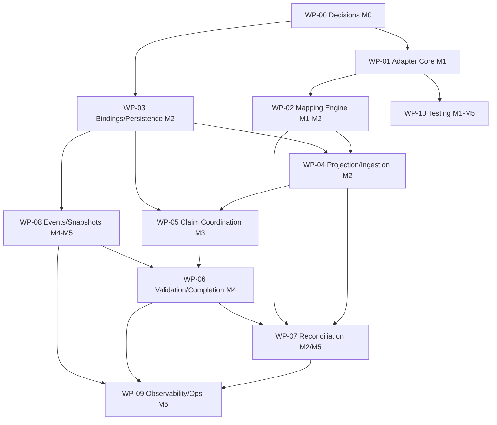

# Plan 018 — Guidance Beads Execution Adapter Implementation

**Status:** Draft — plan phase
**Normative references:**
(1) `specs/018-guidance-beads-execution-adapter/spec.md` (implementation
scope, milestones, deliverables, AC, testing strategy, rollout);
(2) RFC **GBEA-SPEC-001 v0.6.1-draft**
(`SDD/guidance-beads-adapter-specification-en.md`) — sole authority for
MUST/SHALL behavior. Precedence: RFC > spec 018 > this plan. This plan never
restates normative behavior; every task cites its RFC anchor.

## 1. Technology Context

- **Language/runtime:** TypeScript (ESM), Node ≥ 20 — same conventions as
  `servers/server-guidance` (yarn workspaces, root yarn-only rule per
  AGENTS.md).
- **Module layout (indicative, finalized in WP-01):**
  `servers/server-guidance/src/execution/` — `port/` (backend-neutral types),
  `beads/` (adapter, transport, mapping), `governance/` (claims, completion,
  readiness), `sync/` (reconciliation, events), `store/` (persistence).
  The Guidance domain must import only from `port/` (RFC §25.1).
- **Test runner:** vitest; tiers per spec 018 §7 (fast / contract / golden /
  concurrency / security / fault-injection / e2e / migration / scale).
- **Pending M0 decisions (block specific tasks, marked ⏳ADR):**
  persistence technology (ADR 3 → WP-03/WP-08 storage tasks), canonical JSON
  algorithm (ADR 6 → WP-02), retention/archive policy (ADR 7 → WP-08),
  transport confirmation (ADR 1 → default CLI per RFC §23 config sample),
  proof-signing key management (WP-00).

## 2. Work Packages

### WP-00 — Decisions and Implementation Contract (M0, precondition)

**Goal:** Resolve every RFC §28 decision and record the per-method
implementation contract so no later package invents policy.

**RFC anchors:** §28 (ADR 1–8), §11.5 (proof signing "documented in the
implementation contract"), §24 (per-method contract requirement).

Tasks:
- T00.1 Record ADR 1–8 in `memory-bank/decisions.md` with user approval;
  each ADR cites the RFC sections that constrain it (e.g. ADR 3 must satisfy
  §11.4 + §21.1; ADR 6 must satisfy §8.3). ⏳ADR
- T00.2 Implementation contract document: for each of the 22 RFC §24
  methods — authentication, authorization, request/response schemas,
  idempotency behavior, error codes, audit events.
- T00.3 Proof-signing design: key provisioning/rotation, signature
  algorithm, nonce store contract (single-use replay protection, §11.5).
- T00.4 Pin the Beads v1.3 conformance baseline (statuses, issue schema,
  metadata rules, dependency types) as the mapping-v1 ground truth
  (spec 018 §9 risk "Beads version drift").
- T00.5 Operative decision: default `enabled: false` wiring and config
  surface so WP-01 can build fail-closed validation (RFC §23, §4.1).

**Exit:** ADRs approved; contract committed; AC-A1 config default fixed.
**Depends on:** —. **Blocks:** all code packages.

### WP-01 — Adapter Core (M1; D-01, D-02, D-03, D-27 wiring)

**Goal:** The backend-neutral `WorkExecutionAdapter` port, canonical type
module, CLI transport, configuration, capability negotiation, and health —
the skeleton every other package plugs into.

**RFC anchors:** §5 + §5.1 (interface, idempotency/correlation/revision
rules), §6 + Appendix A (canonical types), §17 (error taxonomy with
redaction), §19 (probe, version-range gate, `NegotiatedCompatibility`
audit), §20.2–20.6/20.9–20.10 (executable discovery, path allowlist,
argument-array invocation, env allowlist, output limits, timeouts), §23/§23.1
(config schema, fail-closed validation, stealth semantics), §25.1.

Tasks:
- T01.1 `port/` module: `WorkExecutionAdapter` + all §5 signatures and
  Appendix A request/result types as a single typed source (D-01). Enforce:
  every mutating request carries `idempotencyKey`; every request
  `correlationId` (§5.1).
- T01.2 Canonical types of §6 (package, node, edge, policy, provenance,
  states, timestamps RFC §6.8) with schema-version emission/rejection rules
  (§6.6) and digest format `sha256:<lowercase-hex>` validation (§8.3).
- T01.3 CLI transport: spawn `bd` via argument arrays, no shell, env
  allowlist, `timeoutSeconds` + process termination, `maxOutputBytes`
  schema-validated output guard (§20.4–20.10).
- T01.4 Config schema + startup validation, fail-closed on
  security-sensitive misconfiguration; `workspace` block incl. stealth
  mode rules and `allowedRoots` canonicalization (§23, §23.1, AC-A2).
- T01.5 `probeCapabilities` + `health`: startup probe, recurring interval,
  missing REQUIRED capabilities → adapter unavailable; version-range check
  → `BACKEND_VERSION_UNSUPPORTED`; persist `NegotiatedCompatibility` in the
  audit log (§19).
- T01.6 Error normalization: all backend errors → §17 taxonomy with stable
  code, retryability, correlation, redacted diagnostics (§17, §20.8).
- T01.7 Disabled-path invariance: with `enabled: false`, no port
  registration and zero behavior change (§4.1, AC-A1).

**Verification:** contract tests against fake backend (T10.x), negative
config tests, version-gate tests (§26 items 2/6; §25.1).
**Depends on:** WP-00. **Feeds:** all.

### WP-02 — Mapping Engine (M1–M2; D-05, D-08)

**Goal:** Deterministic, versioned translation between canonical model and
Beads representation — pure functions, fully golden-testable without a
backend.

**RFC anchors:** §8.3 (canonicalization requirements — sorted keys, UTF-8,
no insignificant whitespace, versioned profile, enumerated exclusions),
§9.6.1–9.6.3 (projected item shape, `GuidanceBeadsMetadata`, field/type
table, labels, `guidance` metadata namespace, `bd:`/`_` prohibition, 32 KiB
guard), §9.6.7 (status mapping, unknown-status rejection), §6.6 (mapping
version `guidance.beads-mapping/v1`), §9.7 (migration procedure contract),
§15.4 (`acceptanceDigest` canonicalization).

Tasks:
- T02.1 Canonicalization module with versioned profile identifier;
  deterministic package/receipt hashing; tests for §8.3 conformance. ⏳ADR-6
- T02.2 Canonical→Beads field mapping per §9.6.2 (kind→issueType/labels,
  priority classes→0–3 with backlog-4 prohibition, ordinal→metadata,
  criteria rendering); titles must not embed mutable state.
- T02.3 Labels + metadata encoding: `guidance.managed` invariant,
  `guidance.execution=<id>`, single `guidance` metadata key, canonical JSON,
  byte-limit enforcement with per-item `PROJECTION_FAILED` + actionable
  diagnostic, no silent truncation (§9.6.3).
- T02.4 Dependency mapping table incl. virtual approval gates (no Beads
  item/dependency; Guidance-side enforcement only) and the forbidden-types
  list (§9.6.4).
- T02.5 Status mapping §9.6.7 as a pure table + unknown/custom-status
  rejection (`BACKEND_SCHEMA_INCOMPATIBLE`); claim/blocker-overlay
  comparison rule.
- T02.6 Round-trip encoding/decoding (§9.6.6): lossless recovery except
  virtual gates; immutability guards for `policyDecisionId` /
  `originPackageDigest`.
- T02.7 Mapping-version plumbing: emit/verify `mappingVersion` on every
  projection result, binding, and metadata envelope; migration-scaffold
  hooks for §9.7 (freeze/plan/receipt steps as callable operations — full
  migration exercised in T10.10).

**Verification:** unit + golden suites (§26 items 1/3).
**Depends on:** WP-01 (types). **Feeds:** WP-04, WP-07.

### WP-03 — Bindings and Persistence Foundation (M2; D-07, D-20)

**Goal:** Durable correlation between Guidance and Beads identifiers, the
backend-instance identity, and the persistence layer + operation journal
everything durable sits on.

**RFC anchors:** §7 (binding model, uniqueness, durability, no reuse),
§7.1 (identity derivation from canonical store root, `BEADS_DIR`/worktree
sharing, fallback store id, `BINDING_CONFLICT` fail-closed), §21.1
(persistence requirements: durability, atomicity, transactional sequence
allocation, query patterns, retention), §21.3 (`DurableBackendOperation`
journal states).

Tasks:
- T03.1 Coordination/binding store per ADR-3 satisfying every §21.1 bullet;
  WAL/journal equivalence documented if no multi-record transactions. ⏳ADR-3
- T03.2 `ExternalWorkBinding` CRUD with uniqueness constraints
  `(executionId, guidanceWorkId)` and `(backend, backendInstanceId,
  backendWorkId)`; durable across restarts; deletion never frees a binding
  for unrelated reuse (§7).
- T03.3 Backend-instance identity: store-root resolution (config discovery,
  `BEADS_DIR`, worktree sharing), canonicalization incl. platform-normalized
  separators + symlink resolution, persistent fallback id beside the
  Guidance store, `backendInstanceId` formula, all §7.1 fail-closed paths
  (collision, missing/changed store id → `BINDING_CONFLICT`); Windows/WSL
  dual-layout as an explicit test case (spec 018 §9 risk).
- T03.4 Operation journal (§21.3): PREPARED-before-dispatch, atomic
  DISPATCHED transition, OUTCOME_UNKNOWN resolution by read-back or
  idempotent re-execution, REPAIR_REQUIRED alerting, replayable after
  restart; audit event emitted atomically with FINALIZED.
- T03.5 Query-pattern implementation and test: lookup by `executionId` /
  `workId`, cursor reads, lease sweeps, drift inspection — no steady-state
  full scans (§21.1, AC-A4).

**Verification:** persistence fault-injection (T10.8), identity unit tests,
§26 item 5 storage-race tests.
**Depends on:** WP-00 (ADR-3), WP-01. **Feeds:** WP-04, WP-05, WP-06, WP-07, WP-08.

### WP-04 — Projection and Ingestion Delta (M2; D-06, D-09)

**Goal:** From Spec-Kit artifacts to an authorized, canonically-hashed
execution package, and from package to projected Beads graph — idempotent,
dry-runnable, atomic-or-staged.

**RFC anchors:** §8.1 (14 ingestion steps), §8.2 (authorization states,
only `EXECUTION_AUTHORIZED` publishes), §8.3 (package determinism), §9.1–9.5
(open, projection mapping table, 13-step algorithm incl. `STALE_PACKAGE`
guard, dry run, idempotency incl. `IDEMPOTENCY_CONFLICT`), §9.3 publication
atomicity (`batchTransaction` or staged `guidance.staged` + activation),
§14.2 (amendment → new package revision, `currentPackageDigest` advance,
accepted-item immutability).

Tasks:
- T04.1 Ingestion pipeline steps 1–14 (§8.1) as a delta over existing
  spec-kit import (specs/017): work-graph derivation, evidence-requirement
  derivation, risk classification, policy-set resolution + `policySetDigest`
  (§6.1, §15.2), deterministic hashing, authorization-decision recording.
- T04.2 Authorization-state machine §8.2 incl. SUSPENDED resume
  revalidation and terminal states; suspended executions never publish or
  offer governed-ready work.
- T04.3 `openExecution` (execution binding, no node publication, §9.1) and
  `publishWorkGraph` algorithm §9.3 steps 1–13: topological validation,
  unsupported-edge rejection, per-node digests, deterministic create order,
  CAS updates, dependency-after-endpoints, per-item outcome counts.
- T04.4 Dry-run mode returning intended mutations, zero backend state
  change (§9.4); idempotency-key semantics incl. conflict on differing
  digest (§9.5).
- T04.5 Publication atomicity: transaction path when `batchTransaction`
  negotiated; staged path with `guidance.staged` label, in-place
  validation, deterministic activation; incomplete staged publications
  flagged for WP-07 completion/rollback (§9.3, §21 reliability bullets).
- T04.6 Amendment/package-revision handling (§14.2): new digest, unchanged
  origin digest, supersede-not-modify for accepted items.

**Verification:** contract + idempotency + negative suites (§26 items 1–4,
6); §25.2 criteria.
**Depends on:** WP-02, WP-03. **Feeds:** WP-05, WP-07.

### WP-05 — Claim Coordination and Governed Readiness (M3; D-11..D-15)

**Goal:** Nobody touches backend work without Guidance authorization:
governed ready set, distributed atomic claims, leases, proofs, markers,
context delivery.

**RFC anchors:** §10 (backend vs. governed ready set, filtering inputs,
exclusions with `safeDescription`, evaluation cache key/invalidation/TTL
rules, non-cached final authorization at claim), §11.1–11.6 (claim flow,
crash-safety + orphan suspension, revision guard `WORK_NOT_READY`, lease
rules + restart semantics, claim-intent protocol with fencing tokens,
proofs incl. nonce replay rejection, claim markers + `claimCorrelation`
capability incl. `unsupported` → claiming disabled fail-closed), §12
(context envelope, least privilege), §6.8 (monotonic expiry, Guidance-side
time only).

Tasks:
- T05.1 Backend ready-set adapter query + governed filtering (§10.1/10.2)
  and `GovernedReadyWorkResult` with protected-reason-free exclusions
  (§10.3).
- T05.2 Readiness evaluation cache per §10.4: full key composition,
  invalidation triggers, configurable TTL (`0` = off, default 30 s),
  non-cached claim-time final authorization + CAS, diagnostics counters.
- T05.3 Claim-intent records: transactional insert/acquire keyed
  `(backendInstanceId, executionId, workId)`, monotonic fencing tokens,
  owner instance, expiry, request digest (§11.4 steps 1–4).
- T05.4 `claimWork` flow §11.1 steps 1–7 with proof verification
  (signature/audience/scope/expiry/nonce, §11.5), `expectedRevision` guard
  (§11.1), backend claim + marker per negotiated `claimCorrelation`
  (§11.6), governed lease persistence, orphaned-claim detection at startup
  and periodically — with per-execution claim suspension while unresolved.
- T05.5 Leases: expiry, heartbeat extension within policy limits, idempotent
  release, reassignment → new claim id, expired-claim completion rejection,
  restart semantics incl. startup orphan sweep before serving claims
  (§11.3).
- T05.6 Fencing-token presentation on heartbeat/release/progress/blocker/
  completion/admin repair; stale owner or lower token → `REVISION_CONFLICT`;
  serialization through claim-intent when Beads cannot store tokens, with
  post-mutation assignment verification (§11.4).
- T05.7 Execution context envelopes (§12) with least-privilege disclosure
  and expiry; Beads never invokes other downstream servers.
- T05.8 Agent-facing MCP methods wiring: `guidance.work.ready/claim/
  heartbeat/release/get_context`, `guidance.execution.status` (§24.1)
  per implementation contract.

**Verification:** concurrency + split-brain (≥2 Guidance instances,
mandatory §11.4) + security (proof replay/expiry) suites; §25.3 criteria.
**Depends on:** WP-03, WP-04. **Feeds:** WP-06.

### WP-06 — Validation Workflow and Completion (M4; D-16..D-19)

**Goal:** Evidence-gated two-phase completion: submission → validation →
acceptance receipt → backend closure, with independent state vectors;
plus progress reporting and blocker/amendment intake.

**RFC anchors:** §13 (per-claim monotonic `claimReportSequence`, duplicates,
gap detection, bounded out-of-order buffering + suspect stream, untrusted
summaries, optional Beads note projection with governed record in
Guidance), §14 (blocker types, handling incl. specification-suspension and
new-scope amendments, lifecycle REPORTED→…→SUPERSEDED, Guidance-owned
transitions + audit), §15.1–15.5 (submission shape, 11 validation checks,
orthogonal `acceptanceState` × `backendClosureState` machines with
timeout/retry/repair bounds, immutable receipts with event binding +
`acceptanceDigest` verification, closure only after durable acceptance,
idempotent retry, rejection with reason codes + remediation), §16.3 progress
conflict class.

Tasks:
- T06.1 Progress reporting service per §13 incl. sequence engine, pending
  set, re-sync on suspect streams, and Beads note projection.
- T06.2 Blocker intake + lifecycle with admin methods
  `guidance.blockers.accept/reject/resolve` (§14.2, §24.2) and
  amendment→package-revision handoff to WP-04.
- T06.3 `submitCompletion`: claim/fencing/sequence validity, then the 11
  §15.2 checks; persist `policySetDigest` with every validation result.
- T06.4 `acceptanceState` machine: SUBMITTED/VALIDATING/ACCEPTED/REJECTED
  with `VALIDATION_TIMEOUT` and bounded transient retries
  (`VALIDATION_ERROR`) (§15.3).
- T06.5 Immutable acceptance receipts: content per §15.4 + AcceptanceReceipt
  type, `work.completion.accepted` event binding, canonical
  `acceptanceDigest` with recorded profile, verification recomputation.
- T06.6 `backendClosureState` machine: `closeAcceptedWork` closes only the
  bound item, only after durable receipt; RETRYING bounded by
  `maxClosureAttempts`; REPAIR_REQUIRED stops + alerts; audit; closure
  failure never touches acceptance (§15.3/15.4).
- T06.7 `recordCompletionRejection` + remediation flow (§15.5, §24
  methods `guidance.work.submit_completion/report_progress/report_blocker`).
- T06.8 Execution-level ops: `guidance.execution.open/publish/close` with
  §24 closure preconditions (active claims, open high/critical drift,
  quarantined items; audited override; proof-scoped close).

**Verification:** contract + fault-injection (crash between acceptance and
closure; retry no-duplicate) suites; §25.4 criteria.
**Depends on:** WP-05, WP-08 (event log for receipts — coordinate: T06.5
needs T08.1/T08.2; sequencing note in §3).
**Feeds:** WP-07 (completion states feed reconciliation).

### WP-07 — Reconciliation (M2 core + M5 resolution workflow; D-10, D-24)

**Goal:** Detect out-of-band change, classify severity, suspend at the
right scope, and resolve through an audited administrative workflow.

**RFC anchors:** §16.1–16.3 (inputs, ownership classes, conflict rules),
§16.4 (drift severities + scoped suspension item/subtree/execution with
minimum-scope default, policy may only tighten), §16.5 (detection →
suspension → inspection → idempotent resolution accept-backend/
restore-canonical/quarantine → audit/resume; agents must not resolve
high/critical), §16.6 (checkpoints, incremental ≡ full for affected
subgraph, atomic checkpoint advancement, full-reconciliation triggers,
no steady-state full scans, mode metrics), §9.3 (staged-publication
completion/rollback), §11.1 (orphaned claims via markers), §9.6.4
(forbidden dependency types as drift), §9.6.7 (status drift rules).

Tasks:
- T07.1 Reconciliation engine M2: input assembly, ownership-class diffing
  per §16.2/16.3, `DriftFinding` records, severity classification, scoped
  suspension with reason referencing the finding (§16.4).
- T07.2 Incremental reconciliation with `ReconciliationCheckpoint` (all §16.6
  fields), changed-after-checkpoint requests incl. transitive dependency
  endpoints, full-trigger detection, atomic advancement (no advance on
  failed/partial runs), incremental ≡ full equivalence tests.
- T07.3 Completion/rollback of incomplete staged publications and orphaned
  backend claims (§9.3, §11.1) as reconciliation actions.
- T07.4 Drift admin workflow M5: `guidance.adapters.inspect_drift`,
  `guidance.adapters.resolve_drift` (idempotent per `findingId`, state
  OPEN→RESOLVING→RESOLVED, exactly one action per finding),
  `guidance.adapters.reconcile/list/capabilities/health` (§24.2); audited
  resume only after all blocking findings RESOLVED.
- T07.5 Auto-resolution only for informational/low/medium per §16.3 rules;
  high/critical strictly administrative.

**Verification:** drift + concurrency + fault-injection suites; §25.5
criteria; incremental/full equivalence property test.
**Depends on:** WP-03, WP-04 (graph), WP-02 (mapping for expected values);
T07.4 after WP-06 (admin surface conventions).
**Feeds:** WP-09 (drift metrics), WP-08 (reconciliation events).

### WP-08 — Event Log and Snapshots (M4–M5; D-21)

**Goal:** The append-only audit spine: normalized events with per-execution
total order, snapshots to bound replay, cursors with retention awareness.

**RFC anchors:** §18 (envelope, strictly increasing gap-free
`executionSequence`, at-least-once ordered delivery, `eventId` idempotency,
15 required event types), §18.1 (three-level ordering model, `causationId`
rules, late-report drop as unsequenced diagnostic), §18.2 (snapshots every
≥1,000 configurable default 10,000, contents, atomic
creation/checkpoint-publication, chained `previousSnapshotDigest`, replay
fallback rules, pruning only into immutable archive, `CURSOR_EXPIRED` /
archive locators, `retentionEpoch`), §21.1 (transactional sequence
allocation — no reuse, no gaps).

Tasks:
- T08.1 Event log with transactional sequence allocation and the §18
  envelope; emit all 15 event types from WP-04/05/06/07 integration points.
- T08.2 `collectEvents` cursor API: ascending order, resume semantics,
  `hasMore`/`nextAfterExecutionSequence`, at-least-once.
- T08.3 Causality + ordering rules §18.1: `causationId` sequencing
  constraint, late-report deterministic drop with diagnostic.
- T08.4 Snapshotting: threshold trigger, full §18.2 contents, atomic
  publish, digest chaining, replay-from-snapshot + fallback chain,
  replay-equivalence tests (§25.7).
- T08.5 Retention/pruning per ADR-7: immutable archive handoff, cursor
  boundary behavior, `retentionEpoch` invalidation. ⏳ADR-7
- T08.6 Dead-letter handling for repeatedly failing normalized events (§21).

**Verification:** event/cursor unit + fault-injection + replay-equivalence
suites; §25.7 replay criterion.
**Depends on:** WP-03 (store + sequence allocation). **Feeds:** WP-06
(receipts), WP-09 (snapshot metrics).

### WP-09 — Observability and Operations (M5; D-22, D-25)

**Goal:** One work lifecycle traceable across metrics, logs, traces;
dashboards, alerts, and the runbooks operations needs.

**RFC anchors:** §22.1 (full metric list incl. reconciliation-mode and
cache diagnostics, snapshot/replay-fallback counts), §22.2 (structured log
fields), §22.3 (trace spans across request → policy → adapter → backend →
persistence → event emission), §11 (every state change auditable + correlated,
§4.11), §15.3 (REPAIR_REQUIRED alert), §21.3 (operation-journal alerts),
§29 (dashboards/alerts/runbooks/upgrade docs as DoD).

Tasks:
- T09.1 Metrics module implementing every §22.1 bullet, wired at all
  integration points; cache diagnostics without protected-policy leakage
  (§10.4).
- T09.2 Structured logging with the §22.2 field set; redaction per §20.8.
- T09.3 Trace propagation across the full §22.3 span chain.
- T09.4 Dashboards + alerts: at minimum closure-repair, drift
  high/critical, backend unavailability, lease-expiry bursts, capability
  mismatch (health diagnostics §25.7).
- T09.5 Runbooks: publication/claim/closure recovery exercises (§29),
  drift resolution, orphaned claims, stale-lease policy, store-id
  rebinding (§7.1), upgrade/rollback incl. `supportedBackendVersionRange`
  widening (ADR-8) and §9.7 mapping migration; rollout-stage documentation
  for spec 018 §8 (R0–R5).

**Verification:** observability correlation test (§25.7: metrics/logs/traces
correlate a complete lifecycle); runbook walkthroughs recorded.
**Depends on:** all packages (wired continuously from M1, finalized M5).

### WP-10 — Testing Infrastructure and Suites (M1–M5; D-04, D-23, D-26)

**Goal:** The ten RFC §26 suites as executable, CI-stable tiers — including
the fake backend and the port-neutrality proof.

**RFC anchors:** §26 items 1–10, §25.1 (second adapter), §21.2 (scale
targets), §25.6 (security over CLI transport), §11.4 (split-brain
mandatory), §9.7 (migration tests), §29 (e2e scenario).

Tasks:
- T10.1 Fake backend implementing the port (in-memory, deterministic,
  fault-injectable) — available from M1 (§27 M1).
- T10.2 Second minimal test adapter without Beads dependencies
  (port-neutrality proof, §25.1).
- T10.3 Suite 1 (unit) and Suite 3 (golden incl. round-trip fixtures) —
  built with WP-02.
- T10.4 Suite 2 (contract: every adapter method × fake backend × second
  adapter) and AC-A3 per-method contract coverage.
- T10.5 Suite 4 (idempotency: every mutation) and Suite 6 (negative:
  malformed/unsupported/schema-skew/oversized output).
- T10.6 Suite 5 (concurrency: parallel claims, stale fencing, CAS,
  reconciliation races, **split-brain ≥2 Guidance instances**) — with WP-05.
- T10.7 Suite 7 (security: CLI command injection via titles/descriptions/
  paths/IDs, path traversal/workspace escape, secret leakage, output
  exhaustion, proof replay) — with WP-01/WP-05.
- T10.8 Suite 8 (fault-injection: timeouts, crashes at each protocol step,
  partial projection, storage failure, backend unavailability, journal
  replay) — with WP-03..WP-08.
- T10.9 Suite 9 (e2e: the full §29 lifecycle incl. evidence rejection →
  remediation → acceptance → closure → dependent release).
- T10.10 Suite 10 (migration: adapter/binding schema upgrades; mapping
  MAJOR migration per §9.7 with receipt, no receipt rewrites) — with
  T02.7.
- T10.11 Scale tier (§21.2: 100k items, ≤30 min full / ≤5 min incremental
  recon, readiness p95 ≤2 s) as a separate non-CI-fast tier; baseline-aware
  labeling per AGENTS.md.

**Depends on:** builds incrementally with WP-01..WP-09.
**Gate role:** every milestone exit (spec 018 §6) is verified by a defined
suite subset; DoD (§29) requires all ten green.

## 3. Sequencing and Dependencies

Milestone mapping: **M1** = WP-01 + WP-02 (T02.1–T02.2) + T10.1–T10.4 ·
**M2** = WP-02 rest + WP-03 + WP-04 + WP-07 (T07.1–T07.3) + T10.5/T10.8
(partial) · **M3** = WP-05 + T10.6/T10.7 · **M4** = WP-06 + WP-08
(T08.1–T08.4) + T10.9 · **M5** = WP-07 (T07.4–T07.5) + WP-08 (T08.5–T08.6)
+ WP-09 + T10.10/T10.11.

Cross-package coordination notes:
- T06.5 (receipts) requires T08.1/T08.2 (event log + acceptance-event
  emission) — schedule WP-08 core before T06.5, or land both in M4 as
  planned.
- WP-09 metrics are wired as each package lands (not deferred to M5);
  M5 finalizes dashboards/alerts/runbooks.
- ⏳ADR tasks (T02.1, T03.1, T08.5) start only after WP-00 approval.

## 4. MUST/SHALL Compliance Matrix (traceability)

Every RFC top-level normative area is owned by exactly one package (primary
owner; integration points feed it):

| RFC area | Primary | Key tasks |
|---|---|---|
| §4 invariants (12) | WP-01 (1,2,12), WP-04 (8,10), WP-05 (4,5), WP-06 (6,7), WP-07 (9), all (11) | T01.7, T04.4, T05.4, T06.6, T07.1 |
| §5/§5.1 interface rules | WP-01 | T01.1 |
| §6 + App. A types, §6.6, §6.8 | WP-01 | T01.2 |
| §7/§7.1 bindings + identity | WP-03 | T03.2, T03.3 |
| §8 ingestion, authorization, determinism | WP-04 | T04.1–T04.3 |
| §9 projection, mapping, status, migration | WP-04 + WP-02 | T04.3–T04.5, T02.2–T02.7 |
| §10 readiness + cache | WP-05 | T05.1, T05.2 |
| §11 claims, leases, proofs, markers | WP-05 | T05.3–T05.6 |
| §12 context | WP-05 | T05.7 |
| §13 progress | WP-06 | T06.1 |
| §14 blockers/amendments | WP-06 | T06.2 |
| §15 completion (both machines, receipts) | WP-06 | T06.3–T06.7 |
| §16 reconciliation/drift | WP-07 | T07.1–T07.5 |
| §17 error model | WP-01 | T01.6 |
| §18/§18.1/§18.2 events, snapshots, cursors | WP-08 | T08.1–T08.6 |
| §19 capability negotiation | WP-01 | T01.5 |
| §20 security (14 requirements) | WP-01 (2–6,9,10), WP-05 (1,7), WP-09 (8), all (11–14) | T01.3, T01.4, T05.4, T09.2 |
| §21/§21.1/§21.2/§21.3 reliability | WP-03 + WP-10 | T03.4, T03.5, T10.8, T10.11 |
| §22 observability | WP-09 | T09.1–T09.3 |
| §23/§23.1 configuration | WP-01 | T01.4 |
| §24 MCP methods | WP-05 (agent), WP-06 (completion+exec), WP-07 (admin) | T05.8, T06.2, T06.7, T06.8, T07.4 |
| §25/§26/§29 verification | WP-10 | T10.1–T10.11 |

## 5. Verification and Gates

- Each package exits when its §2 verification line is green **and** the
  owning milestone's RFC §25 block passes as written (spec 018 §6 table).
- Branching per AGENTS.md: one feature branch per work package (or tight
  cluster), `feature/018-wp<NN>-*`; independent review before merge to
  develop; `detect_changes` + `gitnexus analyze --no-stats` before
  completion (Graph-RAG pre-edit impact for every touched symbol).
- DoD = RFC §29 (all suites, security review approval, recovery exercises,
  dashboards, docs, conformance tests, e2e demonstration) — tracked in
  WP-09/WP-10 exits.
- Open items that must NOT be silently closed: GBEA-F016 (partitioning)
  stays deferred; any deviation from RFC MUST/SHALL requires explicit user
  approval and an RFC change first (spec 018 §2).
